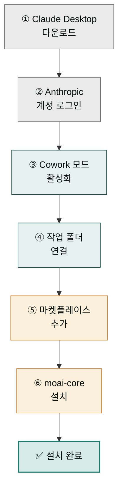

처음 플러그인을 써 보려면 Claude Desktop부터 시작해야 합니다. Claude Desktop이 이미 설치되어 있다면 마켓플레이스 등록과 moai-core 활성화까지 약 5-7분이면 충분합니다. 이 가이드는 그 과정을 6단계로 정리했습니다.

## 전체 설치 절차

### 1단계: Claude Desktop 다운로드


**시스템 요구사항**
- macOS 10.13 이상
- Windows 10 이상
- 8GB 이상 RAM
- 안정적인 인터넷 연결


[claude.com/download](https://claude.com/download)에 접속해 운영체제에 맞는 버전을 받아 설치합니다.

1. [claude.com/download](https://claude.com/download) 접속
2. 운영체제에 맞는 버전 다운로드
3. 다운로드된 파일 실행하여 설치 진행

다운로드 페이지에는 Chrome 확장 프로그램·Slack 통합·모바일 앱 등 여러 배포 방식이 함께 나열됩니다. Cowork 플러그인은 **Desktop 앱**(macOS·Windows)에서만 완전히 지원되므로, 반드시 Desktop 앱을 선택해 설치하세요.

### 2단계: Anthropic 계정 로그인

Claude Desktop을 실행하고 Anthropic 계정으로 로그인합니다. 2단계 인증이 설정되어 있다면 인증 코드도 함께 입력합니다.

1. Claude Desktop 애플리케이션 실행
2. 로그인 화면에서 Anthropic 계정 정보 입력
3. 2단계 인증이 설정된 경우 인증 코드를 함께 입력


**중요**: 개인 계정 또는 조직 계정 모두 사용 가능하지만, 조직 계정의 경우 관리자 승인이 필요할 수 있습니다.


### 3단계: Cowork 모드 활성화

플러그인을 쓰려면 Cowork 모드가 켜져 있어야 합니다. 좌측 사이드바에서 **"Projects"**를 선택하면 진입할 수 있고, 보이지 않으면 설정 메뉴에서 활성화하세요.

1. Claude Desktop 왼쪽 사이드바에서 **"Projects"** 선택
2. "Cowork mode"가 표시되지 않으면 설정 메뉴에서 활성화
3. Cowork 모드가 활성화되면 추가 기능 탭이 표시됩니다

활성화되면 사이드바에 **Cowork 탭**이 생기고, 우측에 모델 선택기(Opus 4.7 등)·직접 설정 토글·프로젝트 선택기·Info 드롭다운이 함께 나타납니다. 이 탭이 보이면 다음 단계로 진행하세요.

### 4단계: 로컬 작업 폴더 연결

산출물이 저장될 로컬 폴더를 Claude Desktop에 연결합니다. 기존 프로젝트 폴더를 연결하거나 새 폴더를 만들어 지정해도 됩니다.

1. 사이드바의 **Customize** 메뉴를 통해 폴더 연결 설정에 접근합니다
2. "Connect a local work folder" 버튼 클릭
3. 작업할 프로젝트 폴더 선택
4. 연결 확인 완료


**팁**: 기존 프로젝트 폴더를 연결하거나 새로운 폴더를 생성하여 사용할 수 있습니다.


### 5단계: 마켓플레이스 추가

MoAI Cowork Plugins 마켓플레이스를 등록합니다. URL 하나를 입력하면 전체 플러그인 목록이 동기화됩니다.

1. **+** 버튼으로 개인 폴더그룹 추가 화면을 엽니다
2. **추가** 버튼으로 새 폴더그룹을 생성합니다
3. 하단 메뉴의 **마켓플레이스 추가**를 선택합니다

4. URL 입력 필드에 `modu-ai/cowork-plugins`을 입력하고 추가를 확인합니다

### 6단계: 필수 플러그인 설치

모든 플러그인 중에서 가장 먼저 `moai-core`를 설치해야 합니다. `/project init` 마법사와 텍스트 품질 검수에 필요한 `ai-slop-reviewer`가 여기에 포함되어 있어, 다른 플러그인은 이것이 있어야 제대로 작동합니다.

1. **개인** 탭 — 설치된 플러그인 목록을 확인합니다
2. **cowork-plugins** 필터 — 마켓플레이스 플러그인만 표시합니다
3. **자동 추가** 토글 — 새 스킬 자동 포함 여부를 설정합니다
4. **+ moai-core** 버튼 — moai-core 플러그인을 추가합니다

5. **Moai core** — 사이드바에 설치된 moai-core 메뉴가 표시됩니다
6. **기능 카드** — 제공되는 스킬 목록을 확인합니다
7. **사용자 지정** 토글 — 개별 스킬 활성화/비활성화를 제어합니다


**필수 플러그인**: `moai-core`는 `/project init`과 `ai-slop-reviewer` 스킬을 포함한 핵심 기능을 제공하므로 반드시 먼저 설치해야 합니다.


## 설치 검증

설치 후에는 다음 두 가지로 정상 여부를 빠르게 확인합니다.

### 1. 플러그인 목록 확인

1. Claude Desktop에서 **"Plugins"** 탭 선택
2. 설치된 플러그인 목록에서 `moai-core` 확인
3. 상태가 "Active"로 표시되는지 확인

### 2. 스킬 테스트

채팅창에 `/project init`을 입력해 실행합니다. 7단계 인터뷰 흐름이 시작되면 설치가 정상적으로 완료된 것입니다.

## 문제 해결

### 자주 발생하는 문제

**Q: 마켓플레이스가 표시되지 않아요**
A: Claude Desktop이 최신 버전인지 먼저 확인하세요. 그래도 안 보이면 인터넷 연결 상태를 점검합니다.

**Q: moai-core 설치 실패**
A: 조직 계정을 사용 중이라면 관리자 승인이 필요할 수 있습니다. 관리자에게 문의하세요.

**Q: `/project init` 명령어가 작동하지 않아요**
A: moai-core가 먼저 설치되어 있어야 합니다. 설치 순서가 중요합니다.

**Q: 스킬 목록이 나타나지 않아요**
A: Claude Desktop을 재시작하거나 캐시를 초기화해 보세요.

### 고급 문제 해결

네트워크 문제가 의심된다면 프록시 설정을 확인하고, 방화벽에서 Claude Desktop을 허용 목록에 추가하거나 DNS 캐시를 비워 보세요. 권한 문제라면 작업 폴더의 읽기/쓰기 권한을 확인하고, macOS는 보안 설정에서 Claude Desktop 권한을 부여하거나 Windows Defender 실행을 허용합니다.

## 다음 단계

설치가 완료됐다면 이제 첫 작업을 진행할 준비가 된 것입니다.

- [첫 작업 가이드](../first-task/) - 약 5-7분 실습 예제 (설치 완료 후)
- [빠른 시작 가이드](../quick-start/) - 주요 스킬 빠르게 숙지하기

### Sources
- GitHub 저장소: [https://github.com/modu-ai/cowork-plugins](https://github.com/modu-ai/cowork-plugins)
- Claude Desktop 다운로드: [https://claude.com/download](https://claude.com/download)
- 온라인 문서: [https://cowork.mo.ai.kr](https://cowork.mo.ai.kr)
