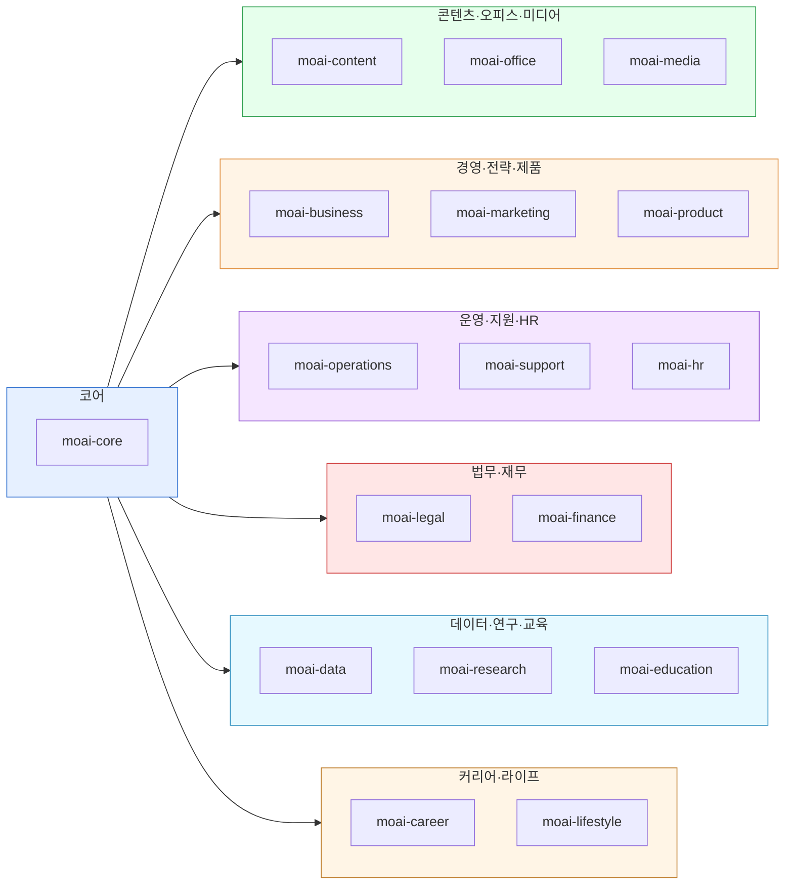

# `cowork-plugins` 카탈로그

[`modu-ai/cowork-plugins`](https://github.com/modu-ai/cowork-plugins)는 한국 업무 환경에 맞춰 설계된 **21개 플러그인 · 129개 스킬**의 커뮤니티 마켓플레이스입니다. 사업계획·IR·마케팅·법무·세무·HR·카드뉴스·PPT·이미지 생성·이커머스 캠프까지 도메인별로 묶여 있습니다.


**v2.4.0 업데이트**: "캠프 후속 인사이트 통합본" — 정해준 강사 본인 노하우 3개 문서 + 광고 심리학 완전판 분석 → 13건(신규 5 + 강화 8) 통합. **신규 5**: coupang-ad-optimizer / commerce-margin-calculator / commerce-automation-audit / landing-page-conversion-audit / pixel-audit. **강화 8**: product-naming·detail-page-copy·jtbd-persona·channel-message·integrated-strategy·market-research·campaign-planner·sns-content. 전체 **129개 스킬 · 21개 플러그인** 체제. Breaking change 없음.


## 전제 조건

- Claude Desktop 앱 + Cowork 모드 진입 완료 → [Cowork 설치](../../cowork/install/)
- 마켓플레이스 설치 절차는 [빠른 시작](./quick-start/) 참고
- **`moai-core`는 가장 먼저 설치**해야 합니다 — `/project init` 마법사와 `ai-slop-reviewer`가 여기에 들어 있습니다

## 도메인별 플러그인

### 코어

- [`moai-core`](./moai-core/) — 프로젝트 초기화, 자연어 라우터, AI 슬롭 검수, 피드백 허브

### 콘텐츠·오피스·미디어

- [`moai-content`](./moai-content/) — 블로그·카드뉴스·랜딩·뉴스레터·상세페이지·SNS 콘텐츠
- [`moai-office`](./moai-office/) — PPTX·DOCX·XLSX·HWPX 문서 자동 생성
- [`moai-media`](./moai-media/) — 이미지(나노바나나·Ideogram), 영상(Kling), 음성(ElevenLabs)

### 경영·전략·제품

- [`moai-business`](./moai-business/) — 사업계획서, IR 덱, 시장조사, 일간 브리핑, 상권분석, 정부지원사업
- [`moai-marketing`](./moai-marketing/) — 브랜드 아이덴티티, SEO, SNS 캠페인, 퍼포먼스 리포트
- [`moai-product`](./moai-product/) — PRD·기능 명세, 로드맵, UX 리서치

### 운영·지원·HR

- [`moai-operations`](./moai-operations/) — SOP, 조달, 벤더 평가, 주간 상태 보고
- [`moai-support`](./moai-support/) — 고객 티켓 분류·응답, 지식베이스, 에스컬레이션
- [`moai-hr`](./moai-hr/) — 채용, 근로계약, 평가, 원격 근무 정책

### 법무·재무

- [`moai-legal`](./moai-legal/) — 계약서 검토, NDA, 컴플라이언스, IP 리스크
- [`moai-finance`](./moai-finance/) — 세무, 결산, K-IFRS 재무제표, 예실 분석

### 데이터·연구·교육

- [`moai-data`](./moai-data/) — CSV 탐색, 공공데이터, 데이터 시각화
- [`moai-research`](./moai-research/) — 논문, 특허(KIPRIS), 연구비 신청
- [`moai-education`](./moai-education/) — 커리큘럼, 리서치 보조, 시험 출제

### 커리어·라이프

- [`moai-career`](./moai-career/) — 자기소개서, 이력서, 면접 코칭, 포트폴리오
- [`moai-lifestyle`](./moai-lifestyle/) — 여행, 웰니스, 이벤트·웨딩 기획

## 한 눈에 보는 스킬 수 (v2.3.0)

"대표 스킬 (일부)"는 각 플러그인에서 가장 자주 호출되는 스킬을 발췌한 것입니다. 전체 스킬 목록은 플러그인 이름을 클릭해 상세 페이지에서 확인하세요.

| 플러그인 | 스킬 수 | 대표 스킬 (일부) |
|---|---|---|
| [moai-core](./moai-core/) | 8 | project, ai-slop-reviewer, feedback, ai-diagnostic, **mcp-connector-setup (v2.3)**, skill-builder, skill-template, skill-tester |
| [moai-content](./moai-content/) | 11 | blog, card-news, landing-page, copywriting, humanize-korean, html-report (v2.2) +5종 |
| [moai-office](./moai-office/) | 5 | pptx-designer, docx-generator, xlsx-creator, hwpx-writer, pdf-writer |
| [moai-media](./moai-media/) | 13 | nano-banana, image-gen, video-gen, audio-gen, speech-video, character-mgmt, fal-gateway, **media-moodboard·media-gpt-image2-builder·media-model-router·media-channel-ad-packager·media-ai-disclosure·media-canva-magic-layer (v2.3)** |
| [moai-business](./moai-business/) | 10 | strategy-planner, investor-relations, sbiz365-analyst, kr-gov-grant, consulting-brief, sales-playbook, startup-launchpad +3종 |
| [moai-marketing](./moai-marketing/) | 10 | brand-identity, seo-audit, campaign-planner (강화 v2.4 광고 심리학 완전판), sns-content (확장 v2.3 + 강화 v2.4), target-script, **landing-page-conversion-audit·pixel-audit (v2.4 신규)** +3종 |
| [moai-commerce](./moai-commerce/) | 22 | mfds-safety, real-estate-search, detail-page-copy (강화 v2.3+v2.4), commerce-market-research·commerce-jtbd-persona·commerce-product-naming·commerce-channel-message·commerce-integrated-strategy·commerce-morning-brief·commerce-order-summary (v2.3 V6 6도구), **coupang-ad-optimizer·commerce-margin-calculator·commerce-automation-audit (v2.4 신규)** +6종 |
| [moai-product](./moai-product/) | 4 | spec-writer, ux-designer +2종 |
| [moai-operations](./moai-operations/) | 3 | status-reporter +2종 |
| [moai-support](./moai-support/) | 4 | ticket-triage +3종 |
| [moai-hr](./moai-hr/) | 5 | employment-manager, draft-offer, performance-review, people-operations +1종 |
| [moai-legal](./moai-legal/) | 5 | contract-review, nda-triage, compliance-check, legal-risk, iros-registry-automation |
| [moai-finance](./moai-finance/) | 6 | tax-helper, financial-statements, close-management, variance-analysis, court-auction-search, korean-stock-search |
| [moai-data](./moai-data/) | 3 | data-explorer, public-data, data-visualizer |
| [moai-research](./moai-research/) | 5 | paper-search, paper-writer, grant-writer +2종 |
| [moai-education](./moai-education/) | 5 | curriculum-designer, assessment-creator, research-assistant, **course-curriculum-design·course-followup-sequence (v2.3)** |
| [moai-career](./moai-career/) | 4 | resume-builder, job-analyzer, interview-coach, portfolio-guide |
| [moai-lifestyle](./moai-lifestyle/) | 3 | travel-planner, event-planner, wellness-coach |
| [moai-bi](./moai-bi/) | 1 | dashboard-builder |
| [moai-pm](./moai-pm/) | 1 | project-manager |
| [moai-sales](./moai-sales/) | 1 | sales-prospecting |

전체 **129개 스킬 · 21개 플러그인** (v2.4.0 기준).

## 다음 단계

- [빠른 시작](./quick-start/) — 마켓플레이스 추가 → 플러그인 설치 → 첫 체인
- [`moai-core`](./moai-core/) — 반드시 가장 먼저 설치
- [Cowork 플러그인 사용](../../cowork/plugins/) — Cowork 환경 통합 가이드

---

### Sources

- [modu-ai/cowork-plugins](https://github.com/modu-ai/cowork-plugins)
- [cowork-plugins README](https://raw.githubusercontent.com/modu-ai/cowork-plugins/main/README.md)
