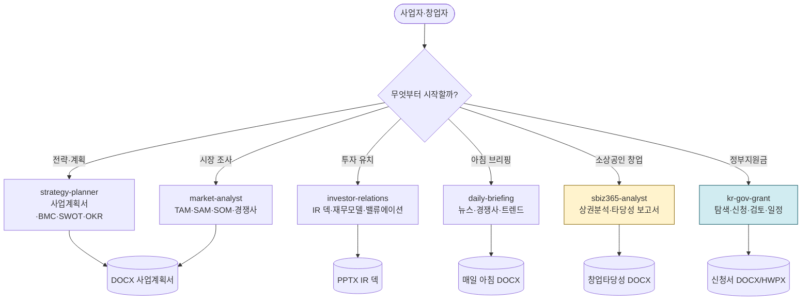
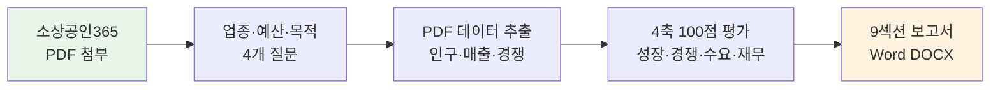
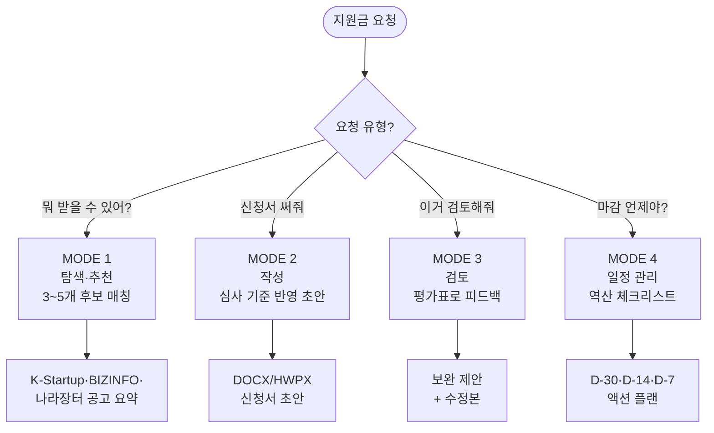

# moai-business

> 스타트업·소상공인·중소기업의 경영과 전략을 위한 **6개 스킬** 묶음입니다. v1.5.0부터 소상공인을 위한 **상권분석(`sbiz365-analyst`)** 과 모든 신청자를 위한 **정부지원사업 통합(`kr-gov-grant`)** 스킬이 추가되었습니다.

## 무엇을 하는 플러그인인가

`moai-business` (v1.5.0)는 사업 아이템을 정리하고, 시장을 살펴보고, 투자자나 정부기관에 제출할 문서까지 만드는 전 과정을 한 플러그인 안에서 끝낼 수 있도록 설계되었습니다. 창업자·기획자·투자 유치 팀·소상공인·지원금 신청자 등 다양한 역할의 사용자를 커버합니다.

v1.5.0의 `sbiz365-analyst`는 소상공인365 빅데이터 포털의 상권분석 PDF를 입력받아 4축 100점 평가와 9섹션 Word 보고서를 생성합니다. `kr-gov-grant`는 정부지원사업 **탐색·작성·검토·일정 관리** 4개 모드를 제공해 K-Startup·BIZINFO·중기부·나라장터·IITP 등 주요 기관의 공고를 연결합니다.

## 6개 스킬이 어떻게 연결되나요



노란색·파란색 두 박스가 v1.5.0에서 새로 들어온 스킬입니다. 나머지 4개는 v1.0부터 있던 검증된 스킬이니 안심하고 사용하시면 됩니다.

## 설치



1. `moai-core` 설치 후 `moai-business` 옆의 **+** 버튼을 눌러 설치합니다.
2. 최종 문서 저장용으로 `moai-office`도 함께 설치하는 것을 권장합니다.


[GitHub 저장소](https://github.com/modu-ai/cowork-plugins/tree/main/moai-business)를 클론한 뒤 `~/.claude/plugins/`에 배치합니다.



## 핵심 스킬 (6개)

| 스킬 | 한 줄 설명 | 누구에게 필요한가 |
|---|---|---|
| `strategy-planner` | 사업계획서, 린 캔버스, BMC, SWOT, OKR | 창업자·기획자 |
| `market-analyst` | TAM/SAM/SOM, 경쟁사 분석, 포지셔닝, 가격 전략 | PM·마케터 |
| `investor-relations` | Series A/B IR 덱, 재무 모델, 밸류에이션 | 투자 유치 준비 팀 |
| `daily-briefing` | 업계 뉴스·경쟁사·시장 동향 아침 브리핑 | 경영진·기획실 |
| `sbiz365-analyst` (v1.5.0 신규) | 소상공인365 PDF → 상권분석·창업타당성 DOCX | 예비창업자·자영업자 |
| `kr-gov-grant` (v1.5.0 신규) | 정부지원사업 탐색·신청서 작성·검토·마감 관리 | 모든 지원금 신청자 |

## 신규 스킬 1 — `sbiz365-analyst` (소상공인 상권분석)

### 언제 쓰나요

- "이 상가 위치에 카페를 차려도 괜찮을까?"
- "소상공인365 보고서를 받았는데 숫자가 너무 많아 뭐가 중요한지 모르겠어요"
- "창업 타당성을 문서로 정리해 가족이나 투자자에게 보여주고 싶어요"

### 준비물

[소상공인365 빅데이터 포털](https://bigdata.sbiz.or.kr)에서 원하는 지역·업종을 선택해 **상권분석 PDF** 를 다운로드하면 됩니다.

### 실행 흐름



**4축 100점 평가**는 다음과 같이 가중치가 설정됩니다.

| 축 | 가중치 | 평가 내용 |
|---|---|---|
| 성장성 | 30점 | 유동인구·매출 추이·상권 확장성 |
| 경쟁도 | 25점 | 경쟁 점포 수·포화도·대체재 |
| 수요 적합도 | 25점 | 타깃 인구·소득·소비 패턴 |
| 재무 타당성 | 20점 | 예상 매출·임대료·손익분기 |

## 신규 스킬 2 — `kr-gov-grant` (정부지원사업 통합)

### 언제 쓰나요

- "우리 회사에 맞는 정부 지원사업이 있는지 모르겠어요"
- "예비창업패키지 신청서를 써야 하는데 심사 기준을 몰라서 막막해요"
- "마감일이 얼마 남았고 무슨 서류가 필요한지 한 번에 정리하고 싶어요"
- "이미 초안을 썼는데 심사관 관점에서 보면 어떤지 검토받고 싶어요"

### 4개 MODE 구조



### 지원 범위

**8가지 신청자 유형**: 예비창업자 · 초기창업자(3년 이내) · 성장기 스타트업(3~7년) · 소상공인 · 중소중견기업 · 연구자 · 비영리단체·사회적기업 · 개인(프리랜서·청년·농업인)

**7가지 지원 목적**: 창업자금 · 사업화 · R&D 기술개발 · 시설장비·운영자금 · 마케팅·수출 · 인력채용·교육 · 공간·콘텐츠

**연결된 기관**: K-Startup(창진원), BIZINFO, 중기부, 나라장터, IITP, 문체부, 농식품부, 지자체 로컬크리에이터 등

### `kr-gov-grant` vs `moai-research:grant-writer` — 언제 어떤 걸 쓰나요

둘 다 "지원금 신청서"를 다루지만 대상 사업이 다릅니다.

| 구분 | `kr-gov-grant` (이 플러그인) | `moai-research:grant-writer` |
|---|---|---|
| 대상 사업 | 창업·사업화·수출·시설·마케팅 | 학술·R&D 연구과제 |
| 대표 기관 | K-Startup, BIZINFO, 중기부 | NRF(연구재단), IITP, KIAT |
| 주 이용자 | 창업자·소상공인·일반기업 | 연구자·교수·연구기관 |
| 문서 형식 | 사업계획서 중심 | 연구계획서·참고문헌 포함 |
| 심사 키워드 | 시장성·수익성·성장성 | 학술 기여도·연구방법론 |

## 선택 연동

- **DART MCP** (금융감독원 전자공시) — 상장사 공시·재무 데이터 자동 조회
- `moai-office` — 최종 DOCX·PPTX·XLSX·HWPX 저장
- `moai-data` — 공공데이터·KOSIS 통계 결합
- `moai-media:nano-banana` — 사업계획서·IR 덱용 다이어그램·썸네일 생성

## 대표 체인

**사업계획서**

```text
strategy-planner → market-analyst → docx-generator → ai-slop-reviewer
```

**IR 덱**

```text
investor-relations → pptx-designer → ai-slop-reviewer
```

**상권분석 보고서 (신규)**

```text
sbiz365-analyst → docx-generator → ai-slop-reviewer
```

**정부지원사업 신청서 (신규)**

```text
kr-gov-grant → docx-generator (또는 hwpx-writer) → ai-slop-reviewer
```

**매일 아침 산업 브리핑** (예약 실행)

```text
daily-briefing → docx-generator
```

## 빠른 사용 예

```text
초기 SaaS 스타트업 사업계획서 만들어줘.
타깃은 한국 중소제조업, 조달 목표는 3억.
```

```text
Series A용 IR 덱 20장 pptx로 만들어줘.
```

```text
소상공인365에서 내려받은 홍대 상권 PDF 첨부했어. 카페 창업 타당성 검토해줘.
```

```text
중기부 예비창업패키지 우리 팀 상황에 맞게 추천받고 신청서 초안도 같이.
```

## 다음 단계

- [`moai-office`](../moai-office/) — 최종 문서 포맷 담당
- [`moai-research`](../moai-research/) — 학술·R&D 과제는 이쪽으로

---

### Sources

- [modu-ai/cowork-plugins](https://github.com/modu-ai/cowork-plugins)
- [moai-business 디렉터리](https://github.com/modu-ai/cowork-plugins/tree/main/moai-business)
- [소상공인365 빅데이터 포털](https://bigdata.sbiz.or.kr)
- [K-Startup 창업지원 포털](https://www.k-startup.go.kr)
- [BIZINFO 기업지원플러스](https://www.bizinfo.go.kr)
