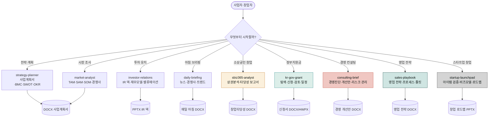
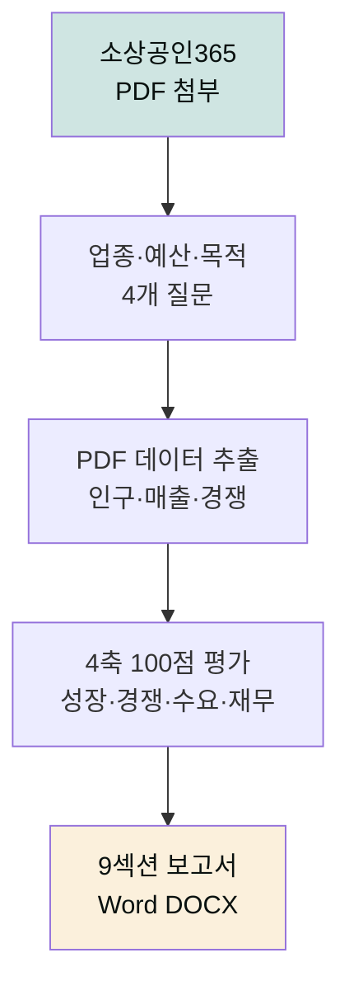
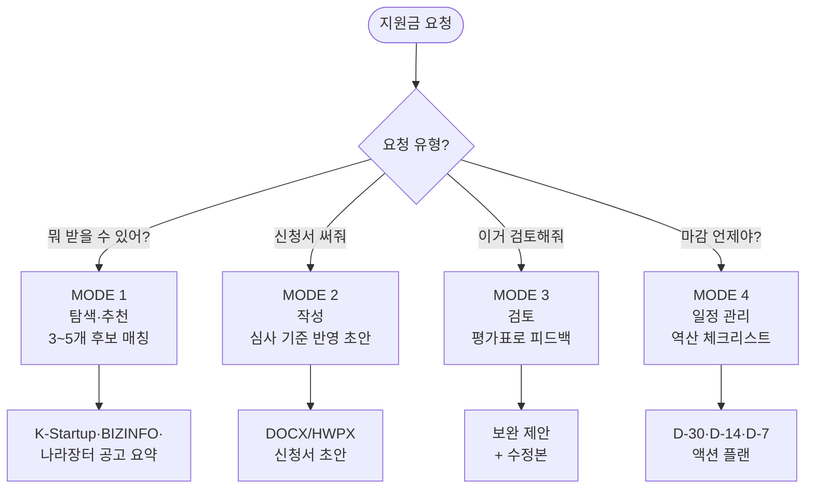
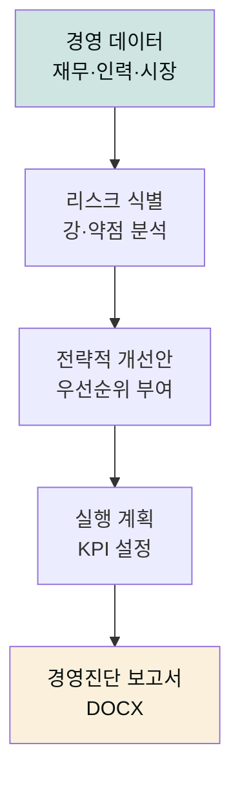
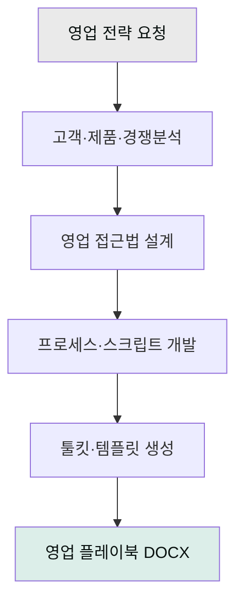
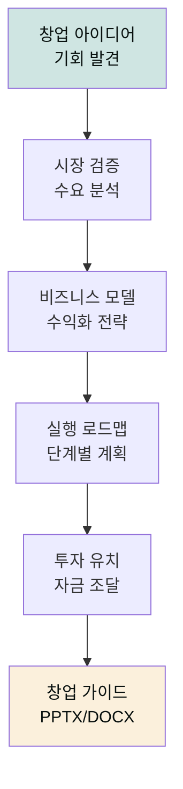

# moai-business

> 스타트업·소상공인·중소기업의 경영과 전략을 위한 **10개 스킬** 묶음입니다. 사업계획서·시장조사·재무모델·IR·투자제안서 + 상권분석·정부지원사업 통합 + 컨설팅·영업·창업 스킬까지 한 플러그인에서 처리합니다.

## 무엇을 하는 플러그인인가

사업계획서가 필요할 때, 정부 지원금 공고를 찾아야 할 때, 상권 분석 PDF를 받아 창업 타당성을 따져봐야 할 때 — `moai-business`는 그 전 과정을 한 플러그인 안에서 처리합니다. 창업자·기획자·투자 유치 팀·소상공인·지원금 신청자 등 다양한 역할의 사용자를 커버하도록 설계되었습니다.

`sbiz365-analyst`는 소상공인365 빅데이터 포털의 상권분석 PDF를 입력받아 4축 100점 평가와 9섹션 Word 보고서를 생성합니다. `kr-gov-grant`는 정부지원사업 **탐색·작성·검토·일정 관리** 4개 모드를 제공해 K-Startup·BIZINFO·중기부·나라장터·IITP 등 주요 기관의 공고를 연결합니다.

## 10개 스킬이 어떻게 연결되나요


```mermaid
flowchart TD
  User([사업자·창업자]) --> Q{무엇부터 시작할까?}

  Q -->|전략·계획| S1[strategy-planner<br/>사업계획서·BMC·SWOT·OKR]
  Q -->|시장 조사| S2[market-analyst<br/>TAM·SAM·SOM·경쟁사]
  Q -->|투자 유치| S3[investor-relations<br/>IR 덱·재무모델·밸류에이션]
  Q -->|아침 브리핑| S4[daily-briefing<br/>뉴스·경쟁사·트렌드]
  Q -->|소상공인 창업| S5[sbiz365-analyst<br/>상권분석·타당성 보고서]
  Q -->|정부지원금| S6[kr-gov-grant<br/>탐색·신청·검토·일정]
  Q -->|경영 컨설팅| S7[consulting-brief<br/>경영진단·개선안·리스크 관리]
  Q -->|영업 전략| S8[sales-playbook<br/>영업 전략·프로세스·툴킷]
  Q -->|스타트업 창업| S9[startup-launchpad<br/>아이템 검증·비즈모델·로드맵]

  S1 --> O1[(DOCX 사업계획서)]
  S2 --> O1
  S3 --> O2[(PPTX IR 덱)]
  S4 --> O3[(매일 아침 DOCX)]
  S5 --> O4[(창업타당성 DOCX)]
  S6 --> O5[(신청서 DOCX/HWPX)]
  S7 --> O6[(경영 개선안 DOCX)]
  S8 --> O7[(영업 전략 DOCX)]
  S9 --> O8[(창업 로드맵 PPTX)]

  style S5 fill:#fbf0dc,stroke:#c47b2a,color:#09110f
  style S6 fill:#dceee9,stroke:#2a8a8c,color:#09110f
  style S7 fill:#f0c7c2,stroke:#c44a3a,color:#09110f
  style S8 fill:#cfe5e2,stroke:#144a46,color:#09110f
  style S9 fill:#d4d4d4,stroke:#4c4c4c,color:#09110f
```

노란색·파란색·빨간색·초록색·회색 다섯 박스는 최근 추가된 스킬입니다 (sbiz365-analyst·kr-gov-grant·consulting-brief·sales-playbook·startup-launchpad). 나머지 6개는 검증된 기본 스킬입니다.

## 설치



1. `moai-core` 설치 후 `moai-business` 옆의 **+** 버튼을 눌러 설치합니다.
2. 최종 문서 저장용으로 `moai-office`도 함께 설치하는 것을 권장합니다.


[GitHub 저장소](https://github.com/modu-ai/cowork-plugins/tree/main/moai-business)를 클론한 뒤 `~/.claude/plugins/`에 배치합니다.



## 핵심 스킬 (9개)

| 스킬 | 한 줄 설명 | 누구에게 필요한가 |
|---|---|---|
| `strategy-planner` | 사업계획서, 린 캔버스, BMC, SWOT, OKR | 창업자·기획자 |
| `market-analyst` | TAM/SAM/SOM, 경쟁사 분석, 포지셔닝, 가격 전략 | PM·마케터 |
| `investor-relations` | Series A/B IR 덱, 재무 모델, 밸류에이션 | 투자 유치 준비 팀 |
| `daily-briefing` | 업계 뉴스·경쟁사·시장 동향 아침 브리핑 | 경영진·기획실 |
| `sbiz365-analyst` | 소상공인365 PDF → 상권분석·창업타당성 DOCX | 예비창업자·자영업자 |
| `kr-gov-grant` | 정부지원사업 탐색·신청서 작성·검토·마감 관리 | 모든 지원금 신청자 |
| `consulting-brief` | 경영진단, 개선안, 리스크 분석, 컨설팅 보고서 | 기업 컨설턴트·경영진 |
| `sales-playbook` | 영업 전략, 프로세스 설계, 툴킷, 스크립트 | 영업 팀장·개인 영업 |
| `startup-launchpad` | 아이템 검증, 비즈니스 모델, 창업 로드맵 | 예비 창업자·스타트업 |
| `real-estate-search` | 국토교통부(MOLIT) 실거래가/전월세 — 아파트·오피스텔·빌라·단독·상업용 | 부동산 투자·시장 분석가 |

## 신규 스킬 1 — `sbiz365-analyst` (소상공인 상권분석)

### 언제 쓰나요

"이 상가 위치에 카페를 차려도 괜찮을까?" 소상공인365 보고서를 받았는데 수치가 너무 많아 무엇이 중요한지 모를 때, 또는 창업 타당성을 문서로 정리해 가족이나 투자자에게 보여줘야 할 때 사용합니다.

### 준비물

[소상공인365 빅데이터 포털](https://bigdata.sbiz.or.kr)에서 원하는 지역·업종을 선택해 **상권분석 PDF**를 다운로드하면 됩니다.

### 실행 흐름


```mermaid
flowchart TD
  A[소상공인365<br/>PDF 첨부] --> B[업종·예산·목적<br/>4개 질문]
  B --> C[PDF 데이터 추출<br/>인구·매출·경쟁]
  C --> D[4축 100점 평가<br/>성장·경쟁·수요·재무]
  D --> E[9섹션 보고서<br/>Word DOCX]

  style A fill:#cfe5e2,color:#09110f
  style E fill:#fbf0dc,color:#09110f
```

**4축 100점 평가**는 다음과 같이 가중치가 설정됩니다.

| 축 | 가중치 | 평가 내용 |
|---|---|---|
| 성장성 | 30점 | 유동인구·매출 추이·상권 확장성 |
| 경쟁도 | 25점 | 경쟁 점포 수·포화도·대체재 |
| 수요 적합도 | 25점 | 타깃 인구·소득·소비 패턴 |
| 재무 타당성 | 20점 | 예상 매출·임대료·손익분기 |

## 신규 스킬 2 — `kr-gov-grant` (정부지원사업 통합)

### 언제 쓰나요

우리 회사에 맞는 정부 지원사업이 무엇인지 모를 때, 예비창업패키지 신청서를 써야 하는데 심사 기준이 막막할 때, 마감일과 필요 서류를 한 번에 정리하고 싶을 때, 또는 이미 초안을 썼는데 심사관 관점에서 검토가 필요할 때 사용합니다.

### 4개 MODE 구조


```mermaid
flowchart TD
  Start([지원금 요청]) --> Mode{요청 유형?}

  Mode -->|뭐 받을 수 있어?| M1[MODE 1<br/>탐색·추천<br/>3~5개 후보 매칭]
  Mode -->|신청서 써줘| M2[MODE 2<br/>작성<br/>심사 기준 반영 초안]
  Mode -->|이거 검토해줘| M3[MODE 3<br/>검토<br/>평가표로 피드백]
  Mode -->|마감 언제야?| M4[MODE 4<br/>일정 관리<br/>역산 체크리스트]

  M1 --> Out1[K-Startup·BIZINFO·<br/>나라장터 공고 요약]
  M2 --> Out2[DOCX/HWPX<br/>신청서 초안]
  M3 --> Out3[보완 제안<br/>+ 수정본]
  M4 --> Out4[D-30·D-14·D-7<br/>액션 플랜]
```

### 지원 범위

**8가지 신청자 유형**: 예비창업자 · 초기창업자(3년 이내) · 성장기 스타트업(3-7년) · 소상공인 · 중소중견기업 · 연구자 · 비영리단체·사회적기업 · 개인(프리랜서·청년·농업인)

**7가지 지원 목적**: 창업자금 · 사업화 · R&D 기술개발 · 시설장비·운영자금 · 마케팅·수출 · 인력채용·교육 · 공간·콘텐츠

**연결된 기관**: K-Startup(창진원), BIZINFO, 중기부, 나라장터, IITP, 문체부, 농식품부, 지자체 로컬크리에이터 등

### 신규 스킬 3 — `consulting-brief` (경영 컨설팅)

### 언제 쓰나요

경영 상태를 진단하거나 비즈니스 리스크 분석과 개선안이 필요할 때, 방대한 데이터를 경영진 보고서로 압축하거나 업계 벤치마킹을 성장 전략으로 연결할 때 사용합니다.

### 준비물

회사 재무 데이터·매출·시장 점유율 등 핵심 지표, 경영진이 고민하는 주요 이슈 목록, 경쟁사 정보 및 업계 동향을 준비하면 됩니다.

### 실행 흐름


```mermaid
flowchart TD
  A[경영 데이터<br/>재무·인력·시장] --> B[리스크 식별<br/>강·약점 분석]
  B --> C[전략적 개선안<br/>우선순위 부여]
  C --> D[실행 계획<br/>KPI 설정]
  D --> E[경영진단 보고서<br/>DOCX]

  style A fill:#cfe5e2,color:#09110f
  style E fill:#fbf0dc,color:#09110f
```

진단 분야는 재무 건전성(수익성·성장성·안정성), 운영 효율성(프로세스·인력·자원), 시장 경쟁력(브랜드·포지셔닝·고객 충성도), 내부 리스크 관리(인력·기술·재무)의 네 축으로 구성됩니다.

### 신규 스킬 4 — `sales-playbook` (영업 전략)

### 언제 쓰나요

영업 프로세스를 체계화하거나 새 영업 팀 구성에서 어디부터 시작할지 막막할 때, 고객별 스크립트가 필요하거나 영업 전략을 문서로 정리하고 싶을 때 사용합니다.

### 준비물

타깃 고객 프로파일, 제품·서비스 특징과 장점, 경쟁사 비교 자료, 이전 영업 사례 데이터를 미리 준비해 두면 더 빠르게 작성됩니다.

### 실행 흐름


```mermaid
flowchart TD
  Start[영업 전략 요청] --> Analysis[고객·제품·경쟁분석]
  Analysis --> Strategy[영업 접근법 설계]
  Strategy --> Process[프로세스·스크립트 개발]
  Process --> Tools[툴킷·템플릿 생성]
  Tools --> Output[영업 플레이북 DOCX]

  style Start fill:#eaeaea,color:#09110f
  style Output fill:#dceee9,color:#09110f
```

산출물은 고객 분류·타깃팅 전략, 단계별 영업 접근법, 스크립트·Q&A, 필요한 도구 및 템플릿으로 구성됩니다.

### 신규 스킬 5 — `startup-launchpad` (스타트업 창업)

### 언제 쓰나요

창업 아이디어를 검증받고 싶거나, 비즈니스 모델 설계·로드맵 수립, 또는 투자 유치 준비를 어디서부터 시작할지 모를 때 사용합니다.

### 준비물

창업 아이디어 개요, 시장 조사 결과, 예상 자원 인프라, 목표 고객 그룹을 준비하면 됩니다.

### 실행 흐름


```mermaid
flowchart TD
  A[창업 아이디어<br/>기회 발견] --> B[시장 검증<br/>수요 분석]
  B --> C[비즈니스 모델<br/>수익화 전략]
  C --> D[실행 로드맵<br/>단계별 계획]
  D --> E[투자 유치<br/>자금 조달]
  E --> F[창업 가이드<br/>PPTX/DOCX]

  style A fill:#cfe5e2,color:#09110f
  style F fill:#fbf0dc,color:#09110f
```

아이디어 검증(시장기회·문제 해결), 비즈니스 모델 설계(가치 제안·수익 모델), 실행 계획 수립(타임라인·자원 배분), 투자 유치 전략(피칭·밸류에이션) 순으로 진행됩니다.

### `kr-gov-grant` vs `moai-research:grant-writer` — 언제 어떤 걸 쓰나요

둘 다 "지원금 신청서"를 다루지만 대상 사업이 다릅니다.

| 구분 | `kr-gov-grant` (이 플러그인) | `moai-research:grant-writer` |
|---|---|---|
| 대상 사업 | 창업·사업화·수출·시설·마케팅 | 학술·R&D 연구과제 |
| 대표 기관 | K-Startup, BIZINFO, 중기부 | NRF(연구재단), IITP, KIAT |
| 주 이용자 | 창업자·소상공인·일반기업 | 연구자·교수·연구기관 |
| 문서 형식 | 사업계획서 중심 | 연구계획서·참고문헌 포함 |
| 심사 키워드 | 시장성·수익성·성장성 | 학술 기여도·연구방법론 |

## `real-estate-search` (국토부 실거래가)

국토교통부(MOLIT) 실거래가 신고 데이터를 기반으로 한국 아파트·오피스텔·연립다세대·단독다가구·상업업무용 부동산의 매매·전월세 시세를 조회합니다. 사업·투자 분석, 입지 검토, 자산 평가에 활용합니다.

### 사용 측 준비

- **사용자 측 API 키 불필요** — NomaDamas의 hosted 프록시(`k-skill-proxy.nomadamas.org`)가 `DATA_GO_KR_API_KEY`를 보유합니다.
- self-host가 필요하면 `KSKILL_PROXY_BASE_URL` 환경변수로 대체 가능.

### 지원 자산 타입

| 자산 | 매매 | 전월세 |
|---|:---:|:---:|
| 아파트 | ✅ | ✅ |
| 오피스텔 | ✅ | ✅ |
| 연립다세대 | ✅ | ✅ |
| 단독/다가구 | ✅ | ✅ |
| 상업업무용 | ✅ | — |

### 출처 어트리뷰션

본 스킬은 **NomaDamas/k-skill** (MIT) 의 `real-estate-search`를 cowork에 포팅했습니다. 원 저작자 설계 참고는 [`tae0y/real-estate-mcp`](https://github.com/tae0y/real-estate-mcp) 입니다.

- **공식 데이터 출처**: 국토교통부 실거래가 신고 데이터 (공공데이터포털 `DATA_GO_KR_API_KEY` 필요)
- **데이터 등록 페이지**: [공공데이터포털](https://www.data.go.kr) → 검색창에 "실거래가" 또는 "전월세" 입력 → 국토교통부 제공 endpoint 활용신청
- **취소된 거래**는 프록시 서버에서 자동 필터링됨 (NomaDamas k-skill 명세)

## 선택 연동

DART MCP를 연결하면 상장사 공시·재무 데이터를 자동으로 조회할 수 있습니다. 최종 문서 저장은 `moai-office`(DOCX·PPTX·XLSX·HWPX)가 담당하며, 공공데이터·KOSIS 통계가 필요하면 `moai-data`를 함께 설치하세요. 사업계획서·IR 덱용 다이어그램이나 썸네일은 `moai-media:nano-banana`로 생성합니다.

## 대표 체인

**사업계획서**

```text
strategy-planner → market-analyst → docx-generator → ai-slop-reviewer
```

**IR 덱**

```text
investor-relations → pptx-designer → ai-slop-reviewer
```

**상권분석 보고서 (신규)**

```text
sbiz365-analyst → docx-generator → ai-slop-reviewer
```

**정부지원사업 신청서 (신규)**

```text
kr-gov-grant → docx-generator (또는 hwpx-writer) → ai-slop-reviewer
```

**매일 아침 산업 브리핑** (예약 실행)

```text
daily-briefing → docx-generator
```

## 빠른 사용 예 (한 줄 요청 + 시스템 자동 인터뷰)

> 매번 옵션·요구사항을 직접 작성할 필요 없습니다. 짧은 한 줄로 요청하면 시스템이 단계·조달목표·타깃 등을 인터뷰로 수집합니다. ([사용 패턴 가이드](../../cowork/patterns/) 참조)


> AI 영어 회화 앱 사업계획서 만들어줘


→ 시스템 인터뷰: 시리즈·조달목표·타깃·형식·저장 경로 → 자동 체인 (`strategy-planner → docx-generator → ai-slop-reviewer`)


> Series A IR 덱 만들어줘


→ 멀티턴 패턴: 스토리라인 초안 제시 → 사용자 검토 → PPT 자동 생성. [IR 덱 쿡북](../../cookbook/ir-deck/) 참조.


> 홍대 상권 카페 창업 타당성 검토해줘


→ 시스템 인터뷰: 데이터 파일·예산·콘셉트 → `market-analyst → strategy-planner` 자동 체인


> 우리 팀에 맞는 정부지원사업 추천하고 신청서 초안 만들어줘


→ 시스템 인터뷰: 팀 단계·산업·매출·목적 → `kr-gov-grant` 자동 매칭 + 신청서 초안

## 다음 단계

- [`moai-office`](../moai-office/) — 최종 문서 포맷 담당
- [`moai-research`](../moai-research/) — 학술·R&D 과제는 이쪽으로

---

### Sources

- [modu-ai/cowork-plugins](https://github.com/modu-ai/cowork-plugins)
- [moai-business 디렉터리](https://github.com/modu-ai/cowork-plugins/tree/main/moai-business)
- [소상공인365 빅데이터 포털](https://bigdata.sbiz.or.kr)
- [K-Startup 창업지원 포털](https://www.k-startup.go.kr)
- [BIZINFO 기업지원플러스](https://www.bizinfo.go.kr)
- [NomaDamas/k-skill](https://github.com/NomaDamas/k-skill) — MIT — `real-estate-search` 원본
- [tae0y/real-estate-mcp](https://github.com/tae0y/real-estate-mcp) — MIT — 부동산 MCP 설계 참고
- [공공데이터포털 (국토부 실거래가)](https://www.data.go.kr) — 공식 데이터 출처
