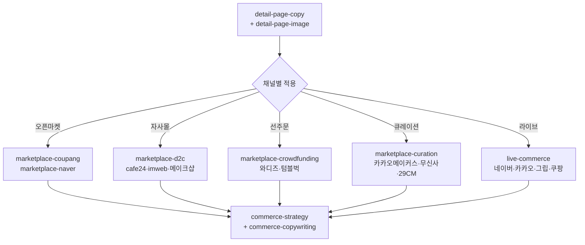

# moai-commerce

> 한국 이커머스 운영의 모든 단계를 한 플러그인 안에 담은 풀세트 플러그인입니다. 상세페이지 카피·이미지 합성부터 8개 판매 채널 가이드, 라이브 커머스, 통합 마케팅 전략까지 11개 스킬이 한 체인 안에서 동작합니다.

## 무엇을 하는 플러그인인가

`moai-commerce` (v1.8.0)는 한국 이커머스 셀러가 실제로 마주치는 작업 전부를 다룹니다.

- **상세페이지 자동화**: 13섹션 감정여정 카피(Hero→Pain→Problem→Story→Solution→How→Proof→Authority→Benefits→Risk→Compare→Filter→CTA) + 1080×12720 단일 PNG 자동 합성
- **8개 판매 채널 가이드**: 쿠팡, 네이버 스마트스토어/11번가/G마켓/옥션, 카페24/아임웹/메이크샵 자사몰, 와디즈/텀블벅 크라우드펀딩, 카카오 메이커스/무신사/29CM 큐레이션, 네이버·카카오·그립·쿠팡 라이브
- **통합 마케팅**: 채널 믹스 전략, 가격·프로모션 캘린더, 광고·톡톡·푸시·이메일 카피
- **상품 사진 분석**: ProductDNA 추출 + 부족한 컷 식별 + 추가 촬영 브리프

이미지 생성은 `moai-media:nano-banana`(Gemini 3 Image)로 위임하며, 합성은 Pillow 기반 자체 스크립트로 처리하므로 외부 패키지 설치가 필요 없습니다. 모든 텍스트 산출물은 `ai-slop-reviewer`로 자동 체이닝됩니다.

## 설치



1. `moai-core` 설치 후 `moai-commerce` 옆의 **+** 버튼을 눌러 설치합니다.
2. 이미지 합성을 사용하려면 `moai-media`도 설치하고 `GEMINI_API_KEY`를 등록합니다 ([CONNECTORS.md](https://github.com/modu-ai/cowork-plugins/blob/main/moai-media/CONNECTORS.md)).


[GitHub 저장소](https://github.com/modu-ai/cowork-plugins/tree/main/moai-commerce)를 클론한 뒤 `~/.claude/plugins/`에 배치합니다.



## 핵심 스킬 (11개)

| 스킬 | 역할 | 대표 출력 |
|---|---|---|
| `detail-page-copy` | 13섹션 감정여정 상세페이지 카피, 카테고리별 어조 분기 | 구조화 JSON + 마크다운 미리보기 |
| `detail-page-image` | 섹션별 이미지 프롬프트 → nano-banana → Pillow 합성 | 1080×12720 단일 PNG |
| `product-photo-brief` | ProductDNA 추출, 부족한 컷 식별, 추가 촬영 브리프 | 13섹션 컷 매핑 + 촬영 리스트 |
| `marketplace-coupang` | 쿠팡 정책·검색최적화·우수상품·로켓배송 가이드 | 채널 적합성 검토 |
| `marketplace-naver` | 네이버 스마트스토어 + 11번가/G마켓/옥션 통합 가이드 | 4개 오픈마켓 정책 적용 |
| `marketplace-d2c` | 카페24·아임웹·메이크샵 자사몰(D2C) 운영 가이드 | 도메인·결제·디자인·SEO 통합 |
| `marketplace-crowdfunding` | 와디즈·텀블벅·해피빈 크라우드펀딩 프로젝트 기획 | 페이지 카피·영상 시놉시스·리워드 |
| `marketplace-curation` | 카카오 메이커스·무신사·29CM 큐레이션 입점 가이드 | 입점 제안서 + 브랜드 콘셉트 정렬 |
| `live-commerce` | 네이버 쇼핑라이브·카카오·그립·쿠팡 라이브 가이드 | 30/60분 진행 스크립트 |
| `commerce-strategy` | 채널 믹스·가격·프로모션·리텐션·KPI 통합 전략 | 단계별(런칭/성장/안정) 전략 |
| `commerce-copywriting` | 광고·톡톡·푸시·이메일·카트이탈 카피 | 채널·길이·톤 맞춤 카피 |

## 주요 채널 커버리지



## 대표 체인

**상세페이지 풀 자동화 (이미지 포함)**

```text
detail-page-copy → detail-page-image → marketplace-coupang(또는 naver) → ai-slop-reviewer
```

**자사몰 신규 런칭**

```text
commerce-strategy → detail-page-copy → detail-page-image → marketplace-d2c → commerce-copywriting → ai-slop-reviewer
```

**크라우드펀딩 신상품 사전판매**

```text
product-photo-brief → marketplace-crowdfunding → detail-page-copy → ai-slop-reviewer
```

**라이브 방송 1회분**

```text
live-commerce → commerce-copywriting(라이브 카피) → ai-slop-reviewer
```

## 빠른 사용 예

```text
무선 이어폰 신상품 상세페이지 만들어줘.
- 카테고리: electronics
- 가격대: 7만 원대
- 핵심 USP: 노이즈 캔슬링, 60시간 배터리, 한국어 음성 명령
- 주요 채널: 쿠팡 + 네이버 스마트스토어 + 자사몰(카페24)
- 13섹션 카피 + 1080×12720 합성 이미지 + 채널별 적용본까지 한 번에
- 상품 사진은 ./photos/ 폴더에 5장 있음 — 부족한 컷이 있으면 촬영 브리프도 만들어줘
```

```text
와디즈에 사전판매할 휴대용 커피머신 프로젝트 페이지 기획해줘.
- 목표 금액: 5,000만원
- 펀딩 기간: 30일
- 리워드 5단계 구성, 메이커 등록 절차도 알려줘
```

## 큐텐 사태 후 채널 정책

[!] **티몬·위메프는 v1.8.0부터 가이드에서 제외**되었습니다. 2024년 큐텐(Qoo10) 인수 후 미정산 사태로 회생절차에 들어가, 한국 이커머스 셀러에게 권장하기 어려운 상태이기 때문입니다. 추후 정상화되면 재포함을 검토합니다.

## 다음 단계

- [`moai-content`](../moai-content/) — 블로그·뉴스레터 결합 콘텐츠 마케팅
- [`moai-media`](../moai-media/) — 추가 이미지·영상·음성 생성
- [`moai-marketing`](../moai-marketing/) — SEO 감사·캠페인 기획·성과 보고
- [`moai-business`](../moai-business/) — 사업계획서·시장조사·재무모델

---

### Sources

- [modu-ai/cowork-plugins README](https://github.com/modu-ai/cowork-plugins)
- [moai-commerce 디렉터리](https://github.com/modu-ai/cowork-plugins/tree/main/moai-commerce)
- 채널별 공식 가이드: 쿠팡 셀러센터, 네이버 스마트스토어 센터, 카페24 매뉴얼, 와디즈 메이커 가이드, 무신사 셀러 정책 등
