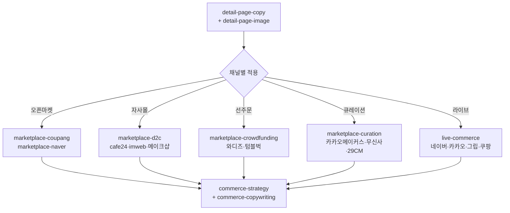

# moai-commerce

> 한국 이커머스 운영의 모든 단계를 한 플러그인 안에 담은 풀세트 플러그인입니다. **v2.3.0부터 "모두의 커머스 3일 마스터 캠프" V6 6도구가 추가**되어 시장조사·고객분석·상품명·NCM 메시지·통합 전략까지 자연어 한 줄 입력으로 자동 호출됩니다. 19개 스킬이 한 체인 안에서 동작합니다.

## 무엇을 하는 플러그인인가

`moai-commerce` (v2.3.0)는 한국 이커머스 셀러가 실제로 마주치는 작업 전부를 다룹니다.

- **상세페이지 자동화**: 13섹션 감정여정 카피(Hero→Pain→Problem→Story→Solution→How→Proof→Authority→Benefits→Risk→Compare→Filter→CTA) + 1080×12720 단일 PNG 자동 합성. **v2.3.0 강화** — `--mode diagnose`(7단계 진단 점수) / `--mode copy`(페르소나 2세트, 비율 25/50/25 강제)
- **V6 6도구 (v2.3.0 신규)**: 모두의 커머스 3일 마스터 캠프 Day 2 V6 7교시 구조 1:1 매핑 — 시장조사 4 MCP, JTBD 9 + 페르소나 3, 상품명 3안+검증, NCM 메시지 15종, 통합 전략 1장
- **Day 1 셋업 (v2.3.0 신규)**: 매장 운영 데이터 1줄 통합 — `commerce-morning-brief`(어제 주문·신규 문의·트렌드·ROAS 4영역) + `commerce-order-summary`(스마트스토어+카페24+아임웹 채널 통합)
- **5개 판매 채널 가이드**: 쿠팡, 네이버 스마트스토어/11번가/G마켓/옥션, 카페24/아임웹/메이크샵 자사몰, 와디즈/텀블벅 크라우드펀딩, 카카오 메이커스/무신사/29CM 큐레이션
- **통합 마케팅**: 채널 믹스 전략, 가격·프로모션 캘린더, 광고·톡톡·푸시·이메일 카피, 네이버·카카오·그립·쿠팡 라이브 커머스
- **상품 사진 분석**: ProductDNA 추출 + 부족한 컷 식별 + 추가 촬영 브리프
- **식약처 안전**: 의약품·식품 통합 조회 (e약은요·건강기능식품 인정현황·검사부적합·회수)

이미지 생성은 `moai-media:nano-banana`(Gemini 3 Image)·`media-gpt-image2-builder`(v2.3.0+ GPT Image 2)로 위임하며, 합성은 Pillow 기반 자체 스크립트로 처리하므로 외부 패키지 설치가 필요 없습니다. V6 6도구와 Day 1 셋업 스킬은 **MoAI-Commerce MCP Phase 1**(v2.4.0 출시 예정)을 호출합니다. 모든 텍스트 산출물은 `ai-slop-reviewer`로 자동 체이닝됩니다.

## 설치



1. `moai-core` 설치 후 `moai-commerce` 옆의 **+** 버튼을 눌러 설치합니다.
2. 이미지 합성을 사용하려면 `moai-media`도 설치하고 `GEMINI_API_KEY`를 등록합니다 ([CONNECTORS.md](https://github.com/modu-ai/cowork-plugins/blob/main/moai-media/CONNECTORS.md)).


[GitHub 저장소](https://github.com/modu-ai/cowork-plugins/tree/main/moai-commerce)를 클론한 뒤 `~/.claude/plugins/`에 배치합니다.



## 핵심 스킬 (19개)

### Day 1 셋업 (2) — v2.3.0 신규

| 스킬 | 역할 | 대표 출력 |
|---|---|---|
| `commerce-morning-brief` | MCP `dashboard_morning_brief` → 어제 주문·신규 문의·트렌드·ROAS 4영역 1줄 통합 | 매장 아침 브리핑 1줄 |
| `commerce-order-summary` | MCP `order_summary_today` → 스마트스토어 + 카페24 + 아임웹 채널 통합 신규 주문 1줄 | 채널 통합 주문 1줄 |

### Day 2 V6 6도구 (5 신규 + 1 강화) — v2.3.0

| 스킬 | V6 매핑 | 대표 출력 |
|---|---|---|
| `commerce-market-research` | ① 시장조사 (4 MCP wrapper) | 거시·경쟁·검색 3축 시장 리포트 1장 |
| `commerce-jtbd-persona` | ② 고객분석 (3 MCP wrapper) | `--mode jtbd`: JTBD 9개 / `--mode persona`: 페르소나 3명 8필드 |
| `detail-page-copy` **강화** | ③ 상세페이지 | 기본 13섹션 + `--mode diagnose`: 7단계 진단 / `--mode copy`: 페르소나 2세트 (비율 25/50/25) |
| `commerce-product-naming` | ④ 상품명 (3 MCP wrapper) | 상품명 3안(검색·CTR·브랜드) + 25자·금지어 검증 |
| `commerce-channel-message` | ⑤ 채널별 메시지 (2 MCP wrapper) | NCM(Need→Channel→Moment→Message→CTA) 검색·광고·CRM × 5종 = 15종 |
| `commerce-integrated-strategy` | ⑥ 통합 전략 (3 MCP wrapper) | 매출 향상 전략 1장 + 실행 우선순위 Top 3 |

### 상세페이지·사진 (2)

| 스킬 | 역할 | 대표 출력 |
|---|---|---|
| `detail-page-image` | 섹션별 이미지 프롬프트 → nano-banana → Pillow 합성 | 1080×12720 단일 PNG |
| `product-photo-brief` | ProductDNA 추출, 부족한 컷 식별, 추가 촬영 브리프 | 13섹션 컷 매핑 + 촬영 리스트 |

### 채널 가이드 (5)

| 스킬 | 역할 | 대표 출력 |
|---|---|---|
| `marketplace-coupang` | 쿠팡 정책·검색최적화·우수상품·로켓배송 가이드 | 채널 적합성 검토 |
| `marketplace-naver` | 네이버 스마트스토어 + 11번가/G마켓/옥션 통합 가이드 | 4개 오픈마켓 정책 적용 |
| `marketplace-d2c` | 카페24·아임웹·메이크샵 자사몰(D2C) 운영 가이드 | 도메인·결제·디자인·SEO 통합 |
| `marketplace-crowdfunding` | 와디즈·텀블벅 크라우드펀딩 프로젝트 기획 | 페이지 카피·영상 시놉시스·리워드 |
| `marketplace-curation` | 카카오 메이커스·무신사·29CM 큐레이션 입점 가이드 | 입점 제안서 + 브랜드 콘셉트 정렬 |

### 마케팅·전략·안전 (4)

| 스킬 | 역할 | 대표 출력 |
|---|---|---|
| `commerce-strategy` | 채널 믹스·가격·프로모션·리텐션·KPI 통합 전략 | 단계별(런칭/성장/안정) 전략 |
| `commerce-copywriting` | 광고·톡톡·푸시·이메일·카트이탈 카피 | 채널·길이·톤 맞춤 카피 |
| `live-commerce` | 네이버 쇼핑라이브·카카오·그립·쿠팡 라이브 가이드 | 30/60분 진행 스크립트 |
| `mfds-safety` | 식약처(MFDS) 의약품·식품 안전 통합 — e약은요·건강기능식품 인정현황·검사부적합·회수 (v2.0.0+) | Red flag 우선 안내 + API 조회 결과 |

## 주요 채널 커버리지



## 대표 체인

**v2.3.0 3일 캠프 풀 체인 (V6 6도구 + Day 3 광고 풀세트)**

```text
[Day 1]  commerce-morning-brief → commerce-order-summary → commerce-market-research
[Day 2]  commerce-jtbd-persona(jtbd) → commerce-jtbd-persona(persona)
         → detail-page-copy(diagnose) → commerce-product-naming
         → commerce-channel-message → commerce-integrated-strategy
[Day 3]  product-photo-brief → detail-page-copy(copy) → detail-page-image
         → moai-media:* (이미지·영상·음성·표기) → live-commerce
```

**상세페이지 풀 자동화 (이미지 포함, 기존)**

```text
detail-page-copy → detail-page-image → marketplace-coupang(또는 naver) → ai-slop-reviewer
```

**자사몰 신규 런칭**

```text
commerce-strategy → detail-page-copy → detail-page-image → marketplace-d2c → commerce-copywriting → ai-slop-reviewer
```

**크라우드펀딩 신상품 사전판매**

```text
product-photo-brief → marketplace-crowdfunding → detail-page-copy → ai-slop-reviewer
```

**라이브 방송 1회분**

```text
live-commerce → commerce-copywriting(라이브 카피) → ai-slop-reviewer
```

## 빠른 사용 예

```text
> 무선 이어폰 신상품 상세페이지 만들어줘.
  - 카테고리: electronics
  - 가격대: 7만 원대
  - 핵심 USP: 노이즈 캔슬링, 60시간 배터리, 한국어 음성 명령
  - 주요 채널: 쿠팡 + 네이버 스마트스토어 + 자사몰(카페24)
  - 13섹션 카피 + 1080×12720 합성 이미지 + 채널별 적용본까지 한 번에
  - 상품 사진은 ./photos/ 폴더에 5장 있음 — 부족한 컷이 있으면 촬영 브리프도 만들어줘
```

```text
> 와디즈에 사전판매할 휴대용 커피머신 프로젝트 페이지 기획해줘.
  - 목표 금액: 5,000만원
  - 펀딩 기간: 30일
  - 리워드 5단계 구성, 메이커 등록 절차도 알려줘
```

## v2.0.0 신규 — `mfds-safety` (식약처 의약품·식품 안전)

식품의약품안전처(MFDS) 공식 OpenAPI를 통해 의약품과 식품의 안전 정보를 통합 조회합니다. 헬스/F&B 커머스 상품 검수, 회수·부적합 이력 점검, 소비자 안전 안내에 활용합니다. 의약품 `mfds-drug-safety`와 식품 `mfds-food-safety`를 한 스킬로 통합했습니다.

### Red Flag 정책 (HARD)

사용자가 증상·복용/섭취 상황을 말하면 **반드시 인터뷰로 먼저 되묻고**, 다음 red flag 발견 시 API 조회보다 **즉시 119·응급실·의료진 안내**가 우선합니다.

- 호흡곤란, 의식저하, 입술·혀 붓기, 심한 발진
- 혈변, 심한 탈수, 심한 복통/고열, 지속되는 구토/흉통

본 스킬은 **진단·처방·복용 지시**를 하지 않습니다. 공식 문서에 있는 효능·주의·상호작용·기능성 문구만 근거로 요약합니다.

### 조회 가능 데이터 + 식품안전나라 서비스 코드

서비스 코드는 NomaDamas k-skill 명세 기준입니다. 식약처 통합 진입점은 [식의약 데이터 포털 (data.mfds.go.kr)](https://data.mfds.go.kr) 이며, 식품안전나라 OpenAPI는 [foodsafetykorea.go.kr/apiMain.do](https://www.foodsafetykorea.go.kr/apiMain.do) 에서 발급받습니다.

| 카테고리 | 서비스 코드 | 항목 |
|---|---|---|
| 의약품 | (data.go.kr) | e약은요(효능·사용법·주의사항·상호작용), 안전상비의약품 |
| 건강기능식품 — 기능성 원료 | I-0040 | 기능성 원료 인정현황 |
| 건강기능식품 — 개별인정형 | I-0050 | 개별 인정 원료의 1일 섭취량·기능성·주의사항 |
| 건강기능식품 — 품목제조 신고 | I0030 | 신고된 제품의 원재료·기능성·기준규격 |
| 검사부적합 (국내) | I2620 | 국내 유통 식품 부적합 판정 이력 |
| 회수·판매중지 | I0490 | 식품안전나라 공개 회수 목록 |

### 사용 측 준비

- **사용자 측 API 키 불필요** — NomaDamas hosted 프록시가 `DATA_GO_KR_API_KEY`, `FOODSAFETYKOREA_API_KEY` 보유
- self-host가 필요하면 `KSKILL_PROXY_BASE_URL` 환경변수로 대체

### 출처 어트리뷰션

본 스킬은 **NomaDamas/k-skill** (MIT) 의 `mfds-drug-safety`와 `mfds-food-safety`를 통합 포팅했습니다. 공식 데이터 출처:

- [식품의약품안전처](https://www.mfds.go.kr)
- [식품안전나라 OpenAPI](https://www.foodsafetykorea.go.kr)
- [공공데이터포털](https://www.data.go.kr)

## 다음 단계

- [`moai-content`](../moai-content/) — 블로그·뉴스레터 결합 콘텐츠 마케팅
- [`moai-media`](../moai-media/) — 추가 이미지·영상·음성 생성
- [`moai-marketing`](../moai-marketing/) — SEO 감사·캠페인 기획·성과 보고
- [`moai-business`](../moai-business/) — 사업계획서·시장조사·재무모델

---

### Sources

- [modu-ai/cowork-plugins README](https://github.com/modu-ai/cowork-plugins)
- [moai-commerce 디렉터리](https://github.com/modu-ai/cowork-plugins/tree/main/moai-commerce)
- 채널별 공식 가이드: 쿠팡 셀러센터, 네이버 스마트스토어 센터, 카페24 매뉴얼, 와디즈 메이커 가이드, 무신사 셀러 정책 등
- [NomaDamas/k-skill](https://github.com/NomaDamas/k-skill) — MIT — `mfds-drug-safety`, `mfds-food-safety` 원본 (v2.0.0, 통합)
- [식의약 데이터 포털 (data.mfds.go.kr)](https://data.mfds.go.kr) — 식약처 OpenAPI 통합 진입점
- [식품안전나라 OpenAPI (foodsafetykorea.go.kr/apiMain.do)](https://www.foodsafetykorea.go.kr/apiMain.do) — 키 발급
- [공공데이터포털 (data.go.kr)](https://www.data.go.kr) — e약은요·안전상비의약품·부적합 식품 API
