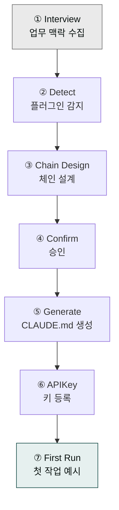

# moai-core

> `cowork-plugins` 전체의 기반이 되는 코어 플러그인입니다. **다른 플러그인을 사용하기 전에 반드시 먼저 설치**하세요.

## 무엇을 하는 플러그인인가

새 프로젝트를 시작할 때마다 "어떤 스킬을 어떤 순서로 써야 하지?"를 매번 다시 생각해야 한다면 생산성이 뚝 떨어집니다. `moai-core`는 그 반복을 없애기 위해 존재합니다. `cowork-plugins` 마켓플레이스 전체가 공유하는 인프라 역할을 하며, **총 8개 스킬**이 포함되어 있습니다.

`/project init` 하나로 설치된 `moai-*` 플러그인을 자동 감지해 산출물별 스킬 체인을 설계하고, 200라인 이내의 `CLAUDE.md`를 프로젝트 루트에 생성합니다. 이후 모든 자연어 요청은 이 파일을 기준으로 라우팅됩니다.

글을 쓰다 보면 AI 특유의 패턴이 남기 마련입니다. "혁신적인", "획기적인" 같은 과장된 수식어나 "첫째, 둘째, 마지막으로"처럼 기계적으로 반복되는 접속어가 대표적입니다. `ai-slop-reviewer`는 블로그·뉴스레터·계약서·사업계획서·이메일 등 모든 한국어 텍스트 산출물의 체인 마지막 단계에서 자동으로 호출되어 이런 패턴을 진단하고 사람 톤으로 다듬어줍니다. 버그나 기능 요청이 생기면 `feedback` 스킬이 GitHub Issues로 직접 등록하고, Drive·Notion·Higgsfield·OpenAI 4커넥터 인증이 막힐 때는 `mcp-connector-setup`이 환경변수 설정부터 트러블슈팅까지 안내합니다.

## 설치



1. Cowork에서 `modu-ai/cowork-plugins` 마켓플레이스를 추가합니다.
2. `moai-core` 옆의 **+** 버튼을 눌러 설치합니다.


[GitHub 저장소](https://github.com/modu-ai/cowork-plugins/tree/main/moai-core)를 클론한 뒤 `~/.claude/plugins/`에 배치합니다.



## 핵심 스킬 (8개)

| 스킬 | 용도 | 자동 호출 트리거 |
|---|---|---|
| `project` | 프로젝트 초기화·상태·API 키·카탈로그 관리 (`/project init`, `/project status`, `/project apikey`, `/project catalog`) | "프로젝트 초기화", "CLAUDE.md 만들어줘" |
| `ai-slop-reviewer` | 텍스트 산출물의 AI 패턴 진단·수정 | "AI 티 나는 부분 고쳐줘", "사람이 쓴 것처럼 수정해줘" |
| `feedback` | 버그 리포트·기능 요청을 GitHub Issues로 자동 등록 | "/project feedback", "버그 신고", "기능 요청" |
| `ai-diagnostic` | AI 시스템 진단, 성능 모니터링, 오류 분석 | "AI 동작이 이상해", "성능 체크해줘" |
| `mcp-connector-setup` | Drive·Notion·Higgsfield·OpenAI **4커넥터** 인증·환경변수·트러블슈팅. Windows MAX_PATH·한글 파일명 30자·`computer://` 링크 오류 대응. 모두의 커머스 캠프 Day 1 S4 셋업 합격 기준(4커넥터 모두 1회 호출 성공) | "MCP 커넥터 연결", "Drive 인증 방법", "Higgsfield 키 발급", "Windows MAX_PATH 오류" |
| `skill-builder` | 새 스킬 생성, 기존 스킬 수정, 스킬 템플릿 관리 (v1.5.x: skill-forge 후속) | "새 스킬 만들어줘", "스킬 템플릿 제공해줘", "/harness" |
| `skill-template` | 스킬 구조 템플릿, 프롬프트 엔지니어링 가이드 | "스킬 구조 알려줘", "템플릿 참고할게" |
| `skill-tester` | 스킬 테스트, 검증, 품질 보증 | "이 스킬 테스트해줘", "검증 프로세스 설계해줘" |

## `/project init` 흐름 (3분)



1. **Interview** — 최대 3개 질문으로 이번 프로젝트의 업무 맥락 수집 (이름·회사는 묻지 않음)
2. **Detect** — 설치된 `moai-*` 플러그인 자동 감지
3. **Chain Design** — 산출물별 스킬 체인 설계 (예: 사업계획서 → `strategy-planner → docx-generator → ai-slop-reviewer`)
4. **Confirm** — AskUserQuestion으로 체인 설계 최종 승인
5. **Generate** — `CLAUDE.md` 자동 생성 (200라인 이내)
6. **APIKey** — 선택된 플러그인이 요구하는 키만 프로젝트 격리 저장
7. **First Run** — 첫 작업 예시 3개 제안

## `ai-slop-reviewer` 이해하기

AI가 작성한 글에는 공통된 패턴이 있습니다. "혁신적인", "획기적인", "업계 최고의" 같은 과장된 수식어, "첫째·둘째·마지막으로"가 과하게 반복되는 기계적 접속어, "많은 사람들은…" 식의 모호한 일반화, 그리고 불필요한 요약 반복이 대표적입니다.

`ai-slop-reviewer`는 이런 패턴을 **진단**하고 **수정 텍스트**를 제시한 뒤 **주요 변경사항**을 리포트로 남깁니다. `cowork-plugins`의 모든 텍스트 스킬 체인은 이 단계로 종료하는 것을 권장합니다.

## 대표 체인

```text
(도메인 스킬)
  → (포맷 변환 스킬, 예: docx-generator)
  → ai-slop-reviewer   ← 필수
```

코드·데이터·차트 같은 **비텍스트 산출물**은 `ai-slop-reviewer`를 스킵합니다.

## 빠른 사용 예

```text
/project init
```

```text
이 블로그 글에서 AI 티 나는 부분 고쳐줘.
```

```text
MCP 커넥터 4개 연결 방법 알려줘 — Drive·Notion·Higgsfield·OpenAI
```
→ `mcp-connector-setup` 🆕

## `mcp-connector-setup`

"모두의 커머스 3일 마스터 캠프" Day 1 S4 (14:00–14:50) 셋업 시간에 수강생이 Drive·Notion·Higgsfield·OpenAI 4커넥터를 Cowork에 연결하는 단계별 가이드입니다. 합격 기준은 **4커넥터 모두 인증 성공 + 1회 호출 성공**입니다 (PDF §4.4 ③).

연결 과정에서 흔히 막히는 지점들을 미리 담아 두었습니다. Windows MAX_PATH(260자 제한) 오류, 한글 파일명 30자 초과 오류, `computer://` 링크가 열리지 않는 경우, API 키 만료·rate limit·OAuth 토큰 갱신, 그리고 Higgsfield Secret Key 발급 절차(워크스페이스 사전 비용 충전 1.5배 권장)까지 커버합니다.

## 다음 단계

- [빠른 시작](../quick-start/) — 실제 프로젝트 초기화 전 과정
- [Cowork 플러그인 사용](../../cowork/plugins/)

---

### Sources

- [modu-ai/cowork-plugins README](https://github.com/modu-ai/cowork-plugins)
- [moai-core 디렉터리](https://github.com/modu-ai/cowork-plugins/tree/main/moai-core)
