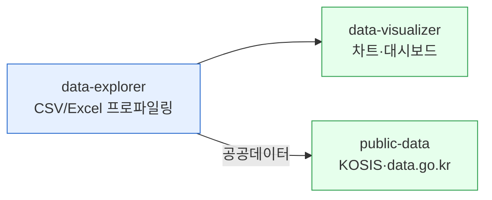

# moai-data

> CSV·Excel 탐색부터 공공데이터·통계청 API까지 3개 스킬을 제공합니다.



## 무엇을 하는 플러그인인가

`moai-data` (v1.5.0)는 업로드한 CSV·Excel 파일의 프로파일링과 결측값·이상값·상관관계 분석, 공공데이터포털(data.go.kr)과 KOSIS 통계청 OpenAPI 호출, Mermaid·Chart.js 기반 인터랙티브 차트와 대시보드 HTML 생성까지 데이터 실무를 자동화합니다.

## 설치



1. `moai-core` 설치 후 `moai-data` 옆의 **+** 버튼을 눌러 설치합니다.
2. (선택) 공공데이터 조회용 API 키를 `.moai/credentials.env`에 등록합니다.


[GitHub 저장소](https://github.com/modu-ai/cowork-plugins/tree/main/moai-data)를 클론한 뒤 `~/.claude/plugins/`에 배치합니다.



## 핵심 스킬

| 스킬 | 용도 |
|---|---|
| `data-explorer` | CSV/Excel 프로파일링, 결측값·이상값·상관관계 |
| `public-data` | 공공데이터포털(data.go.kr)·KOSIS 통계청 OpenAPI |
| `data-visualizer` | Mermaid·Chart.js 인터랙티브 차트, 대시보드 |

## 필수 API 키 (선택)

| 변수 | 용도 | 발급처 |
|---|---|---|
| `DATA_GO_KR_KEY` | 공공데이터포털 | [data.go.kr](https://www.data.go.kr) |
| `KOSIS_KEY` | 통계청 OpenAPI | [KOSIS](https://kosis.kr) |

## 대표 체인

**데이터 탐색 보고서**

```text
data-explorer → data-visualizer → docx-generator
```

**공공통계 분석**

```text
public-data → data-explorer → xlsx-creator
```

**대시보드 HTML**

```text
data-visualizer  (HTML + Chart.js 단독)
```

(숫자·차트이므로 `ai-slop-reviewer` 생략)

## 빠른 사용 예

```text
> KOSIS에서 최근 10년 서울 1인 가구 추이 가져와서 라인차트 만들어줘.
```

```text
> customers.csv에서 이상값 찾고 데이터 품질 보고서 만들어줘.
```

## 다음 단계

- [`moai-business`](../moai-business/) — 전략 분석과 결합
- [`moai-office`](../moai-office/) — 최종 문서화

---

### Sources

- [modu-ai/cowork-plugins](https://github.com/modu-ai/cowork-plugins)
- [moai-data 디렉터리](https://github.com/modu-ai/cowork-plugins/tree/main/moai-data)
