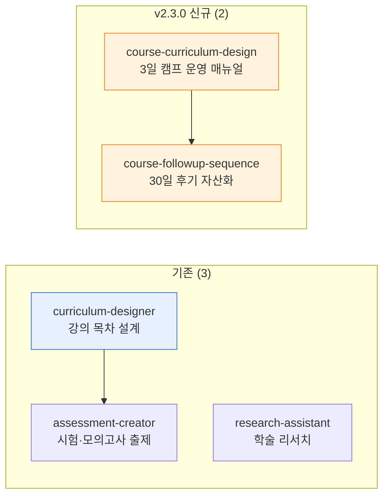

# moai-education

> 강의 설계부터 시험 출제, **3일 21세션 캠프 운영 실무**(v2.3.0+)까지 교육 실무 5개 스킬을 제공합니다.



## 무엇을 하는 플러그인인가

`moai-education` (v2.3.0)는 온라인 강의 목차·학습 목표·역량 갭 분석, 시험·퀴즈·모의고사, 자격증·공무원 시험 대비 문항, 학술 리서치·문헌 검토·논문 구조부터 **모두의 커머스 3일 마스터 캠프 같은 본 캠프 운영 실무 매뉴얼**(시간표·강사 동선·D-7 사전 준비물·리스크 Plan B), **강의 후 30일 후기 자산화 시퀀스**(D+1·D+3·D+7·D+14·D+30 카피 5종)까지 교육 콘텐츠 제작과 운영 전반을 자동화합니다.

## 설치



1. `moai-core` 설치 후 `moai-education` 옆의 **+** 버튼을 눌러 설치합니다.


[GitHub 저장소](https://github.com/modu-ai/cowork-plugins/tree/main/moai-education)를 클론한 뒤 `~/.claude/plugins/`에 배치합니다.



## 핵심 스킬 (5개)

### 기존 (3) — 강의 설계·시험 출제·학술 리서치

| 스킬 | 용도 |
|---|---|
| `curriculum-designer` | 온라인 강의 목차·학습 목표·역량 갭 분석, 외국어 학습 전략 |
| `assessment-creator` | 시험·퀴즈·모의고사, 자격증·공무원 대비 |
| `research-assistant` | 학술 리서치, 문헌 검토, 논문 구조 |

### v2.3.0 신규 (2) — 본 캠프 운영 실무

| 스킬 | 용도 | 출력 |
|---|---|---|
| `course-curriculum-design` | 3일 21세션 시간표 + 강사·조교 동선표 + D-7 사전 준비물 + 리스크 Plan B 5건+ | `moai-office:docx-generator` 자동 체이닝 → Word(.docx) |
| `course-followup-sequence` | 강의 후 30일 후기 카피 5종(D+1·D+3·D+7·D+14·D+30) + 인센티브 + 자산화 시퀀스 + SUNO BGM·MCP Phase 1 직접 호출 가이드 | 후기 카피 5종 + 자산화 매뉴얼 |

## 대표 체인

**강의 커리큘럼 + 교안 (기존)**

```text
curriculum-designer → docx-generator → pptx-designer → ai-slop-reviewer
```

**자격증 모의고사 키트 (기존)**

```text
assessment-creator → xlsx-creator(문제지) → docx-generator(해설)
```

**3일 캠프 운영 풀 체인 (v2.3.0 신규)**

```text
[D-30]  course-curriculum-design → moai-office:docx-generator(.docx 운영 매뉴얼)
[D-7]   moai-core:mcp-connector-setup (4커넥터 인증)
[D-1]   course-curriculum-design (시간표·동선표 출력)
[D+0]   Day 1 셋업 → Day 2 V6 6도구 → Day 3 광고 풀세트
[D+1~D+30]  course-followup-sequence → moai-content:copywriting
              → ai-slop-reviewer → moai-content:korean-spell-check
```

## 빠른 사용 예

```text
"ChatGPT 실무 활용" 8주 과정 커리큘럼 짜줘. 시수 16시간, 중급자 대상.
```
→ `curriculum-designer`

```text
> 정보처리기사 실기 모의고사 50문항 + 해설 만들어줘.
```
→ `assessment-creator`

```text
> "모두의 커머스 3일 마스터 캠프" 운영 매뉴얼 만들어줘
> — 21세션, 강사+조교 1명, D-7 사전 준비물 메일까지
```
→ `course-curriculum-design` 🆕

```text
> 캠프 종료 후 D+1·D+3·D+7·D+14·D+30 후기 카피 시퀀스 만들어줘
> — 후기 인센티브 + 30일 자산화 + SUNO BGM 가이드 포함
```
→ `course-followup-sequence` 🆕

## 다음 단계

- [`moai-research`](../moai-research/) — 학술 리서치 결합
- [`moai-content`](../moai-content/) — 강의 홍보 콘텐츠 + 30일 후기 카피 후처리
- [`moai-commerce`](../moai-commerce/) — Day 2 V6 6도구 (캠프 Day 2 연계)
- [`moai-media`](../moai-media/) — Day 3 광고 풀세트 (캠프 Day 3 연계)
- [`moai-core`](../moai-core/) — MCP 4커넥터 인증 셋업 (캠프 Day 1 셋업)

---

### Sources

- [modu-ai/cowork-plugins](https://github.com/modu-ai/cowork-plugins)
- [moai-education 디렉터리](https://github.com/modu-ai/cowork-plugins/tree/main/moai-education)
- [SPEC-CAMP-FOLLOWUP-006](https://github.com/modu-ai/cowork-plugins/blob/main/.moai/specs/SPEC-CAMP-FOLLOWUP-006/spec.md) — 30일 후기 자산화 시퀀스 EARS 요구사항
