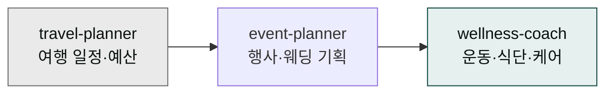

# moai-lifestyle

> 개인 일상과 이벤트 기획을 위한 3개 스킬을 제공합니다.



## 무엇을 하는 플러그인인가

여행 계획을 세울 때마다 맛집·숙소·이동 동선·예산을 직접 조합하는 데 시간을 쏟거나, 50명 규모 워크샵 기획서와 체크리스트를 처음부터 작성해야 하는 일이 반복됩니다. 운동 루틴이나 월간 식단 플랜도 목표와 일정에 맞게 짜려면 생각보다 손이 많이 갑니다. 결국 하고 싶은 것보다 준비 작업에 더 오랜 시간이 걸리죠.

`moai-lifestyle`은 이런 개인 일상 영역의 기획·설계를 자동화합니다. 가족 여행 일정과 예산표, 행사·워크샵·웨딩 기획서와 타임라인, 운동 루틴·식단·육아·시니어 케어 플랜까지 3개 스킬이 처리합니다. 부동산 수익률 계산이나 사이드 프로젝트 검토도 `travel-planner` 스킬 안에서 함께 다룰 수 있습니다.

## 설치



1. `moai-core` 설치 후 `moai-lifestyle` 옆의 **+** 버튼을 눌러 설치합니다.


[GitHub 저장소](https://github.com/modu-ai/cowork-plugins/tree/main/moai-lifestyle)를 클론한 뒤 `~/.claude/plugins/`에 배치합니다.



## 핵심 스킬

| 스킬 | 용도 |
|---|---|
| `travel-planner` | 여행 일정·맛집·숙소·예산, 부동산 수익률, 사이드 프로젝트 |
| `event-planner` | 행사·워크샵·웨딩 준비, 예산·타임라인 |
| `wellness-coach` | 운동 루틴, 식단, 육아, 시니어 케어 |

## 대표 체인

**여행 일정표**

```text
travel-planner → xlsx-creator(예산표) → docx-generator(일정표)
```

**이벤트 기획**

```text
> event-planner → docx-generator(기획서) → xlsx-creator(체크리스트)
```

**웰니스 플랜**

```text
wellness-coach → docx-generator(월간 플랜) → ai-slop-reviewer
```

## 빠른 사용 예

```text
제주 3박 4일 가족 여행(아이 7세) 일정 짜줘. 예산 150만원, 렌트카 포함.
```

```text
> 50명 규모 회사 워크샵 하루 프로그램 기획해줘. 팀빌딩 위주.
```

## 다음 단계

- [`moai-business`](../moai-business/) — 부업·사이드 프로젝트 기획
- [`moai-finance`](../moai-finance/) — 개인 재무

---

### Sources

- [modu-ai/cowork-plugins](https://github.com/modu-ai/cowork-plugins)
- [moai-lifestyle 디렉터리](https://github.com/modu-ai/cowork-plugins/tree/main/moai-lifestyle)
