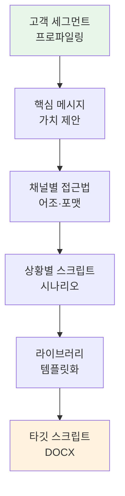

# moai-marketing

> 퍼스널·기업 브랜딩부터 퍼포먼스 마케팅까지 8개 스킬을 제공합니다.

## 무엇을 하는 플러그인인가

`moai-marketing` (v1.5.1)는 브랜드 아이덴티티 설계부터 SEO 감사, 이메일 드립 캠페인, GA4·메타·카카오모먼트 통합 ROAS 분석까지 마케팅 실무 전 주기를 커버하는 플러그인입니다. 네이버·구글·생성형 검색(GEO)을 모두 포함한 한국 시장 SEO 감사, 정보통신망법을 준수하는 이메일 시퀀스 설계 등 국내 규제·채널 특성을 반영합니다.

## 설치



1. `moai-core` 설치 후 `moai-marketing` 옆의 **+** 버튼을 눌러 설치합니다.


[GitHub 저장소](https://github.com/modu-ai/cowork-plugins/tree/main/moai-marketing)를 클론한 뒤 `~/.claude/plugins/`에 배치합니다.



## 핵심 스킬 (8개)

| 스킬 | 용도 |
|---|---|
| `brand-identity` | 네이밍·슬로건·톤앤매너·비주얼 가이드 |
| `personal-branding` | 전문가 포지셔닝, 링크드인·브런치·유튜브 전략 |
| `sns-content` | 인스타·네이버 블로그·카카오 브랜드 보이스 콘텐츠 |
| `campaign-planner` | 마케팅 캠페인·그로스해킹·인플루언서·상세페이지 |
| `seo-audit` | 네이버·구글·AI(GEO) 통합 SEO 감사 |
| `email-sequence` | 정보통신망법 준수 드립 캠페인·온보딩 시퀀스 |
| `performance-report` | GA4·네이버·메타·카카오모먼트 채널별 ROAS 분석 |
| `target-script` (v1.5.1 신규) | 타깃 고객 스크립트, 맞춤형 메시지, 세그먼트별 콘텐츠 |

## 대표 체인

**브랜드 런칭 세트**

```text
brand-identity → personal-branding (선택) → copywriting → ai-slop-reviewer
```

**SEO 리뉴얼**

```text
seo-audit → blog(재작성) → ai-slop-reviewer
```

**월간 성과 보고서**

```text
performance-report → xlsx-creator → docx-generator
```

### 신규 스킬 — `target-script` (타깃 스크립트)

#### 언제 쓰나요

- "특정 고객 그룹을 위한 맞춤형 스크립트를 만들고 싶어"
- "다양한 채널별 메시지를 체계화하고 싶어"
- "고객 세그먼트별 차별화된 콘텐츠를 개발해야 해"
- "영업이나 CS 팀을 위한 스크립트 라이브러리를 구축하고 싶어"

#### 준비물

- 타깃 고객 프로파일 (인구통계, 심리, 행동)
- 제품/서비스 핵심 가치 제안
- 경쟁사 메시지 분석
- 이전 고객 반응 데이터

#### 실행 흐름



**주요 특징**:
- 세분화된 고객 그룹별 맞춤 메시지
- 다양한 채널(이메일, SNS, CS, 영업)별 최적화
- 상황별 대응 시나리오 포함
- A/B 테스트용 다양한 버전 제공
- 지속적인 개선 및 업데이트 가이드

#### 빠른 사용 예

```text
> 30대 여성을 위한 뷰티 제품 영업 스크립트 5가지 버전 만들어줘. 핵심은 자연 유기 성분이야.
```

```text
> B2B 고객사별 맞춤 프레젠테이션 오프닝 스크립트 3종 제작해줘. IT 매니저와 C레벌용으로 분류.
```

## 빠른 사용 예

```text
> 친환경 생활용품 D2C 브랜드 아이덴티티 설계해줘. 20대 후반 여성 타깃.
```

```text
> 지난달 네이버·메타·카카오 광고 ROAS 통합 분석해서 경영진 보고서 만들어줘.
```

## 다음 단계

- [`moai-content`](../moai-content/) — 카피·블로그 본문 생성
- [`moai-media`](../moai-media/) — 광고 이미지·영상

---

### Sources

- [modu-ai/cowork-plugins](https://github.com/modu-ai/cowork-plugins)
- [moai-marketing 디렉터리](https://github.com/modu-ai/cowork-plugins/tree/main/moai-marketing)
