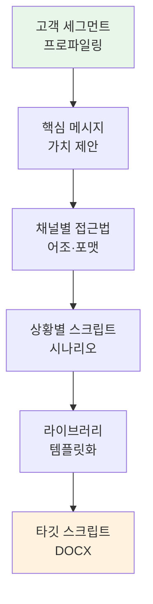

# moai-marketing

> 퍼스널·기업 브랜딩부터 퍼포먼스 마케팅까지 11개 스킬을 제공합니다. v2.4.0부터 광고 심리학 완전판·랜딩 페이지 CVR 진단·메타·구글 픽셀 검증이 추가되었고, v2.5.0부터 메타 광고 보고서 분석기 + 자체 audit MCP 서버 인프라가 추가되었습니다.

## 무엇을 하는 플러그인인가

`moai-marketing` (v2.5.0)는 브랜드 아이덴티티 설계부터 SEO 감사, 이메일 드립 캠페인, GA4·메타·카카오모먼트 통합 ROAS 분석, 메타 광고관리자 `.xlsx` 보고서 audit까지 마케팅 실무 전 주기를 커버하는 플러그인입니다. 네이버·구글·생성형 검색(GEO)을 모두 포함한 한국 시장 SEO 감사, 정보통신망법을 준수하는 이메일 시퀀스 설계, 한국 시장 7 변화 영역(벤치마크·8 산업·5 규제·표현·출력·분석 차원·사용자 그룹) 특화 audit 등 국내 규제·채널 특성을 반영합니다.

**v2.5.0 신규** — 메타 광고관리자 `.xlsx` 보고서 1~6개 업로드 → 9 분석 모듈(퍼널·KPI·차원·매트릭스·누수·라이프사이클·학습·예산·시뮬) + 4D 교차(광고×지면×연령×성별) + 3 사용자 그룹 톤(명시 입력) + 4 출력 형식(HTML/DOCX/PPTX/MD) + 🟢🟡🔴 강도별 액션 옵션(`meta-ads-analyzer`)을 추가했습니다. 동시에 `mcp-servers/moai-ads-audit/` 자체 MCP 서버(Python uvx, MIT)를 신규 출시 — [agricidaniel/claude-ads](https://github.com/AgriciDaniel/claude-ads) v1.5.1 (MIT, 4,815 stars) 방법론을 한국 시장에 맞춰 차용한 50-check audit + 가중치 스코어링 + 한국 벤치마크 8 카테고리 + 5 규제 컴플라이언스를 제공합니다.

**v2.4.0 신규** — 광고 심리학 완전판(9 인지편향·6 방아쇠·PAS·후크 6종)을 `campaign-planner`에 통합하고, 랜딩 페이지 CTR/CVR 분기·불안해소 처방(`landing-page-conversion-audit`)과 메타·구글 픽셀·CAPI·Lookalike 씨앗 품질 검증(`pixel-audit`)을 신규 추가했습니다.

## 설치



1. `moai-core` 설치 후 `moai-marketing` 옆의 **+** 버튼을 눌러 설치합니다.


[GitHub 저장소](https://github.com/modu-ai/cowork-plugins/tree/main/moai-marketing)를 클론한 뒤 `~/.claude/plugins/`에 배치합니다.



## 핵심 스킬 (11개)

| 스킬 | 용도 | 신규 |
|---|---|---|
| `brand-identity` | 네이밍·슬로건·톤앤매너·비주얼 가이드 | — |
| `personal-branding` | 전문가 포지셔닝, 링크드인·브런치·유튜브 전략 | — |
| `sns-content` (강화 v2.4) | 인스타·네이버 블로그·카카오 브랜드 보이스 콘텐츠 + 글로벌 4채널(스레드·X·링크드인·유튜브쇼츠) + 채널별 심리 상태 매트릭스 | — |
| `campaign-planner` (강화 v2.4) | 마케팅 캠페인·그로스해킹·인플루언서 + 광고 심리학 완전판(성과 공식·3 동기·6 방아쇠·9 편향·PAS·후크 6종·영상 30초·타겟 온도×3동기 매트릭스·CAC/LTV·단계별 예산 배분) | — |
| `seo-audit` | 네이버·구글·AI(GEO) 통합 SEO 감사 | — |
| `email-sequence` | 정보통신망법 준수 드립 캠페인·온보딩 시퀀스 | — |
| `performance-report` | GA4·네이버·메타·카카오모먼트 채널별 ROAS 분석 | — |
| `target-script` | 타깃 고객 스크립트, 맞춤형 메시지, 세그먼트별 콘텐츠 | — |
| `landing-page-conversion-audit` (v2.4 신규) | 랜딩 페이지 6섹션 진단(히어로·공감·증명·사회증거·CTA·FAQ) + CTR/CVR 분기 + 불안해소·메시지 일치 처방 | 신규 |
| `pixel-audit` (v2.4 신규) | 메타·구글 픽셀 + CAPI + Lookalike 씨앗 품질 검증 (VIP 상위 20% 권장) + 1st Party 데이터 진단 | 신규 |
| `meta-ads-analyzer` (v2.5 신규) | 메타 광고관리자 `.xlsx` 보고서 1~6개 → 9 분석 모듈 + 4D 교차(광고×지면×연령×성별) + 3 사용자 그룹 톤(명시 입력) + 4 출력 형식(HTML/DOCX/PPTX/MD) + 🟢🟡🔴 강도별 액션 옵션. claude-ads v1.5.1 (MIT) 50-check 한국 매핑 | 신규 |

## MCP 서버 인프라 (v2.5.0 신규)

본 플러그인은 `.mcp.json`에 2개 MCP 서버를 등록합니다 — Layer 1 데이터 fetch + Layer 2 audit 비즈니스 로직. 자세한 발급 절차·환경변수는 [CONNECTORS.md](https://github.com/modu-ai/cowork-plugins/blob/main/moai-marketing/CONNECTORS.md) 참조.

| MCP 이름 | 책임 | 유형 | 환경변수 |
|---------|------|------|---------|
| `meta-ads` | Meta Marketing API 원시 데이터 fetch (Layer 1) | http (hosted at `mcp.facebook.com/ads`) | `META_ACCESS_TOKEN` (OAuth) |
| `moai-ads-audit` | 50-check audit + 가중치 스코어링 + 한국 벤치마크/컴플라이언스 (Layer 2) | stdio (local uvx, `mcp-servers/moai-ads-audit/`) | `MOAI_LOG_LEVEL` (선택) |

**자체 MCP 서버 사양** (`moai-ads-audit`):

- Python uvx 패키지(MIT, v0.1.0) — cowork-plugins monorepo 첫 MCP 서버 패키지
- 가중치 스코어링: `S_total = Σ(C_pass × W_sev × W_cat) / Σ(C_total × W_sev × W_cat) × 100`
- Severity: Critical 5.0× · High 3.0× · Medium 1.5× · Low 0.5×
- 카테고리 가중치: Pixel/CAPI 30% · Creative 30% · Account 20% · Audience 20%
- A-F 등급: A ≥90 / B 75-89 / C 60-74 / D 40-59 / F <40
- 43 unique check matrix (Pixel/CAPI 10 + Creative 12 + Account 10 + Audience 7 + Andromeda 4)
- 한국 벤치마크 8 카테고리: 식품/음료, 패션/뷰티, 건강기능식품, IT/디지털, 가정용품, 교육, B2B, 기타
- 5 규제 검사: PIPA (개인정보), ITNA (정보통신망법), 전자상거래법, 표시광고법, 식약처 광고심의
- 우선 도구 3종 구현 (`audit_meta_account` · `audit_pixel_capi` · `calculate_health_score`) + 50/50 pytest pass
- 잔여 7 도구 (creative_diversity · account_structure · audience_targeting · andromeda_emq · quick_wins · korean_benchmarks · korean_compliance)는 v2.5.x 후속

**Attribution**: [agricidaniel/claude-ads](https://github.com/AgriciDaniel/claude-ads) v1.5.1 (MIT, 4,815 stars) 방법론 차용 — 한국 시장 7 변화 영역(벤치마크·산업·규제·사용자 그룹·표현·출력·분석 차원) 1차 시민 변환. 전체 attribution: [.claude/rules/moai/NOTICE.md §agricidaniel/claude-ads (MIT)](https://github.com/modu-ai/cowork-plugins/blob/main/.claude/rules/moai/NOTICE.md).

## 대표 체인

**브랜드 런칭 세트**

```text
brand-identity → personal-branding (선택) → copywriting → ai-slop-reviewer
```

**광고 캠페인 (v2.4.0 강화)**

```text
campaign-planner (광고 심리학 완전판) → landing-page-conversion-audit (CTR/CVR 분기) → pixel-audit (CAPI·Lookalike 검증) → ai-slop-reviewer
```

**메타 광고 audit 풀세트 (v2.5.0 신규)**

```text
pixel-audit (인프라 검증) → landing-page-conversion-audit (랜딩 진단) → meta-ads-analyzer (보고서 분석, 9 모듈·4D 교차·🟢🟡🔴 액션) → ai-slop-reviewer
```

Layer 1 `meta-ads` MCP가 활성화된 환경에서는 보고서 업로드 없이 Meta Marketing API에서 직접 데이터를 fetch. 비활성 환경에서는 `.xlsx` 업로드 fallback이 자동 동작 (REQ-AUDIT-MCP-005).

**SEO 리뉴얼**

```text
seo-audit → blog(재작성) → ai-slop-reviewer
```

**월간 성과 보고서**

```text
performance-report → xlsx-creator → docx-generator
```

### 신규 스킬 — `target-script` (타깃 스크립트)

#### 언제 쓰나요

- "특정 고객 그룹을 위한 맞춤형 스크립트를 만들고 싶어"
- "다양한 채널별 메시지를 체계화하고 싶어"
- "고객 세그먼트별 차별화된 콘텐츠를 개발해야 해"
- "영업이나 CS 팀을 위한 스크립트 라이브러리를 구축하고 싶어"

#### 준비물

- 타깃 고객 프로파일 (인구통계, 심리, 행동)
- 제품/서비스 핵심 가치 제안
- 경쟁사 메시지 분석
- 이전 고객 반응 데이터

#### 실행 흐름



**주요 특징**:
- 세분화된 고객 그룹별 맞춤 메시지
- 다양한 채널(이메일, SNS, CS, 영업)별 최적화
- 상황별 대응 시나리오 포함
- A/B 테스트용 다양한 버전 제공
- 지속적인 개선 및 업데이트 가이드

#### 빠른 사용 예

```text
> 30대 여성을 위한 뷰티 제품 영업 스크립트 5가지 버전 만들어줘. 핵심은 자연 유기 성분이야.
```

```text
> B2B 고객사별 맞춤 프레젠테이션 오프닝 스크립트 3종 제작해줘. IT 매니저와 C레벌용으로 분류.
```

## 빠른 사용 예

```text
> 친환경 생활용품 D2C 브랜드 아이덴티티 설계해줘. 20대 후반 여성 타깃.
```

```text
> 지난달 네이버·메타·카카오 광고 ROAS 통합 분석해서 경영진 보고서 만들어줘.
```

## 다음 단계

- [`moai-content`](../moai-content/) — 카피·블로그 본문 생성
- [`moai-media`](../moai-media/) — 광고 이미지·영상

---

### Sources

- [modu-ai/cowork-plugins](https://github.com/modu-ai/cowork-plugins)
- [moai-marketing 디렉터리](https://github.com/modu-ai/cowork-plugins/tree/main/moai-marketing)
