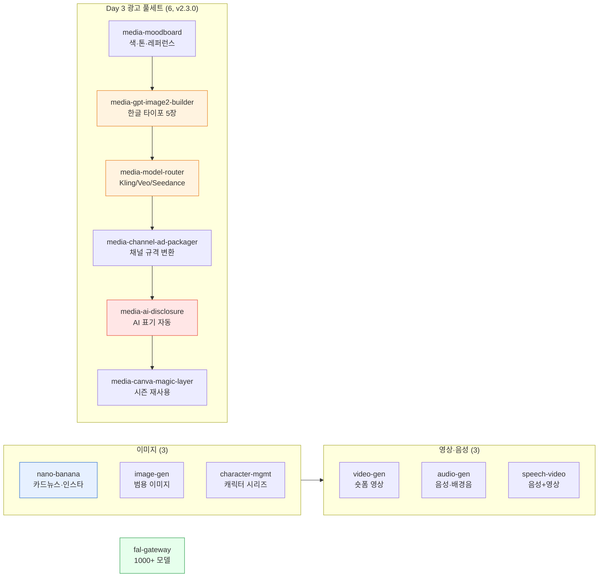

# moai-media

> AI 미디어 생성 전용 플러그인입니다. 카드뉴스 썸네일부터 숏폼 영상·내레이션, **v2.3.0부터 한국 이커머스 광고 풀세트**(무드보드·한글 타이포 5장·메인 영상·보조 컷 2개·채널별 변환·AI 표기·캔바 매직 레이어)까지 한 번에 만들 수 있습니다.



## 무엇을 하는 플러그인인가

`moai-media` (v2.3.0)는 이미지·영상·음성을 모두 한 플러그인 안에서 생성할 수 있도록 묶은 AI 미디어 스튜디오입니다. **총 13개 스킬**이 통합되어 있습니다.

- **범용 미디어 생성 (7)**: nano-banana(한국어 타이포 SOTA)·image-gen·video-gen·audio-gen·speech-video·character-mgmt·fal-gateway(1000+ 모델)
- **Day 3 광고 풀세트 (6, v2.3.0 신규)**: "모두의 커머스 3일 마스터 캠프" Day 3 산출물 ⑫~⑰ 전담 — 무드보드부터 채널별 변환, AI 표기, 시즌 재사용 가이드까지

카드뉴스 슬라이드 이미지 일괄 생성, 한국어 타이포 포스터, 15초 숏폼 영상, 팟캐스트 내레이션부터 **광고 영상 자동 라우팅**(카테고리 매트릭스 기반 의류=Kling 3 / 뷰티=Veo 3 / 건강식품=Kling 3 / 생활용품=Seedance), 메타·네이버 GFA·카카오모먼트 채널 규격 자동 변환까지 한 번의 체인으로 처리할 수 있습니다.

본 플러그인은 MCP 서버를 번들합니다 (`fal-ai` hosted, `elevenlabs` local stdio, `higgsfield` local stdio). API 키 등록 절차는 플러그인 루트의 `CONNECTORS.md`를 참고하세요.

## 설치



1. `moai-core` 설치 후 `moai-media` 옆의 **+** 버튼을 눌러 설치합니다.
2. 아래 API 키를 `.moai/credentials.env`에 등록합니다.
3. Day 3 광고 풀세트를 사용하려면 `OPENAI_API_KEY`(GPT Image 2)와 `HIGGSFIELD_API_KEY`+`HIGGSFIELD_SECRET`(Kling/Veo/Seedance)을 함께 등록합니다.


[GitHub 저장소](https://github.com/modu-ai/cowork-plugins/tree/main/moai-media)를 클론한 뒤 `~/.claude/plugins/`에 배치합니다.



## 핵심 스킬 (13개)

### 범용 미디어 생성 (7)

| 스킬 | 모델·서비스 | 특화 |
|---|---|---|
| `nano-banana` | Google Gemini (nano-banana pro/flash) | 카드뉴스·인스타 이미지, 한국어 텍스트 렌더링 SOTA |
| `audio-gen` | Google Gemini + ElevenLabs MCP | 음성 생성, 배경음악, 효과음, 다국어 더빙 |
| `character-mgmt` | Higgsfield | 캐릭터 디자인, 일관된 캐릭터 이미지 시리즈 |
| `image-gen` | Google Gemini + fal.ai | 다양한 스타일 이미지 생성, 한국어 프롬프트 최적화 |
| `speech-video` | ElevenLabs + Higgsfield | 음성 합성 + 립싱크 영상, 팟캐스트/강의용 |
| `video-gen` | fal.ai (Kling·Hailuo) + Higgsfield | 단순 영상 생성, 애니메이션, 제품 데모 |
| `fal-gateway` | fal.ai 통합 | Flux 1.1 Pro, Recraft V3, Ideogram, MiniMax 등 1000+ 모델 |

### Day 3 광고 풀세트 (6) — v2.3.0 신규

| 스킬 | V6 매핑 | 백엔드 | 산출물 |
|---|---|---|---|
| `media-moodboard` | ⑫ Day3 S1 | 분석·검색 | 색 팔레트 3종 + 톤 키워드 5개 + 레퍼런스 이미지 5장 + 작업 카드 |
| `media-gpt-image2-builder` | ⑬ Day3 S2 | **GPT Image 2** | 한글 타이포 5장 세트 (Hero 1 + 인포 1 + 라이프 2 + CTA 1) — 8단계 자동 리라이팅 |
| `media-model-router` | ⑮⑯ Day3 S4 | Kling 3 / Veo 3 / Seedance | 카테고리 매트릭스 자동 라우팅 + 의심차단형 후크 + 메인 영상 5~10초 + 보조 영상 2컷 |
| `media-channel-ad-packager` | ⑰ Day3 S6 | 후처리 | 메타 1:1·9:16 / 네이버 GFA / 카카오모먼트 1:1·16:9 채널 규격 자동 변환 + .zip |
| `media-ai-disclosure` | Day3 S2~S7 | 후처리 자동 체인 | "AI 생성" 메타데이터·워터마크·캡션 3계층 부착 — 광고심의·소비자보호법 대응 |
| `media-canva-magic-layer` | Day3 S7 보너스 | 가이드 | 합성 PNG → 카피만 분리 → 시즌 재사용 5단계 체크리스트 (GPT Image 2 재호출 ↓90%) |

## 필수 API 키


이미지·영상·음성을 생성하려면 **API 키 설정이 필수**입니다. 프로젝트 루트 `.moai/credentials.env`에 저장하세요.


```bash
# .moai/credentials.env
GEMINI_API_KEY=...                          # nano-banana, audio-gen, video-gen, speech-video, image-gen
OPENAI_API_KEY=...                          # media-gpt-image2-builder (v2.3.0+)
FAL_KEY=...                                 # fal-gateway, image-gen, video-gen
ELEVENLABS_API_KEY=...                      # audio-gen, speech-video (ElevenLabs MCP)
HIGGSFIELD_API_KEY=...                      # character-mgmt, video-gen, speech-video, media-model-router (v2.3.0+)
HIGGSFIELD_SECRET=...
```

| 변수 | 용도 | 발급처 |
|---|---|---|
| `GEMINI_API_KEY` | Nano Banana·Audio Gen·Image Gen·Video Gen·Speech Video | [Google AI Studio](https://aistudio.google.com/) |
| `OPENAI_API_KEY` | **media-gpt-image2-builder** (GPT Image 2 호출, v2.3.0+) | [platform.openai.com](https://platform.openai.com/api-keys) |
| `FAL_KEY` | fal Gateway (Flux 1.1, Recraft V3 등 1000+ 모델) | [fal.ai](https://fal.ai) |
| `ELEVENLABS_API_KEY` | ElevenLabs MCP (TTS·다국어 더빙) | [elevenlabs.io](https://elevenlabs.io) |
| `HIGGSFIELD_API_KEY` + `HIGGSFIELD_SECRET` | Higgsfield MCP (시네마틱·립싱크·캐릭터 + Day 3 Kling 3·Veo 3·Seedance) | [higgsfield.ai](https://higgsfield.ai) |

> **v2.3.0 Day 1 셋업**: `moai-core:mcp-connector-setup` 스킬에서 Drive·Notion·Higgsfield·OpenAI 4커넥터 인증·환경변수·트러블슈팅 통합 가이드를 제공합니다.

## Day 3 광고 풀세트 표준 워크플로우

```text
[10:10–10:25 S1]  media-moodboard               → 색 팔레트·톤·레퍼런스 5장 + 작업 카드
       ↓
[11:08–11:18 S2]  media-gpt-image2-builder      → Hero+인포+라이프 2+CTA = 5장 한글 타이포
       ↓                                         ↘ media-ai-disclosure 자동 체인
[14:08–14:20 S4]  media-model-router            → 카테고리 매트릭스 자동 라우팅
                                                  → 메인 영상 5~10초 + 보조 영상 2컷
       ↓                                         ↘ media-ai-disclosure 자동 체인
[16:20–16:45 S6]  media-channel-ad-packager     → 메타·네이버 GFA·카카오 채널 규격 .zip
       ↓
[17:40–17:45 S7]  media-canva-magic-layer       → 카피만 교체해 시즌 재사용 가이드
```

## 대표 체인

**카드뉴스 전체 제작 (기존)**

```text
moai-content:card-news → nano-banana → ai-slop-reviewer
```

**쇼핑몰 상세페이지 이미지 (기존)**

```text
moai-commerce:detail-page-copy → moai-commerce:detail-page-image (→ nano-banana) → ai-slop-reviewer
```

**캐릭터 기반 영상 콘텐츠**

```text
moai-content:copywriting → character-mgmt → speech-video
```

**Day 3 광고 풀세트 (v2.3.0 신규)**

```text
media-moodboard → media-gpt-image2-builder → media-model-router
  → media-channel-ad-packager → media-ai-disclosure (자동 체인) → media-canva-magic-layer
```

## 비용 관리

- `nano-banana`는 비교적 저렴하며 반복 생성에 적합합니다.
- `video-gen`·`media-model-router`는 영상당 비용이 상대적으로 큽니다 — 스토리보드 확정 후 최종 생성 권장.
- **Day 3 캠프 운영**: 4명×5조 = 20명 시차 호출(5분 간격, 총 100분 윈도우). Higgsfield 워크스페이스 사전 비용 충전 **1.5배** 권장 (PDF §6.9).
- `fal-gateway`는 단일 `FAL_KEY`로 다양한 모델을 사용할 수 있어 테스트 단계에서 유용합니다.

## 빠른 사용 예

```text
> 인스타 6슬라이드 카드뉴스에 쓸 이미지 6장을 3:4 비율로 만들어줘.
주제는 '프리랜서 3.3% 원천징수 쉽게 정리'.
```

```text
> 무드보드 만들어줘 — 비건 스킨케어, 따뜻한 톤
> 광고 이미지 5장 만들어줘 — 무선이어폰, 직장인 타겟
> 광고 영상 만들어줘 — 의류 카테고리, 의심차단형 후크
> 채널별 광고 소재 만들어줘 — 메타+네이버+카카오
```

## 다음 단계

- [`moai-commerce`](../moai-commerce/) — V6 6도구·상세페이지·채널 가이드
- [`moai-content`](../moai-content/) — 슬라이드 카피·기획과 결합
- [`moai-core`](../moai-core/) — MCP 4커넥터 인증 셋업 가이드
- [Cowork 커넥터와 MCP](../../cowork/connectors-mcp/)

---

### Sources

- [modu-ai/cowork-plugins README](https://github.com/modu-ai/cowork-plugins)
- [moai-media 디렉터리](https://github.com/modu-ai/cowork-plugins/tree/main/moai-media)
- [SPEC-MEDIA-CAMP-004](https://github.com/modu-ai/cowork-plugins/blob/main/.moai/specs/SPEC-MEDIA-CAMP-004/spec.md) — Day 3 광고 풀세트 EARS 요구사항
