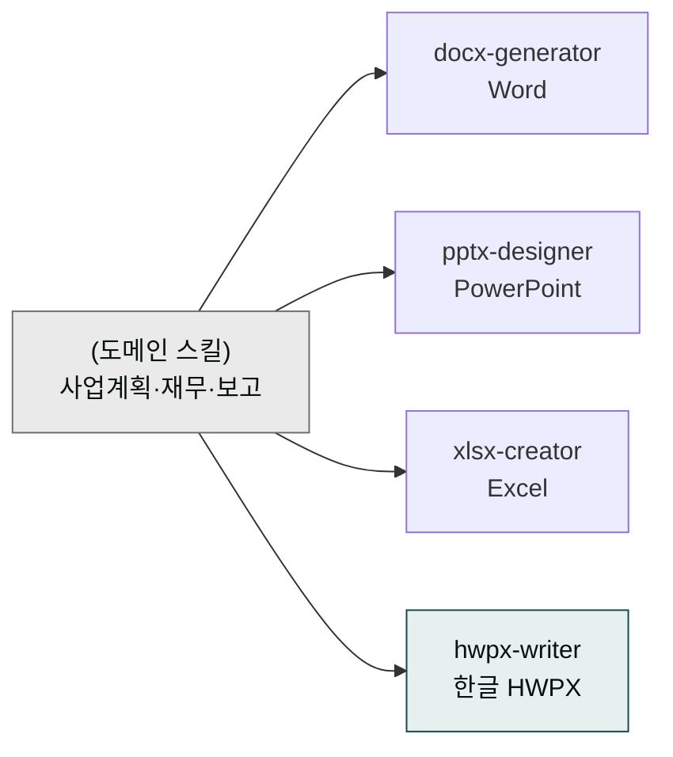

# moai-office

> 한국 기업 문서 양식에 맞춘 4가지 포맷 생성기입니다. 발표자료, 공문, 매출표, 한글 기안서까지 한 번에 처리합니다.



## 무엇을 하는 플러그인인가

`moai-office` (v1.5.0)는 한국 기업·관공서에서 실제로 쓰이는 문서 양식을 그대로 자동 생성하는 플러그인입니다. PowerPoint(PPTX), Word(DOCX), Excel(XLSX), 한글(HWPX) 네 가지 포맷을 모두 지원하며, 폰트·결재란·숫자 표기·표 라벨 등 한국 문서 관례를 기본값으로 반영합니다.

각 스킬은 검증된 오픈소스 라이브러리(pptxgenjs, python-docx, openpyxl, python-hwpx) 위에서 동작하며, 다른 도메인 플러그인의 산출물(예: 사업계획서 본문, 결산 데이터)을 받아 최종 파일로 저장하는 **출력 단계**를 담당합니다.

## 설치 시 유의

- Python 3.10+ 권장
- `python-hwpx`는 pip로 설치: `pip install python-hwpx --break-system-packages`
- 폰트: 시스템에 Pretendard·맑은고딕·바탕 설치 권장

## 설치



1. `moai-core` 설치 후 `moai-office` 옆의 **+** 버튼을 눌러 설치합니다.
2. Python 의존성을 설치합니다 (`python-docx`, `openpyxl`, `python-hwpx`).


[GitHub 저장소](https://github.com/modu-ai/cowork-plugins/tree/main/moai-office)를 클론한 뒤 `~/.claude/plugins/`에 배치합니다.



## 핵심 스킬

| 스킬 | 용도 | 기반 라이브러리 |
|---|---|---|
| `pptx-designer` | 발표자료·피칭덱·기안서 | pptxgenjs (Pretendard + 명조 기반) |
| `docx-generator` | 공문·보고서·계약서 | python-docx |
| `xlsx-creator` | KPI 대시보드·간트차트·매출표 | openpyxl (차트·수식·조건부서식 포함) |
| `hwpx-writer` | 한글(HWPX) 공문서·기안서 | python-hwpx (OWPML) |

## 한국 문서 관례 반영

- 공문서 결재란·두문·본문·결문 구조
- HWPX는 아래한글 2020 이상 호환
- 표·차트 라벨 한국어 기본, 숫자 구분은 한국식 콤마(예: 12,345,678)

## 대표 체인

**사업계획서 → DOCX**

```text
moai-business:strategy-planner → docx-generator → ai-slop-reviewer
```

**IR 피칭덱 → PPTX**

```text
moai-business:investor-relations → pptx-designer → ai-slop-reviewer
```

**월간 매출 대시보드 → XLSX**

```text
moai-finance:variance-analysis → xlsx-creator
```

(숫자·차트이므로 `ai-slop-reviewer` 생략)

**관공서 기안서 → HWPX**

```text
moai-operations:process-manager → hwpx-writer → ai-slop-reviewer
```

## 빠른 사용 예

```text
> 2026년 1분기 영업 실적 보고서 docx로 만들어줘.
KPI는 매출·고객수·재구매율이야.
```

```text
> 기업설명회용 IR 덱을 20장 피칭덱으로 pptx 만들어줘.
```

## 다음 단계

- [`moai-business`](../moai-business/) — 사업계획·IR 본문 생성과 결합
- [`moai-finance`](../moai-finance/) — 결산표·예실 분석 데이터와 결합

---

### Sources

- [modu-ai/cowork-plugins README](https://github.com/modu-ai/cowork-plugins)
- [moai-office 디렉터리](https://github.com/modu-ai/cowork-plugins/tree/main/moai-office)
