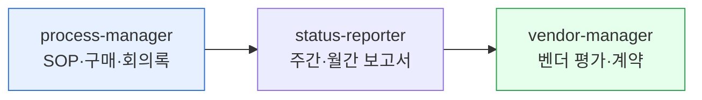

# moai-operations

> 운영·총무·구매 실무를 위한 3개 스킬을 제공합니다.



## 무엇을 하는 플러그인인가

`moai-operations` (v1.5.0)는 표준작업지침서(SOP), 구매 요청서·발주서, 회의록, 주간·월간·분기 보고서, OKR 현황, 리스크 매트릭스, 벤더 평가·계약 관리까지 운영 조직에서 반복적으로 작성하는 문서를 자동화합니다.

## 설치



1. `moai-core` 설치 후 `moai-operations` 옆의 **+** 버튼을 눌러 설치합니다.


[GitHub 저장소](https://github.com/modu-ai/cowork-plugins/tree/main/moai-operations)를 클론한 뒤 `~/.claude/plugins/`에 배치합니다.



## 핵심 스킬

| 스킬 | 용도 |
|---|---|
| `process-manager` | SOP, 구매 요청서, 발주서, 회의록 |
| `status-reporter` | 주간·월간·분기 보고서, OKR 현황, 리스크 매트릭스 |
| `vendor-manager` | 공급업체 평가, 계약 관리, 리스크 레지스터 |

## 대표 체인

**주간 보고서**

```text
status-reporter → xlsx-creator → docx-generator
```

**신규 벤더 온보딩**

```text
vendor-manager → docx-generator(계약서 초안) → ai-slop-reviewer
```

## 빠른 사용 예

```text
> 영업팀용 월간 보고서 템플릿 만들어줘. 리드·전환·파이프라인 지표 포함.
```

```text
> 클라우드 서비스 벤더 3곳 평가표 만들어줘.
```

## 다음 단계

- [`moai-finance`](../moai-finance/) — 예산·정산 연계
- [`moai-legal`](../moai-legal/) — 벤더 계약 검토

---

### Sources

- [modu-ai/cowork-plugins](https://github.com/modu-ai/cowork-plugins)
- [moai-operations 디렉터리](https://github.com/modu-ai/cowork-plugins/tree/main/moai-operations)
