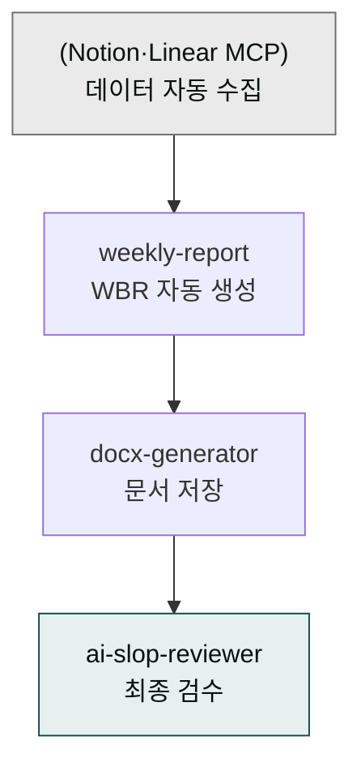

# moai-pm

> 한국 팀의 주간 비즈니스 리뷰(WBR)·OKR·회고를 자동 생성하는 프로젝트 관리 플러그인입니다. 임원용 격식체와 팀용 구어체 두 버전을 함께 출력합니다.



## 무엇을 하는 플러그인인가

금요일 오후마다 한 주를 정리해 보고서를 써야 합니다. 임원에게 보내는 격식체 버전과 팀 슬랙에 올리는 구어체 버전을 따로 만들고, Notion·Linear 등에 흩어진 완료 태스크와 KPI 수치를 하나하나 모아야 하죠. 정작 중요한 이슈·블로커 정리보다 포맷을 맞추는 데 더 시간이 걸리기도 합니다.

`moai-pm`은 이 반복 보고 작업을 자동화합니다. 일일 노트·완료 태스크·KPI 데이터를 입력하면 WBR(주간 비즈니스 리뷰) 요약 보고서를 생성합니다. 임원 보고용 격식체와 팀 공유용 구어체를 동시에 출력하고, Notion·Linear·Asana·Slack MCP가 연결되어 있으면 데이터를 자동으로 가져옵니다. MCP가 없는 환경에서는 자유 텍스트 입력 fallback이 작동합니다. 한국 팀 표준 양식(이번 주 / 다음 주 / 이슈·블로커 / 도움 요청)을 기반으로 글로벌 베스트 프랙티스를 결합한 구조입니다.

향후 OKR 추적, 회고(KPT/4L), 스탠드업, 스프린트 리뷰 스킬이 추가될 예정입니다 (v1.9.x 이후 로드맵).

## 설치



1. `moai-core` 설치 후 `moai-pm` 옆의 **+** 버튼을 눌러 설치합니다.
2. Notion·Linear·Asana·Slack 데이터를 자동으로 가져오려면 해당 커넥터를 Cowork 설정에서 활성화하세요.


[GitHub 저장소](https://github.com/modu-ai/cowork-plugins/tree/main/moai-pm)를 클론한 뒤 `~/.claude/plugins/`에 배치합니다.



## 핵심 스킬 (1개 + 로드맵)

| 스킬 | 용도 | 대표 출력 |
|---|---|---|
| `weekly-report` | 한국 팀 주간 비즈니스 리뷰(WBR) 자동 생성 | 임원 격식체 + 팀 구어체 두 버전 |

향후 추가 예정 (로드맵): `okr-tracker` · `retro-kpt` · `standup-summary` · `sprint-review` · `roadmap-status`.

## 대표 체인

**기본 주간보고 (수동 입력)**

```text
weekly-report → docx-generator → ai-slop-reviewer
```

**MCP 자동 수집 주간보고**

```text
(Notion·Linear MCP 자동 fetch) → weekly-report → docx-generator → ai-slop-reviewer
```

**임원 + 팀 두 버전 동시 출력**

```text
weekly-report (격식체 + 구어체 동시) → 두 파일 저장
```

## 한국 주간보고 특화

이번 주 / 다음 주 / 이슈·블로커 / 도움 요청 4분할 템플릿은 한국 팀에서 가장 흔히 쓰이는 주간보고 양식입니다. 격식체·구어체는 수신자에 맞게 자동 전환되어, 임원 보고는 `…했습니다` 체계로, 팀 공유는 `…했어요` 체계로 출력됩니다. 정량 수치가 빠져 있으면 자동으로 보강을 제안하고, 블로커는 "임원 결정 필요" 같은 명시적 라벨로 에스컬레이션 여부를 명확히 표기합니다.

## 빠른 사용 예

```text
> 이번 주 주간보고 만들어줘.
  - 데이터 소스: Notion 'Team Tasks' 페이지의 이번 주 완료 태스크
  - 형식: 임원용 격식체 + 팀용 구어체 두 버전
  - 다음 주 계획 포함
  - 저장: 90_Output/wbr/2026-W17-{임원|팀}.docx
```

```text
> 지난 한 주 회의록 5개를 첨부했어. 주간보고로 정리해줘.
구어체로 슬랙 #weekly 채널에 올릴 거야.
```

## 다음 단계

- [`moai-bi`](../moai-bi/) — 경영진 1pager 요약
- [`moai-business`](../moai-business/) — 사업 전략·시장조사 자료 결합
- [`moai-product`](../moai-product/) — 제품 로드맵·UX 리서치
- [`moai-office`](../moai-office/) — DOCX·PPTX·PDF 출력

---

### Sources

- [modu-ai/cowork-plugins README](https://github.com/modu-ai/cowork-plugins)
- [moai-pm 디렉터리](https://github.com/modu-ai/cowork-plugins/tree/main/moai-pm)
