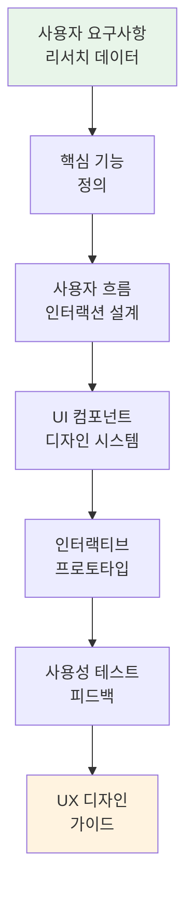

# moai-product

> 제품 매니저를 위한 4개 스킬을 제공합니다.

## 무엇을 하는 플러그인인가

`moai-product` (v1.5.0)는 제품 기획·UX 리서치·로드맵 관리에 필요한 문서를 자동으로 작성하는 플러그인입니다. PRD와 기능 명세뿐 아니라 AI 전략 보고서·정부 R&D 신청서, 분기 로드맵, 페르소나, 유저빌리티 테스트 계획, VOC·NPS 분석까지 제품 팀의 주요 산출물을 커버합니다.

## 설치



1. `moai-core` 설치 후 `moai-product` 옆의 **+** 버튼을 눌러 설치합니다.


[GitHub 저장소](https://github.com/modu-ai/cowork-plugins/tree/main/moai-product)를 클론한 뒤 `~/.claude/plugins/`에 배치합니다.



## 핵심 스킬 (4개)

| 스킬 | 용도 |
|---|---|
| `spec-writer` | PRD, 기능 명세, AI 전략 보고서, 정부 R&D 신청서 |
| `roadmap-manager` | 프로젝트 로드맵, 마일스톤, MOU 초안, ESG 감사 |
| `ux-researcher` | 페르소나, 유저빌리티 테스트 계획, VOC·NPS 분석 |
| `ux-designer` (v1.5.1 신규) | UI 디자인, 프로토타입, 사용자 경험 최적화 |

### 신규 스킬 — `ux-designer` (UX 디자인)

#### 언제 쓰나요

- "사용자 인터페이스 디자인을 만들고 싶어"
- "프로토타입을 빠르게 개발해야 해"
- "사용자 경험을 개선하고 싶어"
- "디자인 시스템이나 가이드라인을 구축하고 싶어"

#### 준비물

- 사용자 리서치 결과
- 사용자 흐름도(User Flow)
- 경쟁사 UI/UX 분석 자료
- 브랜드 가이드라인

#### 실행 흐름



**주요 특징**:
- 웹/모바일 최적화 UI 디자인
- 인터랙티브 프로토타입 생성
- 디자인 시스템 컴포넌트
- 사용성 가이드라인 문서
- 접근성 및 웹 표준 준수

#### 빠른 사용 예

```text
모바일 앱의 결제 프로세스 UX 디자인 만들어줘. 사용자는 30대 이커머스 고객이야.
```

```text
웹사이트 메인 페이지 �자인 시스템과 컴포넌트 라이브러리 만들어줘. B2B 서비스 타겟이야.
```

## 대표 체인

**PRD 작성**

```text
ux-researcher → spec-writer → docx-generator → ai-slop-reviewer
```

**분기 로드맵**

```text
roadmap-manager → xlsx-creator(간트) → pptx-designer
```

**UX 디자인 프로세스**

```text
ux-researcher → ux-designer → spec-writer → docx-generator → ai-slop-reviewer
```

## 빠른 사용 예

```text
결제 모듈 리뉴얼 PRD 써줘. 대상 고객은 국내 전자상거래 소상공인.
```

```text
지난 분기 NPS 결과 50개 텍스트 응답 분석해서 개선 우선순위 뽑아줘.
```

## 다음 단계

- [`moai-business`](../moai-business/) — 사업 전략 연계
- [`moai-data`](../moai-data/) — 정량 리서치 결합

---

### Sources

- [modu-ai/cowork-plugins](https://github.com/modu-ai/cowork-plugins)
- [moai-product 디렉터리](https://github.com/modu-ai/cowork-plugins/tree/main/moai-product)
