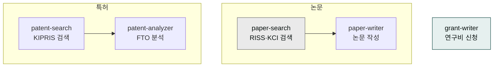

# moai-research

> 논문·특허·연구비 신청까지 연구자 워크플로우를 커버하는 5개 스킬을 제공합니다.



## 무엇을 하는 플러그인인가

논문 한 편을 쓰려면 선행연구 검색부터 시작해 서론–방법론–결과–논의 구조를 갖추고, 학술지 포맷에 맞는 참고문헌까지 정리해야 합니다. 특허 출원 전에는 선행기술을 검색해 FTO(자유실시 권한)를 확인해야 하고, 정부 과제 신청서는 기관마다 요구 양식이 달라 처음부터 작성하기가 쉽지 않습니다.

`moai-research`는 연구자의 이 전 주기를 지원합니다. RISS·KCI·DBpia·Google Scholar 통합 논문 검색, 서론–선행연구–방법론–결과–논의–결론 구조의 학술 논문 작성(APA/KCI/IEEE 참고문헌 포맷), KIPRIS 특허·실용신안·디자인·상표 검색과 FTO 분석, NRF·IITP·KIAT·중기부 연구비 신청서 작성까지 5개 스킬로 연결됩니다.

학술·R&D 과제 신청서가 필요하면 이 플러그인을 사용하세요. 창업·사업화 지원금은 [`moai-business`](../moai-business/)의 `kr-gov-grant`가 더 적합합니다.

## 설치



1. `moai-core` 설치 후 `moai-research` 옆의 **+** 버튼을 눌러 설치합니다.
2. (선택) KIPRIS·NRF API 키를 `.moai/credentials.env`에 등록합니다.


[GitHub 저장소](https://github.com/modu-ai/cowork-plugins/tree/main/moai-research)를 클론한 뒤 `~/.claude/plugins/`에 배치합니다.



## 핵심 스킬

| 스킬 | 용도 |
|---|---|
| `paper-search` | RISS·KCI·DBpia·Google Scholar 통합 논문 검색 |
| `paper-writer` | 서론–선행연구–방법론–결과–논의–결론 구조 작성, APA/KCI/IEEE 참고문헌 |
| `patent-search` | KIPRIS 특허·실용신안·디자인·상표 검색 |
| `patent-analyzer` | 특허 동향·선행기술·FTO 분석, 출원서 초안 |
| `grant-writer` | NRF·IITP·KIAT·중기부 연구비 신청서 |

## 선택 API 키

| 변수 | 용도 | 발급처 |
|---|---|---|
| `KIPRIS_KEY` | 특허정보원 Plus API | [KIPRIS Plus](https://plus.kipris.or.kr) |
| `NRF_KEY` | 한국연구재단 API | [NRF](https://www.nrf.re.kr) |

## 대표 체인

**연구 논문 초안**

```text
paper-search → paper-writer → docx-generator → ai-slop-reviewer
```

**특허 출원 준비**

```text
patent-search → patent-analyzer → docx-generator(출원서 초안)
```

**정부 과제 신청**

```text
grant-writer → docx-generator → ai-slop-reviewer
```

## 빠른 사용 예

```text
"스마트팩토리 AI 이상탐지" 주제로 최근 3년 KCI 논문 20편 찾고 서론 초안 써줘.
```

```text
> 2026년 NRF 중견연구자지원사업 신청서 초안 만들어줘. 주제는 ○○, 팀 구성은 …
```

## 다음 단계

- [`moai-product`](../moai-product/) — R&D 과제 기획서
- [`moai-education`](../moai-education/) — 교육 자료화

---

### Sources

- [modu-ai/cowork-plugins](https://github.com/modu-ai/cowork-plugins)
- [moai-research 디렉터리](https://github.com/modu-ai/cowork-plugins/tree/main/moai-research)
