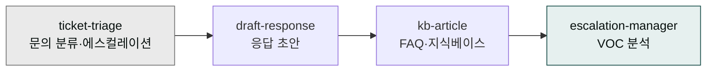

# moai-support

> CS·티켓·지식베이스 관리용 4개 스킬을 제공합니다.



## 무엇을 하는 플러그인인가

`moai-support` (v1.5.0)는 고객 문의 접수부터 응답·에스컬레이션·지식베이스화까지 CS 조직의 주요 업무를 지원하는 플러그인입니다. 한국어 경어체 응답 초안, Zendesk·Freshdesk 호환 FAQ 문서, VOC 분석 리포트 등 실무 산출물을 바로 생성할 수 있습니다.

## 설치



1. `moai-core` 설치 후 `moai-support` 옆의 **+** 버튼을 눌러 설치합니다.


[GitHub 저장소](https://github.com/modu-ai/cowork-plugins/tree/main/moai-support)를 클론한 뒤 `~/.claude/plugins/`에 배치합니다.



## 핵심 스킬

| 스킬 | 용도 |
|---|---|
| `ticket-triage` | 문의 분류(유형·긴급도·담당팀), 에스컬레이션 판단 |
| `draft-response` | 이메일·채팅·카카오채널 응답 초안 (한국어 경어체) |
| `kb-article` | FAQ, 트러블슈팅, 정책 안내 문서 (Zendesk·Freshdesk 호환) |
| `escalation-manager` | 불만 대응, VIP 응대, VOC 분석, 주간 CS 요약 |

## 대표 체인

**고객 문의 처리**

```text
ticket-triage → draft-response → ai-slop-reviewer
```

**FAQ 생성**

```text
kb-article → ai-slop-reviewer
```

**주간 VOC 보고**

```text
escalation-manager → docx-generator
```

## 빠른 사용 예

```text
> 환불 요청 이메일 답변 초안 만들어줘. 고객은 구매 5일 뒤 단순 변심이야.
```

```text
지난주 CS 티켓 120건 분석해서 반복되는 이슈 TOP 5 뽑아줘.
```

## 다음 단계

- [`moai-content`](../moai-content/) — 고객 대상 커뮤니케이션
- [`moai-operations`](../moai-operations/) — 개선 프로세스

---

### Sources

- [modu-ai/cowork-plugins](https://github.com/modu-ai/cowork-plugins)
- [moai-support 디렉터리](https://github.com/modu-ai/cowork-plugins/tree/main/moai-support)
