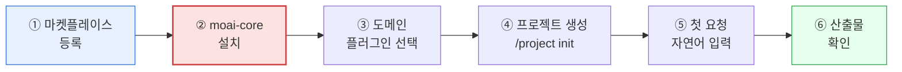

`modu-ai/cowork-plugins` 마켓플레이스를 Claude Cowork에 등록하고 첫 스킬 체인을 실행하기까지의 전체 흐름을 정리한 페이지입니다. 처음부터 끝까지 약 **10분** 소요됩니다.

## 사전 체크

- [Cowork 설치](../../cowork/install/) 완료
- 작업할 **로컬 폴더** 하나 준비 (Windows에서는 짧은 경로를 권장합니다)

## 전체 흐름



1. **마켓플레이스 등록**

   Cowork **좌측 사이드바 → 사용자 지정(Customize)** 메뉴로 진입합니다.

   

   1. **알림 배지** — Customize 메뉴에 새로운 항목이 있음을 나타냅니다.

   플러그인 설정 화면에서 **마켓플레이스 추가**를 선택합니다.

   

   1. **+ 버튼(설정 그룹)** — 새 설정 그룹을 추가합니다.
   2. **플러그인 설정 + 버튼** — 플러그인 섹션을 확장합니다.
   3. **"마켓플레이스 추가" 메뉴** — 마켓플레이스 URL을 입력하는 진입점입니다.

   마켓플레이스 추가 대화상자에서 다음 URL을 입력합니다.

   

   ```text
   modu-ai/cowork-plugins
   ```

   

   1. **URL 입력 필드** — GitHub `owner/repo` 형식 또는 전체 git 리포지토리 URL을 입력합니다.

   동기화가 끝나면 21개 플러그인·107개 스킬 목록이 표시됩니다.

2. **`moai-core` 설치**

   
   **반드시 `moai-core`부터** 설치합니다. 여기에 `/project init` 마법사와 모든 텍스트 체인에 필요한 `ai-slop-reviewer`가 포함되어 있습니다.
   

   마켓플레이스 동기화 후 플러그인 목록에서 `moai-core`를 찾습니다.

   

   1. **알림 아이콘** — 새 플러그인이 사용 가능함을 알립니다.
   2. **검색 입력** — "cowork-plugins"로 마켓플레이스를 검색합니다.
   3. **토글 스위치** — 전체 플러그인을 한 번에 활성화/비활성화합니다.
   4. **Moai core 카드 + 버튼** — 이 버튼을 클릭하여 핵심 플러그인을 설치합니다.

   `moai-core` 옆의 **+** 버튼을 클릭하면 설치가 완료됩니다.

   

   1. **Moai core** — 왼쪽 사이드바의 핵심 기능 카테고리입니다.
   2. **Moai master** — 메인 화면의 플러그인 항목으로, AI 기반 작업 자동화/최적화 기능을 제공합니다.
   3. **"설치되지 않음" 상태** — 설치 전 상태를 나타냅니다. + 버튼을 누르면 설치됩니다.

3. **도메인 플러그인 선택**

   이번에 진행할 작업에 맞춰 플러그인을 추가합니다. 예시는 다음과 같습니다.

   - 사업계획서 → `moai-business`, `moai-office`
   - 블로그 발행 → `moai-content`, `moai-media`
   - 계약서 검토 → `moai-legal`, `moai-office`
   - 이미지 생성 → `moai-media` (+ `GEMINI_API_KEY` 필요)

   21개 모두를 한 번에 설치할 필요는 없습니다.

4. **프로젝트 생성 및 `/project init`**

   Cowork에서 좌측 사이드바 **프로젝트** 섹션의 **+ 새 프로젝트**를 눌러 프로젝트를 만들고, 프로젝트 설정 화면에서 **작업 폴더 연결** 항목에 앞서 준비한 로컬 폴더를 지정합니다. 프로젝트·폴더 개념이 낯설다면 [프로젝트와 메모리](../../cowork/projects-memory/) 페이지를 먼저 참고하세요. 이후 대화창에 다음을 입력합니다.

   ```text
   /project init
   ```

   `moai-core:project` 스킬이 실행되어 **7단계 흐름**(Interview → Detect → Chain → Confirm → Generate → APIKey → First Run)을 진행합니다. 자세한 내용은 [moai-core 상세](../moai-core/)에서 확인할 수 있습니다. 약 3~5분 안에 프로젝트용 `CLAUDE.md`가 루트에 생성됩니다.

5. **첫 요청**

   이제 자연어로 요청하면 `moai-core`의 라우터가 적합한 스킬을 자동으로 호출합니다.

   ```text
   우리 SaaS의 Series A용 IR 덱 초안 만들어줘.
   타깃 고객은 한국 중소제조업체야.
   ```

   체인 예시: `investor-relations → pptx-designer → ai-slop-reviewer`

6. **산출물 확인**

   PPTX 파일이 작업 폴더에 저장되고, 대화창에 **진단 → 수정 → 주요 변경사항** 3블록의 AI 슬롭 검수 리포트가 함께 표시됩니다.

## API 키·커넥터 등록 (선택)

일부 플러그인은 외부 서비스 키가 필요합니다.

| 플러그인 | 필요한 키·커넥터 |
|---|---|
| `moai-media` | `GEMINI_API_KEY`, `FAL_KEY`, `ELEVENLABS_API_KEY` |
| `moai-business` (DART 공시 연동) | DART MCP |
| `moai-data` | 공공데이터포털·KOSIS API 키 |
| `moai-content:blog` (WordPress 자동 업로드) | WordPress MCP |

키는 프로젝트 루트의 `.moai/credentials.env`에 저장됩니다. 절대 외부 저장소에 커밋하지 마세요.

## 잘 안 될 때

- **스킬이 자동으로 호출되지 않을 때**: `moai-core`가 설치돼 있는지, `/project init`이 실행됐는지 확인합니다.
- **Word·PPT 파일이 깨질 때**: `moai-office`가 설치돼 있는지, Python 의존성(`python-docx`, `python-hwpx` 등)이 갖춰졌는지 확인합니다.
- **AI 슬롭 검수가 실행되지 않을 때**: 요청에 "빠르게"라는 표현이 포함되면 검수가 스킵될 수 있습니다. "검수까지 돌려줘"라고 명시하세요.

## 다음 단계

- [`moai-core` 상세](../moai-core/)
- [`moai-content` 상세](../moai-content/)
- [Cowork 플러그인 사용](../../cowork/plugins/) — Cowork 환경 통합 가이드

---

### Sources

- [modu-ai/cowork-plugins README](https://github.com/modu-ai/cowork-plugins)
- [Use plugins in Claude Cowork](https://support.claude.com/en/articles/13837440)
