MoAI Cowork Plugins은 지속적인 개발을 통해 새로운 기능을 추가하고 기존 기능을 개선합니다. 이 페이지에서는 버전 관리 정책과 릴리스 노트에 대한 정보를 제공합니다.

```mermaid
flowchart LR
    V10["v1.0<br/>초기 릴리스"] --> V12["v1.2<br/>미디어·MCP"]
    V12 --> V13["v1.3<br/>AI 슬롭·체이닝"]
    V13 --> V15["v1.5<br/>상권분석·문서"]
    V15 --> V16["v1.6<br/>pdf-writer"]
    V16 --> V20["v2.0<br/>B2B 6스킬"]
    V20 --> V21["v2.1<br/>humanize-korean"]
    V21 --> V22["v2.2<br/>html-report"]
    V22 --> V23["v2.3<br/>커머스 캠프"]
    V23 --> V24["v2.4<br/>캠프 후속 통합"]

    style V10 fill:#f0f0f0,stroke:#999
    style V24 fill:#dff5dd,stroke:#3a8a3a,stroke-width:2px
```



## 버전 관리 정책

### 버전 형식

- **주 버전 (Major)**: 주요 아키텍처 변경 또는 호환성 파괴 변경
- **부 버전 (Minor)**: 새로운 플러그인 또는 스킬 추가
- **패치 버전 (Patch)**: 버그 수정 및 기능 개선

### 업데이트 방법

최신 버전으로 업데이트하려면 다음 명령어를 사용하세요:

```bash
/plugin marketplace update cowork-plugins
```

업데이트 후 플러그인 상세 페이지를 다시 진입하여 새로운 기능을 확인하세요.

### 버전 확인

현재 설치된 버전을 확인하려면:

```bash
/plugin info cowork-plugins
```

## 릴리스 노트

각 버전의 상세 변경 사항은 다음 페이지에서 확인할 수 있습니다:

- [v2.4.x (최신)](v2.4/) - **"캠프 후속 인사이트 통합본"** — 정해준 강사 본인 노하우 3개 문서(쿠팡 매출 9배·커머스 자동화·매출향상 AI) + 광고 심리학 완전판 분석 → 13건(신규 5 + 강화 8). coupang-ad-optimizer·commerce-margin-calculator·commerce-automation-audit·landing-page-conversion-audit·pixel-audit. 마켓플레이스 124 → 129 스킬
- [v2.3.x](v2.3/) - **"모두의 커머스 3일 마스터 캠프" 통합본** — 17 신규 + 6 강화 스킬. Day 1 셋업(MCP 4커넥터)·Day 2 V6 6도구·Day 3 광고 풀세트(GPT Image 2·Kling/Veo/Seedance)·D+1~D+30 후기 자산화 + Track C 페어 정리. 마켓플레이스 108 → 124 스킬
- [v2.2.x](v2.2/) - **마크다운 → 단일 파일 HTML 변환** — html-report 신규 스킬, 6개 보고서 모드, 외부 의존성 0, 12-25KB 산출물
- [v2.1.x](v2.1/) - **한국어 AI 티 정밀 윤문 도입** (epoko77-ai/im-not-ai 포팅) — humanize-korean 신규 스킬, 10대 카테고리 × 40+ 패턴 SSOT, 의미 100% 보존 가드, A/B/C/D 등급 자동 판정
- [v2.0.x](v2.0/) - **한국 B2B 시장 특화 6스킬 도입** (NomaDamas/k-skill 포팅) — 인터넷등기소·국토부 실거래가·식약처·법원경매·KRX·바른한글
- [v1.6.x](v1.6/) - skill-builder 리네임, skill-tester self-contained, pdf-writer 신규
- [v1.5.x](v1.5/) - 소상공인365 상권분석, 정부지원사업 통합, 한국어 문서 사이트 정식 오픈
- [v1.3.x](v1.3/) - AI 슬롭 검수 도입, 스킬 체이닝, 명령어 변경
- [v1.2.x](v1.2/) - 미디어 플러그인 추가, MCP 서버 번들링
- [v1.0.x](v1.0/) - 초기 릴리스

## 업그레이드 가이드

### 안전 업그레이드

MoAI Cowork Plugins의 업그레이드는 일반적으로 안전하게 진행할 수 있습니다:

1. **백업**: 현재 작업 중인 프로젝트를 백업하세요
2. **업데이트**: `/plugin marketplace update cowork-plugins` 실행
3. **재시작**: Claude Desktop을 재시작하여 새 플러그인 로드
4. **테스트**: 기존 작업이 정상적으로 동작하는지 확인

### 호환성 정보

- **v2.4.x**: 이전 버전과 완전 호환 — Breaking change 없음 (5 신규 + 8 강화 스킬, 캠프 후속 인사이트 통합)
- **v2.3.x**: 이전 버전과 완전 호환 — Breaking change 없음 (17 신규 + 6 강화 스킬 추가, Track C 페어 정리는 stub으로 v2.5.0까지 호환)
- **v2.2.x**: 이전 버전과 완전 호환 — Breaking change 없음 (html-report 신규 스킬 추가)
- **v2.1.x**: 이전 버전과 완전 호환 — Breaking change 없음 (humanize-korean 신규 스킬 추가)
- **v2.0.x**: 이전 버전과 완전 호환 — Breaking change 없음 (한국 B2B 특화 6스킬 추가)
- **v1.5.x**: 이전 버전과 완전 호환
- **v1.3.x**: 주요 명령어 변경 (`/moai` → `/project`)
- **v1.2.x**: 새 플러그인 추가로 확장성 증대
- **v1.0.x**: 초기 버전으로 최소 기능 제공

## 변경 사항 유형

### Added (신규 추가)
- 새로운 플러그인 추가
- 새로운 스킬 기능
- 새로운 API 연동
- 새로운 템플릿

### Changed (변경)
- 기존 스킬 기능 개선
- 사용자 인터페이스 변경
- 성능 향상
- 내부 구조 변경

### Fixed (수정)
- 버그 수정
- 안전성 개선
- 성능 문제 해결
- 사용성 개선

### Removed (제거)
- 더 이상 사용되지 않는 기능
- 중복된 스킬 통합
- 오래된 API 연동 제거

## 릴리스 일정

- **주요 릴리스**: 분기별 (3월, 6월, 9월, 12월)
- **보완 릴리스**: 필요 시 (보통 매월)
- **긴급 업데이트**: 중요한 버그나 보안 문제 시

## 피드백 및 기여

릴리스 노트에 기여하거나 개선 제안이 있으면 [GitHub 이슈](https://github.com/modu-ai/cowork-plugins/issues)를 통해 알려주세요.

### Sources
- GitHub 저장소: [https://github.com/modu-ai/cowork-plugins](https://github.com/modu-ai/cowork-plugins)
- 마켓플레이스: [https://claude.com/marketplace](https://claude.com/marketplace)
- 릴리스 노트: [https://github.com/modu-ai/cowork-plugins/releases](https://github.com/modu-ai/cowork-plugins/releases)