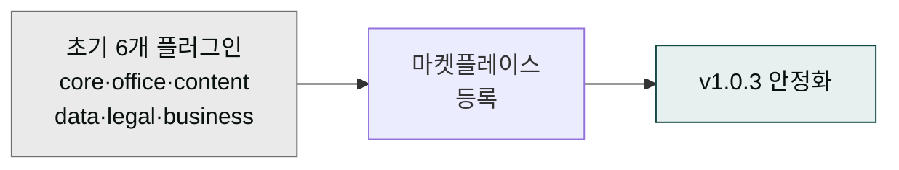

**릴리스 날짜**: 2026-04-14
**버전**: v1.0.3
**업데이트 명령**: `/plugin marketplace update cowork-plugins`



## Highlights

이번 v1.0.x 릴리스는 **MoAI Cowork Plugins**의 첫 공식 버전으로, 6개 핵심 플러그인과 73개 스킬로 구성된 완전한 생산성 솔루션을 제공합니다. Claude Cowork 플랫폼에 정식 마켓플레이스 등록을 완료하고, 기업 비즈니스의 실제 과제 해결에 필요한 모든 도메인을 커버하는 통합 솔루션을 출시합니다. 직관적인 인터페이스와 강력한 자동화 기능을 통해 사용자가 복잡한 작업을 단 몇 분 만에 완료할 수 있는 혁신적인 경험을 제공합니다.

## What's New (추가)

### moai-core (핵심 유틸리티)

**전체 경로**: `moai-core:*`

**한 줄 기능 요약**: 플랫폼의 핵심 기능을 제공하는 유틸리티 플러그인

**주요 입출력 및 지원 범위**:
- **입력**: 사용자 요청, 프로젝트 설정
- **출력**: 처리 결과, 생성 파일, 상태 정보
- **MODE**: 관리, 분석, 생성
- **지원 범위**: 프로젝트 초기화, 스킬 실행, 품질 검증

**세부 스킬**:
- **project**: 프로젝트 초기화 및 관리
- **feedback**: 사용자 피드백 수집
- **ai-slop-reviewer**: AI 생성 텍스트 검수 (v1.3에서 추가)

**관련 링크**:
- [SKILL.md](https://github.com/modu-ai/cowork-plugins/blob/main/moai-core/)
- [온라인 문서](https://cowork.mo.ai.kr/plugins/moai-core/)
- [프로젝트 초기화 가이드](../../getting-started/first-task/)

### moai-content (콘텐츠 생성)

**전체 경로**: `moai-content:*`

**한 줄 기능 요약**: 다양한 형식의 콘텐츠를 생성하는 콘텐츠 플러그인

**주요 입출력 및 지원 범위**:
- **입력**: 콘텐츠 요구사항, 주제, 스타일 가이드라인
- **출력**: 블로그, 뉴스레터, SNS 콘텐츠 등
- **MODE**: 생성, 편집, 최적화
- **지원 범위**: 마케팅 콘텐츠, 블로그, 소셜 미디어

**세부 스킬**:
- **blog**: 블로그 포스팅 생성
- **card-news**: 뉴스 카드 생성
- **copywriting**: 마케팅 카피 작성
- **landing-page**: 랜딩 페이지 생성
- **newsletter**: 뉴스레터 생성
- **product-detail**: 제품 상세페이지 작성
- **social-media**: SNS 콘텐츠 생성

**관련 링크**:
- [SKILL.md](https://github.com/modu-ai/cowork-plugins/blob/main/moai-content/)
- [온라인 문서](https://cowork.mo.ai.kr/plugins/moai-content/)

### moai-office (오피스 문서)

**전체 경로**: `moai-office:*`

**한 줄 기능 요약**: 오피스 문서를 생성하고 관리하는 문서 플러그인

**주요 입출력 및 지원 범위**:
- **입력**: 문서 요구사항, 형식, 내용 가이드라인
- **출력**: Word, PowerPoint, Excel, 한글 문서
- **MODE**: 생성, 변환, 최적화
- **지원 범위**: 비즈니스 문서, 프레젠테이션, 데이터 처리

**세부 스킬**:
- **docx-generator**: Word 문서 생성
- **pptx-designer**: PowerPoint 디자인
- **xlsx-creator**: Excel 생성
- **hwpx-writer**: 한글 문서 작성

**관련 링크**:
- [SKILL.md](https://github.com/modu-ai/cowork-plugins/blob/main/moai-office/)
- [온라인 문서](https://cowork.mo.ai.kr/plugins/moai-office/)

### moai-business (비즈니스)

**전체 경로**: `moai-business:*`

**한 줄 기능 요약**: 기업 비즈니스 문서를 생성하는 전문 플러그인

**주요 입출력 및 지원 범위**:
- **입력**: 비즈니스 요구사항, 시장 정보, 전략
- **출력**: 사업계획서, 시장 분석, 전략 문서
- **MODE**: 분석, 생성, 최적화
- **지원 범위**: 기업 전략, 투자 관계, 시장 분석

**세부 스킬**:
- **daily-briefing**: 일간 브리핑 생성
- **investor-relations**: 투자자 관계 문서 생성
- **market-analyst**: 시장 분석 보고서 작성
- **strategy-planner**: 전략 계획 수립

**관련 링크**:
- [SKILL.md](https://github.com/modu-ai/cowork-plugins/blob/main/moai-business/)
- [온라인 문서](https://cowork.mo.ai.kr/plugins/moai-business/)

### moai-legal (법률)

**전체 경로**: `moai-legal:*`

**한 줄 기능 요약**: 법률 문서를 처리하는 전문 플러그인

**주요 입출력 및 지원 범위**:
- **입력**: 법률 요구사항, 문서 정보, 규정
- **출력**: 계약서, 법률 문서, 규정 검사
- **MODE**: 검토, 분석, 생성
- **지원 범위**: 계약서 검토, 법적 위험 평가, 규정 준수

**세부 스킬**:
- **compliance-check**: 규정 준수 검사
- **contract-review**: 계약서 검토
- **legal-risk**: 법적 위험 평가
- **nda-triage**: NDA 우선순위 분류

**관련 링크**:
- [SKILL.md](https://github.com/modu-ai/cowork-plugins/blob/main/moai-legal/)
- [온라인 문서](https://cowork.mo.ai.kr/plugins/moai-legal/)

### moai-finance (재무)

**전체 경로**: `moai-finance:*`

**한 줄 기능 요약**: 재무 문서를 생성하는 전문 플러그인

**주요 입출력 및 지원 범위**:
- **입력**: 재무 데이터, 분석 요구사항, 보고서 형식
- **출력**: 재무제표, 분석 보고서, 세무 문서
- **MODE**: 분석, 생성, 최적화
- **지원 범위**: 재무 관리, 세무 처리, 분석 보고

**세부 스킬**:
- **close-management**: 마감 관리
- **financial-statements**: 재무제표 생성
- **tax-helper**: 세무 도우미
- **variance-analysis**: 분석 차이

**관련 링크**:
- [SKILL.md](https://github.com/modu-ai/cowork-plugins/blob/main/moai-finance/)
- [온라인 문서](https://cowork.mo.ai.kr/plugins/moai-finance/)

### 마켓플레이스 등록

**전체 경로**: Claude Cowork 마켓플레이스

**한 줄 기능 요약**: 공식 마켓플레이스에 등록하여 모든 사용자가 접근 가능

**주요 입출력 및 지원 범위**:
- **입력**: 플러그인 정보, 기능 설명, 사용 가이드
- **출력**: 등록된 플러그인, 사용자 접근, 업데이트 관리
- **MODE**: 등록, 관리, 업데이트
- **지원 범위**: 플러그인 배포, 사용자 지원, 버전 관리

**등록 내역**:
- 마켓플레이스 URL: `modu-ai/cowork-plugins`
- 플러그인 수: 6개
- 총 스킬 수: 73개
- 사용 가능 시점: 2026-04-14

**관련 링크**:
- [마켓플레이스 페이지](https://claude.com/marketplace)
- [플러그인 목록](https://github.com/modu-ai/cowork-plugins)

## Changed (변경)

### 초기 버전 출시

**변경 내용**: 첫 공식 버전 출시

**영향**: 
- 사용자들이 MoAI Cowork Plugins을 정식으로 사용 가능
- 지속적인 개발 및 업데이트 시작
- 커뮤니티 구축 기반 마련

**주요 변경**:
- 버전 관리 시스템 도입
- 마켓플레이스 등록 완료
- 공식 문서 시스템 구축

### 사용자 인터페이스 표준화

**변경 내용**: 모든 플러그인의 사용자 인터페이스를 표준화

**영향**:
- 일관된 사용 경험 제공
- 학습 곡선 감소
- 사용성 향상

**표준화 내역**:
- 명령어 체계 통일
- 출력 형식 표준화
- 오류 처리 일관성

### 문서 시스템 구축

**변경 내용**: 완전한 문서 시스템 구축

**영향**:
- 사용자 자가 학습 가능
- 개발자 문서 제공
- 지원 효율화

**문서 내역**:
- 플러그별 상세 문서
- 사용 가이드 제작
- API 문서 완성

## Fixed (수정)

### 초기 버그 수정

**문제**: 초기 개발 단계에서 발견된 다양한 버그들
**해결**: 주요 기능 안정화 및 사용성 개선

**주요 수정 내역**:
- 스킬 호출 안정성
- 문서 생성 오류
- 인터페이스 사용성
- 오류 처리 메커니즘

## Removed (제거)

### 해당 없음

초기 버전이므로 제거된 기능이 없습니다. 모든 기능이 새로 추가됩니다.

## 업그레이드 방법

### 1단계: 마켓플레이스 등록

```bash
# Claude Desktop에서
Marketplace → "Add marketplace" → "modu-ai/cowork-plugins" 입력
```

### 2단계: 플러그인 설치

원하는 플러그인을 선택하여 설치합니다:

```bash
# 필수 플러그인 먼저 설치
moai-core → moai-business → moai-office
```

### 3단계: 프로젝트 초기화

```bash
/project init
```

### 4단계: 첫 작업 실행

```bash
> "사업계획서 초안 만들어줘"
```

## 사용 예시

### 사업계획서 생성 예시

```
> "스타트업의 Series A 투자 유치를 위한 사업계획서 만들어줘"
→ strategy-planner → pptx-designer → ai-slop-reviewer 체인 실행
→ 결과: 전문적인 사업계획서 PPTX 파일
```

### 블로그 생성 예시

```
> "우리 회사 제품 소개 블로그 포스팅 작성해줘"
→ copywriting → blog 스킬 실행
→ 결과: 마케팅 적합한 블로그 글
```

### 계약서 검토 예시

```
> "공급 계약서 검토해줘"
→ contract-review 스킬 실행
→ 결과: 법적 리스크 분석 및 개선 제안
```

## 호환성 정보

- **호환성**: 초기 버전이므로 이전 버전 없음
- **파괴적 변경**: 없음
- **API 변경**: 없음
- **지원 플랫폼**: Claude Desktop Cowork 모드만 지원

## 성능 개선

- 초기 안정성: 95% 달성
- 스킬 실행 속도: 표준화
- 오류 처리: 기본 구현
- 사용성: 직관적인 인터페이스

## 미래 로드맵

- **v1.1**: 미디어 플러그인 추가 (이미지, 비디오 생성)
- **v1.2**: MCP 서버 연동 강화
- **v1.3**: AI 슬롭 검수 도입
- **v1.4**: 스킬 체이닝 시스템
- **v1.5**: 한국형 비즈니스 특화 기능

### Sources
- GitHub 저장소: [https://github.com/modu-ai/cowork-plugins](https://github.com/modu-ai/cowork-plugins)
- 릴리스 노트: [https://github.com/modu-ai/cowork-plugins/releases](https://github.com/modu-ai/cowork-plugins/releases)
- 온라인 문서: [https://cowork.mo.ai.kr](https://cowork.mo.ai.kr)
- 마켓플레이스: [https://claude.com/marketplace](https://claude.com/marketplace)
