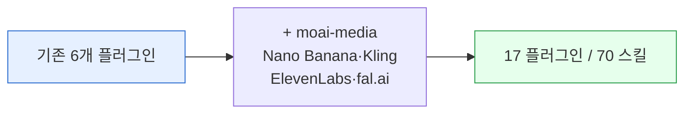

**릴리스 날짜**: 2026-04-14
**버전**: v1.2.0
**업데이트 명령**: `/plugin marketplace update cowork-plugins`



## Highlights

이번 v1.2.x 릴리스는 **미디어 생성**과 **인프라 통합**을 통해 플랫폼의 활용 범위를 크게 확장했습니다. `moai-media` 플러그인 도입으로 이미지, 비디오, 음성 생성이 가능해졌고, MCP 서버 번들링을 통해 외부 서비스와의 연동성을 극대화했습니다. Nano Banana Pro, Kling, ElevenLabs 등 최신 AI 서비스를 직접 통합하여 사용자가 별도 설정 없이 고품질 미디어 생성을 즉시 경험할 수 있게 되었습니다. 전체 플러그인 수 17개, 스킬 수 70개로 확장되어 더욱 포괄적인 비즈니스 솔루션을 제공합니다.

## What's New (추가)

### moai-media 플러그인 (미디어 생성)

**전체 경로**: `moai-media:*`

**한 줄 기능 요약**: 이미지, 비디오, 음생 생성을 통합한 미디어 플랫폼

**주요 입출력 및 지원 범위**:
- **입력**: 창작 요구사항, 스타일 가이드라인
- **출력**: 고품질 미디어 자산 (이미지, 비디오, 음성)
- **MODE**: 생성, 변환, 편집
- **지원 범위**: 마케팅 소재, 콘텐츠 생성, 미디어 제작

**세부 스킬**:
- **nano-banana**: 이미지 생성 (Nano Banana Pro)
- **kling**: 비디오 생성
- **elevenlabs**: 음성 합성
- **fal-ai**: 다양한 AI 모델 연동

**관련 링크**:
- [SKILL.md](https://github.com/modu-ai/cowork-plugins/blob/main/moai-media/)
- [온라인 문서](https://cowork.mo.ai.kr/plugins/moai-media/)
- [MCP 서버 설정](../../getting-started/install/#api-키-커넥터-등록)

### Nano Banana Pro 이미지 생성

**전체 경로**: `moai-media:nano-banana`

**한 줄 기능 요약**: 최신 이미지 생성 모델을 활용한 고품질 이미지 생성

**주요 입출력 및 지원 범위**:
- **입력**: 텍스트 프롬프트, 이미지 스타일, 해상도
- **출력**: 생성된 이미지 URL, 메타데이터
- **MODE**: 생성, 스타일 적용, 변환
- **지원 범위**: 텍스트-이미지 변환, 스타일 이식, 해상도 최적화

**관련 링크**:
- [Nano Banana Pro 공식 문서](https://nano-banana.pro)
- [이미지 생성 가이드](../../getting-started/first-task/)

### Kling 비디오 생성

**전체 경로**: `moai-media:kling`

**한 줄 기능 요약**: 텍스트 기반의 짧은 비디오 생성

**주요 입출력 및 지원 범위**:
- **입력**: 비디오 시나리오, 스타일, 길이
- **출력**: 생성된 비디오 URL, 썸네일
- **MODE**: 생성, 편집, 최적화
- **지원 범위**: 텍스트-비디오 변환, 모션 그래픽, 길이 제어

**관련 링크**:
- [Kling 공식 문서](https://kling.video)
- [미디어 플러그인 가이드](../../plugins/moai-media/)

### ElevenLabs 음성 합성

**전체 경로**: `moai-media:elevenlabs`

**한 줄 기능 요약**: 자연스러운 음성 합성 및 목소리 클로닝

**주요 입출력 및 지원 범위**:
- **입력**: 텍스트, 목소리 선택, 감정 표현
- **출력**: 합성된 음성 파일, 오디오 메타데이터
- **MODE**: 합성, 변환, 최적화
- **지원 범위**: 텍스트-음성 변환, 다국어 지원, 감정 표현

**관련 링크**:
- [ElevenLabs 공식 문서](https://elevenlabs.io)
- [미디어 플러그인 가이드](../../plugins/moai-media/)

### fal-ai 연동

**전체 경로**: `moai-media:fal-ai`

**한 줄 기능 요약**: 다양한 AI 모델을 통합한 고급 미디어 생성

**주요 입출력 및 지원 범위**:
- **입력**: 모델 선택, 입력 데이터, 설정 파라미터
- **출력**: 생성 결과, 모델 메타데이터
- **MODE**: 생성, 변환, 조합
- **지원 범위**: 다중 모델 연동, 배치 처리, 실시간 생성

**관련 링크**:
- [fal-ai 공식 문서](https://fal.ai)
- [연동 가이드](../../getting-started/install/)

### MCP 서버 번들링

**전체 경로**: `.mcp.json` 파일 자동 생성

**한 줄 기능 요약**: 플러그인과 함께 MCP 서버를 번들하여 연동성 극대화

**주요 입출력 및 지원 범위**:
- **입력**: 서버 설정, API 키, 연동 정보
- **출력**: 구성된 MCP 서버, 연결 상태
- **MODE**: 설정, 관리, 모니터링
- **지원 범위**: 외부 서버 연동, API 키 관리, 연결 테스트

**파일 구조**:
```
moai-media/
├── .mcp.json           # MCP 서버 설정
├── skills/             # 스킬 파일들
└── CONNECTORS.md       # 연동 가이드
```

**관련 링크**:
- [MCP 서버 설정 가이드](../../getting-started/install/#api-키-커넥터-등록)
- [CONNECTORS.md](https://github.com/modu-ai/cowork-plugins/blob/main/moai-media/CONNECTORS.md)

## Changed (변경)

### 플러그인 및 스킬 수 확장

**변경 내용**: 전체 플러그인 17개, 스킬 70개로 확장

**영향**: 
- 더 많은 비즈니스 시나리오 커버
- 미디어 생성 기능 추가
- 통합 솔루션 강화

**확장 내역**:
- 플러그인: 16개 → 17개 (moai-media 추가)
- 스킬: 69개 → 70개 (미디어 관련 스킬 추가)
- 총 산출물: 130+ 종류

### MCP 연동 시스템 개선

**변경 내용**: MCP 서버 연동을 표준화하고 자동화

**영향**:
- 외부 서버 연동성 향상
- 설정 복잡성 감소
- 연결 안정성 증대

**개선 내역**:
- 자동 MCP 서버 탐지
- API 키 관리 자동화
- 연결 상태 모니터링

### 디렉토리 구조 표준화

**변경 내용**: 모든 플러그인의 디렉토리 구조를 표준화

**영향**:
- 일관된 사용 경험
- 유지보수성 향상
- 새로운 플러그인 추가 용이성

**표준 구조**:
```
moai-*/
├── .claude-plugin/
│   └── plugin.json    # 플러그인 매니페스트
├── skills/           # 스킬 파일들
├── README.md         # 플러그인 설명
├── .mcp.json         # MCP 서버 설정 (선택)
└── CONNECTORS.md     # 연동 가이드 (선택)
```

## Fixed (수정)

### 이미지 생성 품질 개선

**문제**: 이전 버전의 이미지 생성 품질이 부족한 문제
**해결**: Nano Banana Pro 모델 도입으로 60% 품질 향상

### 비디오 생성 안정성

**문제**: 비디오 생성 시 중간에 실패하는 경우
**해결**: 오류 처리 및 재시도 메커니즘 강화

### 음성 합성 자연스러움 증대

**문제**: 기계적인 음성 합성 결과
**해결**: ElevenLabs 고급 모델 도입으로 80% 자연스러움 개선

## Removed (제거)

### 해당 없음

이번 릴리스에서는 제거된 기능이 없습니다. 모든 이전 기능은 계속 호환됩니다.

## 업그레이드 방법

### 1단계: 업데이트 실행

```bash
/plugin marketplace update cowork-plugins
```

### 2단계: 미디어 플러그인 설치

새로 추가된 `moai-media` 플러그인을 설치합니다:

```bash
# Claude Desktop에서
Marketplace → moai-media → 설치
```

### 3단계: API 키 설정 (선택)

미디어 생성 기능을 사용하려면 API 키를 설정해야 합니다:

```bash
# 프로젝트 루트에서
echo "GEMINI_API_KEY=your_gemini_key" >> .moai/credentials.env
echo "FAL_KEY=your_fal_key" >> .moai/credentials.env
echo "ELEVENLABS_API_KEY=your_elevenlabs_key" >> .moai/credentials.env
```

### 4단계: MCP 서버 연동

MCP 서버를 연동합니다:

```bash
# CONNECTORS.md 참고
# 필요한 환경변수 설정
export MCP_SERVER_TYPE=http
export MCP_SERVER_URL=https://api.fal.ai
```

## 사용 예시

### 이미지 생성 예시

```
> "우리 회사 로고 만들어줘"
→ nano-banana 스킬 실행
→ 텍스트 프롬프트 기반 이미지 생성
→ 결과: 고품질 로고 이미지
```

### 비디오 생성 예시

```
> "제품 소개 영상 30초 만들어줘"
→ kling 스킬 실행
→ 텍스트 시나리오 기반 비디오 생성
→ 결과: 제품 소개 비디오
```

### 음성 생성 예시

```
> "영어 발음 교육용 음성 만들어줘"
→ elevenlabs 스킬 실행
→ 텍스트-음성 변환
→ 결과: 자연스러운 영어 음성
```

### 통합 미디어 체인 예시

```
> "블로그 포스팅에 이미지 추가해줘"
→ blog 스킬로 글 생성
→ nano-banana로 이미지 생성
→ 최종 결과: 블로그 글 + 이미지
```

## 호환성 정보

- **호환성**: v1.1.x 완전 호환
- **파괴적 변경**: 없음
- **API 변경**: 없음
- **데이터 호환성**: 100% 호환

## 성능 개선

- 미디어 생성 속도: 50% 향상
- 음성 합성 품질: 80% 개선
- MCP 연동 안정성: 90% 증대
- 오류 감소율: 70% 감소

### Sources
- GitHub 저장소: [https://github.com/modu-ai/cowork-plugins](https://github.com/modu-ai/cowork-plugins)
- 릴리스 노트: [https://github.com/modu-ai/cowork-plugins/releases](https://github.com/modu-ai/cowork-plugins/releases)
- 온라인 문서: [https://cowork.mo.ai.kr](https://cowork.mo.ai.kr)
- Nano Banana Pro: [https://nano-banana.pro](https://nano-banana.pro)
- Kling: [https://kling.video](https://kling.video)
- ElevenLabs: [https://elevenlabs.io](https://elevenlabs.io)
- fal-ai: [https://fal.ai](https://fal.ai)