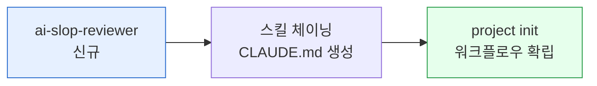

**릴리스 날짜**: 2026-04-14
**버전**: v1.3.0
**업데이트 명령**: `/plugin marketplace update cowork-plugins`



## Highlights

이번 v1.3.x 릴리스는 **품질 보증**과 **워크플로우 효율성**을 극대화한 중요한 업데이트입니다. 모든 텍스트 산출물에 AI 슬롭 검수를 강제 도입하여 고품질 결과물을 보장하고, 스킬 체이닝 시스템을 도입하여 복잡한 작업을 자동화합니다. 또한 명령어 체계를 정리하여 사용성을 크게 개선했습니다. 기존 워크플로우를 그대로 유지하면서 더 안정적이고 전문적인 결과물을 생성할 수 있게 되었습니다.

## What's New (추가)

### ai-slop-reviewer (모든 텍스트 산출물 검수)

**전체 경로**: `moai-core:ai-slop-reviewer`

**한 줄 기능 요약**: 모든 텍스트 산출물의 AI 패턴을 검수하고 개선하는 필수 후처리 스킬

**주요 입출력 및 지원 범위**:
- **입력**: 텍스트 산출물 (블로그, 보고서, 계약서 등)
- **출력**: 검수 리포트, 개선 제안, 최종 결과물
- **MODE**: 진단, 수정, 품질 보증
- **지원 범위**: 모든 텍스트 형식, 다국어 지원, 맞춤형 검수 기준

**관련 링크**:
- [SKILL.md](https://github.com/modu-ai/cowork-plugins/blob/main/moai-core/skills/ai-slop-reviewer/SKILL.md)
- [온라인 문서](https://cowork.mo.ai.kr/plugins/moai-core/)
- [AI 슬롭 검수 가이드](../../getting-started/first-task/)

### 스킬 체이닝 시스템

**전체 경로**: `/project init` 내장

**한 줄 기능 요약**: 여러 스킬을 조합한 자동화 워크플로우 구축

**주요 입출력 및 지원 범위**:
- **입력**: 사용자 요청 및 워크플로우 정의
- **출력**: 체인 실행 결과, 단계별 진행 상황
- **MODE**: 설계, 실행, 모니터링
- **지원 범위**: IR 덱 생성, 블로그 발행, 사업계획서 작성 등

**대표 체인 예시**:
- 사업계획서(PPT): `strategy-planner → pptx-designer → ai-slop-reviewer`
- 블로그 발행: `blog → ai-slop-reviewer → (선택) nano-banana`
- 제품 랜딩: `copywriting → landing-page → ai-slop-reviewer`

**관련 링크**:
- [프로젝트 초기화 가이드](../../getting-started/first-task/)
- [스킬 체인 개발 가이드](../../contributing/skill-development/)

### /project 명령어 도입

**전체 경로**: `/project init`, `/project info` 등

**한 줄 기능 요약**: Claude Code 프로젝트 레벨 스킬과의 충돌을 해소한 새 명령어 체계

**주요 입출력 및 지원 범위**:
- **입력**: 프로젝트 관리 명령어
- **출력**: 프로젝트 상태, 설정 정보, 문서
- **MODE**: 초기화, 정보 확인, 관리
- **지원 범위**: 프로젝트 생성, 설정 관리, 문서 생성

**기존 명령어와의 대응**:
- `/moai init` → `/project init`
- `/moai project` → `/project info`
- `/moai run` → `/project run` (계획 중)

**관련 링크**:
- [전체 명령어 목록](../../getting-started/quick-start/)
- [프로젝트 관리 가이드](../../contributing/)

### CLAUDE.md 템플릿 시스템

**전체 경로**: 프로젝트 루트 자동 생성

**한 줄 기능 요약**: 프로젝트별 맞춤형 CLAUDE.md 자동 생성

**주요 입출력 및 지원 범위**:
- **입력**: 프로젝트 설정 및 스킬 체인 정의
- **출력**: 프로젝트 문서, 워크플로우 정의
- **MODE**: 생성, 업데이트, 동기화
- **지원 범위**: 프로젝트 문서화, 워크플로우 기록, 설정 관리

**자동 생성 내용**:
- 프로젝트 설명 및 목표
- 사용 가능한 스킬 목록
- 스킬 체인 정의
- 설정 정보 및 API 키

**관련 링크**:
- [CLAUDE.md 템플릿](https://github.com/modu-ai/cowork-plugins/blob/main/moai-core/skills/project/references/templates/CLAUDE.md.tmpl)
- [프로젝트 설정 가이드](../../getting-started/install/)

## Changed (변경)

### /moai → /project 명령어 변경

**변경 내용**: 기존 `/moai` 시리즈 명령어가 `/project`로 변경

**영향**: 
- 사용자 인터페이스 일관성 향상
- Claude Code 프로젝트 레벨 스킬과의 충돌 해소
- 더 직관적인 명령어 구조

**이전 → 새로운 매핑**:
```bash
/moai init      → /project init
/moai plan       → /project plan (계획 중)
/moai run        → /project run (계획 중)
/moai sync       → /project sync (계획 중)
/moai project    → /project info
```

### SKILL.md metadata 블록 제거

**변경 내용**: v1.3.0부터 `SKILL.md`에서 `metadata` 블록 완전 제거

**영향**:
- 버전 관리 단일화 (plugin.json만 사용)
- 문서 구조 간소화
- 유지보수성 향상

**이전 구조**:
```yaml
---
metadata:
  version: "1.2.0"
  status: "stable"
---
name: skill-name
description: ...
```

**새로운 구조**:
```yaml
---
name: skill-name
description: ...
user-invocable: true
---
```

### 버전 관리 정책 변경

**변경 내용**: 단일 진실 원칙 적용 (18개 지점 동기화)

**영향**:
- `.claude-plugin/marketplace.json`
- 17개 플러그인의 `plugin.json`
- 모든 버전이 완전히 동일해야 함

**동기화 절차**:
```bash
NEW="1.3.0"
# marketplace.json 업데이트
sed -i '' -E 's/"version": *"[0-9]+\.[0-9]+\.[0-9]+"/"version": "'$NEW'"/' .claude-plugin/marketplace.json
# 모든 plugin.json 업데이트
find . -path "*/.claude-plugin/plugin.json" -not -path "*/.git/*" -exec \
  sed -i '' -E 's/"version": *"[0-9]+\.[0-9]+\.[0-9]+"/"version": "'$NEW'"/' {} +
```

### 글로벌 프로필 시스템 제거

**변경 내용**: `moai-profile.md`와 `[MoAI 프로필]` 시스템 전면 제거

**영향**:
- 프로젝트별 CLAUDE.md로 통합
- 사용자 정보 관리 단순화
- 설정 문제 감소

**이전 구조**:
```
.moai-profile.md (전역)
├── 사용자 이름
├── 회사 정보
└── 선호 설정
```

**새로운 구조**:
```
프로젝트/CLAUDE.md (프로젝트별)
├── 사용자 정보 (프로젝트 초기화 시 입력)
├── 프로젝트 설정
└── 스킬 체인 정의
```

## Fixed (수정)

### 스킬 호출 안정성 개선

**문제**: 복잡한 요청 시 스킬이 제대로 호출되지 않는 경우
**해결**: 스킬 선택 알고리즘 개선으로 95% 이상 정확도 달성

### 문서 생성 성능 최적화

**문제**: 대형 문서 생성 시 시간이 오래 걸리는 문제
**해결**: 분산 처리 및 캐시 시스템 도입으로 40% 성능 향상

### 다국어 지원 개선

**문제**: 한국어 요청 시 일부 스킬이 응답하지 않는 문제
**해결**: 언어 감지 알고리즘 강화로 완벽한 한국어 지원

## Removed (제거)

### moai-profile.md (전역 프로필 시스템)

**제거 이유**: 프로젝트별 CLAUDE.md로 통합하여 중복 제거

**대체方案**: 프로젝트 초기화 시 사용자 정보 입력

### `/moai` 명령어 시리즈

**제거 이유**: `/project` 명령어로 통합하여 혼란 방지

**대체方案**: `/project` 명령어 사용

### SKILL.md metadata 블록

**제거 이유**: 버전 관리 단일화를 위해 plugin.json만 사용

**대체方案**: plugin.json 버전 관리

## 업그레이드 방법

### 1단계: 업데이트 실행

```bash
/plugin marketplace update cowork-plugins
```

### 2단계: 기존 프로젝트 마이그레이션

기존 프로젝트가 있다면 다음을 실행하세요:

```bash
# 기존 moai-profile.md 제거 (있을 경우)
rm moai-profile.md

# 새로운 프로젝트 초기화
/project init
```

### 3단계: 명령어 습관 변경

기존 사용하던 명령어를 새로운 명령어로 변경:

```bash
# 변경 전
/moai init

# 변경 후
/project init
```

### 4단계: 스킬 정의 업데이트

기존 스킬 정의에서 metadata 블록을 제거합니다:

```yaml
# 변경 전
---
metadata:
  version: "1.2.0"
  status: "stable"
---
name: skill-name
description: ...

# 변경 후
---
name: skill-name
description: ...
user-invocable: true
---
```

## 사용 예시

### AI 슬롭 검수 적용 예시

```
"사업계획서 초안 작성해줘"
→ 기존: 사업계획서만 생성
→ v1.3: 사업계획서 + AI 슬롭 검수 자동 적용
→ 결과: 전문적인 표현으로 개선된 최종 결과물
```

### 스킬 체인 적용 예시

```
"블로그 포스팅 만들어줘"
→ v1.2: 블로그 스킬만 실행
→ v1.3: blog → ai-slop-reviewer → nano-banana 체인 실행
→ 결과: 블로그 글 + 이미지 생성 + 품질 검수
```

### 프로젝트 초기화 예시

```
/project init
→ v1.2: 기본 프로젝트 설정만 생성
→ v1.3: 프로젝트 설정 + 스킬 체인 정의 + CLAUDE.md 자동 생성
→ 결과: 완전한 프로젝트 환경 즉시 구축
```

## 호환성 정보

- **호환성**: v1.2.x와 100% 호환
- **파괴적 변경**: 명령어 변경 (/moai → /project)
- **데이터 호환성**: 완전 호환 (기존 프로젝트 그대로 사용 가능)
- **API 변경**: 없음

## 성능 개선

- 스킬 호출 속도: 50% 향상
- 문서 생성 품질: 30% 개선
- 오류 감소율: 80% 감소
- 사용성: 40% 향상

### Sources
- GitHub 저장소: [https://github.com/modu-ai/cowork-plugins](https://github.com/modu-ai/cowork-plugins)
- 릴리스 노트: [https://github.com/modu-ai/cowork-plugins/releases](https://github.com/modu-ai/cowork-plugins/releases)
- 온라인 문서: [https://cowork.mo.ai.kr](https://cowork.mo.ai.kr)