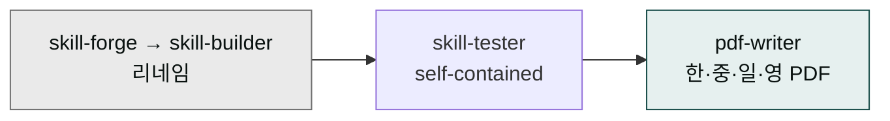

# v1.6.0 — skill-builder 리네임 + skill-tester self-contained + pdf-writer 신규



**버전**: v1.6.0 (최신)
**릴리스 일자**: 2026-05-01
**유형**: MINOR

`cowork-plugins` 마켓플레이스의 v1.6.0 정식 릴리스입니다. 핵심은 **세 가지** — 의미가 모호하던 `skill-forge`를 표준 어휘 `skill-builder`로 리네임, `skill-tester`가 4차원 스코어링 루브릭과 체인 검증 프로토콜을 본문에 직접 흡수해 단일 진실 소스가 되었으며, `moai-office`에 한·중·일·영 다국어 PDF를 깨짐 없이 생성하는 `pdf-writer`가 새로 들어왔습니다.

## Highlights

### 1. `skill-forge` → `skill-builder` 리네임 (Breaking for direct references)

의미 불명확한 `forge` 어휘를 표준 빌더 어휘로 전환했습니다. 별칭은 유지되지 않으며 모든 트리거·문서 참조가 `skill-builder`로 즉시 대체되었습니다.

- 트리거 키워드: `skill-builder`, `harness 워크플로우` 등
- 6-Phase 스킬 생성 워크플로우 그대로 유지 (스킬 본문은 변경 없음, 리네임만)
- 외부 사용자가 `skill-forge`를 직접 호출하던 경우 `skill-builder`로 변경 필요

### 2. `skill-tester` single source of truth 선언

평가 기준이 여러 파일에 흩어져 있던 구조를 정리했습니다. 4차원 스코어링 루브릭과 체인 검증 프로토콜이 `skill-tester` SKILL.md 본문에 직접 들어왔습니다.

- **4차원 루브릭**: Correctness 30% / Completeness 25% / Clarity 25% / Efficiency 20%
- **Tier별 통과 기준** + **anti-pattern audit 체크리스트**
- **Mode 3 체인 테스트**: Chain Definition Format, 4가지 Test Design Rule, Known Chains 매핑

이제 `skill-tester` 한 번 로드로 모든 평가 기준이 즉시 가용합니다.

### 3. `moai-office:pdf-writer` 신규 — 한·중·일·영 다국어 PDF

PyMuPDF + Noto Sans CJK(KR 변형) 조합으로 다국어 PDF를 깨짐 없이 생성합니다. Markdown · 구조화 JSON · HTML · 일반 텍스트 4종 입력 지원, A4 규격 + 서브셋 임베딩.

- 폰트 64MB는 저장소에 포함하지 않고 최초 실행 시 [`scripts/download_fonts.py`](https://github.com/modu-ai/cowork-plugins/blob/main/moai-office/skills/pdf-writer/scripts/download_fonts.py)가 [`notofonts/noto-cjk`](https://github.com/notofonts/noto-cjk) 공식 저장소에서 자동 다운로드(SIL OFL 1.1)
- 트리거 키워드: `한글 PDF`, `한국어 PDF`, `일본어 PDF`, `중국어 PDF`, `다국어 PDF`, `CJK PDF`, `Markdown PDF`, `PyMuPDF`, `Noto Sans CJK` 등 13종
- 사용 예: `moai-office:pdf-writer로 분기 보고서 Markdown을 한·영 혼용 A4 PDF로 만들어줘`

## 변경 사항

### Added (신규)

- `moai-core/skills/skill-builder/SKILL.md` — `skill-forge`에서 이름 변경된 6-Phase 생성 스킬
- `moai-core/skills/skill-tester/SKILL.md` § 스코어링 루브릭 + § Mode 3 체인 테스트 본문 직접 포함
- `moai-office/skills/pdf-writer/SKILL.md` — 다국어 PDF 생성 스킬
- `moai-office/skills/pdf-writer/scripts/download_fonts.py` — 표준 라이브러리만 사용하는 폰트 자동 다운로드 (`--check` / 기본 / `--force` 3가지 모드, OTF 매직바이트 무결성 검증)
- `moai-office/skills/pdf-writer/tests/test-cases.yaml` — 5건 테스트 케이스 (happy path / JSON+표 / 한영 혼용 / 일반 텍스트 / 한·중·일·영 4언어 혼용)

### Changed (변경)

- 18지점 버전 동시 bump: `marketplace.json` × 1 + `plugin.json` × 17 모두 1.5.1 → **1.6.0**
- `moai-core/skills/skill-forge/` 디렉토리 삭제, `moai-core/skills/skill-builder/`로 대체
- 루트 `README.md` Skills 배지 73 → **85** (skill-builder rename + pdf-writer 추가 반영)
- `.claude-plugin/marketplace.json` — `moai-office` description에 PDF 추가
- `moai-office/README.md` — 헤더 설명 갱신, 스킬 테이블에 `pdf-writer` 행 추가, 의존성에 PyMuPDF + Noto Sans CJK 추가

### Removed (제거)

- `moai-core/skills/skill-forge/` 전체 (디렉토리 rename으로 대체)

### Fixed (수정)

해당 없음.

## 업그레이드 방법

```bash
/plugin marketplace update cowork-plugins
```

업데이트 후 플러그인 상세 페이지를 다시 진입하면 새로운 스킬이 표시됩니다.

### Migration

- **`skill-forge`를 직접 호출하던 사용자/에이전트** → `skill-builder`로 변경 필요. 별칭은 유지되지 않습니다.
- **`pdf-writer` 최초 사용 시** 64MB(Noto Sans CJK 4 weight) 자동 다운로드가 1회 발생합니다. 네트워크 미연결 환경은 사전에 다음 명령으로 캐싱 가능합니다.
  ```bash
  python3 moai-office/skills/pdf-writer/scripts/download_fonts.py
  ```
- 기존 워크플로우(스킬 본문·인터페이스)는 모두 호환됩니다.

## 참고 링크

- [CHANGELOG v1.6.0 전문](https://github.com/modu-ai/cowork-plugins/blob/main/CHANGELOG.md#160---2026-05-01)
- [skill-builder SKILL.md](https://github.com/modu-ai/cowork-plugins/blob/main/moai-core/skills/skill-builder/SKILL.md)
- [skill-tester SKILL.md](https://github.com/modu-ai/cowork-plugins/blob/main/moai-core/skills/skill-tester/SKILL.md)
- [pdf-writer SKILL.md](https://github.com/modu-ai/cowork-plugins/blob/main/moai-office/skills/pdf-writer/SKILL.md)
- [Noto Sans CJK 공식 저장소 (notofonts)](https://github.com/notofonts/noto-cjk)
- [PyMuPDF 문서](https://pymupdf.readthedocs.io/)
