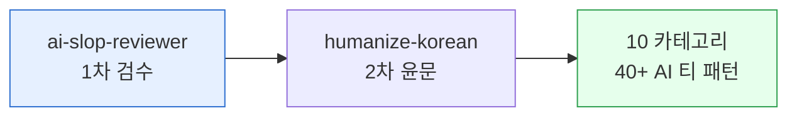

**릴리스 날짜**: 2026-05-07
**버전**: v2.1.0 (최신, MINOR)
**업데이트 명령**: `/plugin marketplace update cowork-plugins`



## Highlights

v2.1.0은 **한국어 AI 티 정밀 윤문** 도입 릴리스입니다. [`epoko77-ai/im-not-ai`](https://github.com/epoko77-ai/im-not-ai) v1.6.1 (MIT, ⭐937 stars)의 Fast 모드 단일 스킬 변형을 cowork에 포팅해, 영어권 humanizer가 약한 **한국어 고유 패턴**을 수술적으로 제거합니다.

기존 `moai-core:ai-slop-reviewer`가 일반 AI 슬롭을 1차 정리하고, 신규 `moai-content:humanize-korean`이 **10대 카테고리 × 40+ AI 티 패턴 SSOT**를 기반으로 한국어를 2차 정밀 윤문하는 **2단 체인 구조**가 표준 권장 워크플로우가 되었습니다.

마켓플레이스는 106 → **107 스킬**, 플러그인은 21개 그대로입니다. **Breaking change 없음** — 기존 워크플로우(블로그·뉴스레터·카피·랜딩 등)는 그대로 동작하며, `ai-slop-reviewer` 단독 사용도 변함없이 가능합니다. 한국어 텍스트에서 추가 정밀 윤문이 필요할 때만 `humanize-korean`을 자연어로 호출하시면 됩니다.

## What's New (추가)

### moai-content: humanize-korean (한국어 AI 티 정밀 윤문)

**전체 경로**: `moai-content:humanize-korean`

**한 줄 기능 요약**: AI(ChatGPT·Claude·Gemini)가 쓴 한국어 텍스트를 사람이 쓴 글처럼 윤문하되, **내용은 한 글자도 건드리지 않는** 한국어 특화 스킬.

**주요 입출력 및 지원 범위**:
- **입력**: 한국어 텍스트 또는 파일 경로 (블로그·뉴스레터·카피·사업계획서·제안서·보고서·이메일·랜딩 카피·칼럼·리포트)
- **출력**: `_workspace/{run_id}/` 디렉토리 안 분리 산출물 — `01_input.txt` (원문), `00_metrics.json` (사전 메트릭), `final.md` (윤문본 + HTML 주석 요약), `summary.md` (등급·검증·하이라이트), `06_metrics_after.json` (사후 메트릭)
- **분류 체계 SSOT**: 10대 카테고리 × 40+ 서브 패턴, S1/S2/S3 심각도
  - **A**: 번역투 (~를 통해, ~에 있어서, 이중 피동 ~되어진다, 가지고 있다)
  - **B**: 영어 인용·용어 과다 (한글+괄호 영어 매번)
  - **C**: 구조적 AI 패턴 (이모지 남발, 콜론 부제 헤딩, 연결어미 뒤 쉼표)
  - **D**: AI 특유 관용구 (결론적으로, 시사하는 바가 크다, 본질적으로, hype 어휘, 결말 공식)
  - **E**: 리듬 균일성 (문장 길이 stdev 8 미만)
  - **F**: 한자어 -성/-적/-화 밀도
  - **G**: hedging 남용 (~할 수 있을 것으로 보인다)
  - **H**: 문두 접속사 남발 (또한·따라서·즉·나아가)
  - **I**: 형식명사 과다 (~인 것이다, ~다는 뜻이다)
  - **J**: 시각 장식 남용 (볼드·따옴표·불릿)
- **의미 보존 가드**: 고유명사·수치·날짜·인용 100% 보존, **변경률 30% 경고 / 50% 강제 중단·롤백**
- **자체검증 6항**: 윤문 직후 보존성·register·장르 이탈·잔존 S1·인공 표현을 자가 점검
- **A/B/C/D 등급**: 자동 판정 후 등급 C/D는 정밀 검증 권고
- **정량 메트릭**: `metrics.py` (Python 3.13 표준 라이브러리만, 외부 의존 없음) 로 사전·사후 측정
- **옵션**: 장르 (칼럼/리포트/블로그/공적), 강도 (보수/기본/적극), 최소심각도 (S1/S2/S3)
- **사용자 측 API 키 불필요**: 외부 호출 없음. 모든 처리가 로컬에서 완결

**관련 링크**:
- [SKILL.md](https://github.com/modu-ai/cowork-plugins/blob/v2.1.0/moai-content/skills/humanize-korean/SKILL.md)
- [분류 체계 SSOT (40KB)](https://github.com/modu-ai/cowork-plugins/blob/v2.1.0/moai-content/skills/humanize-korean/references/ai-tell-taxonomy.md)
- [윤문 처방 playbook](https://github.com/modu-ai/cowork-plugins/blob/v2.1.0/moai-content/skills/humanize-korean/references/rewriting-playbook.md)
- [정량 메트릭 metrics.py](https://github.com/modu-ai/cowork-plugins/blob/v2.1.0/moai-content/skills/humanize-korean/references/metrics.py)
- [원본 저장소: epoko77-ai/im-not-ai](https://github.com/epoko77-ai/im-not-ai) (MIT License, ⭐937)

### references/strict-pipeline-spec.md (보존 문서)

원본의 7인 에이전트 Strict 5인 파이프라인 명세를 보존했습니다. 현재 스킬에서는 미사용이며, 향후 독립 플러그인 또는 Agent Teams 모드로 정밀 검증 워크플로를 확장할 때 참조합니다.

## Changed (변경)

### marketplace.json description 갱신

`metadata.description`이 v2.1.0 humanize-korean 도입 사실을 반영하도록 갱신되었습니다. 스킬 카운트 106 → **107**.

### moai-content plugin description 갱신

`moai-content/.claude-plugin/plugin.json`의 `description`·`keywords`에 `humanize-korean`·`한국어윤문`·`AI티제거`·`humanize` 키워드가 추가되었습니다.

### CLAUDE.md.tmpl 한국어 권장 체인 명시

`/project init`이 생성하는 CLAUDE.md 템플릿(`moai-core/skills/project/references/templates/CLAUDE.md.tmpl`)에 다음 한국어 권장 체인이 명시되었습니다:

```text
{콘텐츠 생성 스킬} → ai-slop-reviewer (1차 일반 후처리) → humanize-korean (2차 한국어 정밀 윤문, A/B/C/D 등급)
```

### 버전 동기화 129지점

`.claude-plugin/marketplace.json` × 1 + 21개 `plugin.json` + **107개 SKILL.md** = 총 **129 지점** 모두 `2.1.0`으로 동기화되었습니다 (Cowork 자동 업데이트 감지 보장).

## Fixed (수정)

해당 없음. 본 릴리스는 신규 스킬 도입 중심이며 버그 수정은 없습니다.

## Removed (제거)

해당 없음. 모든 이전 기능은 그대로 동작합니다.

## 업그레이드 방법

### 1단계: 마켓플레이스 업데이트

```bash
/plugin marketplace update cowork-plugins
```

### 2단계: 플러그인 상세 재진입

Claude Cowork에서 `moai-content` 플러그인 상세 페이지를 한 번 닫았다가 다시 열면 신규 `humanize-korean` 스킬이 표시됩니다.

### 3단계: API 키 (불필요)

신규 스킬은 **외부 API 키가 필요하지 않습니다**. `metrics.py`는 Python 3.13 표준 라이브러리만 사용하며, 외부 호출이 0건입니다 (로컬 완결).

### 4단계: 호환성 확인

기존 워크플로우는 그대로 동작합니다. v2.0.x에서 작성한 SPEC·체인은 v2.1.0에서 변경 없이 실행됩니다. `ai-slop-reviewer` 단독 사용도 그대로 유지됩니다.

## 사용 예시

### 가장 쉬운 호출 — 자연어 한 줄

```
이 ChatGPT 초안 자연스럽게 윤문해줘. 한국어 AI 티 제거해서 사람이 쓴 것처럼.

[ChatGPT 초안 본문 붙여넣기]
```

다음 자동 트리거 키워드 중 어느 것이든 인식합니다:
- "AI 티 없애줘"
- "GPT 문체 제거해줘"
- "사람이 쓴 것처럼 윤문해줘"
- "번역투 제거"
- "한글 AI 윤문"
- "ChatGPT 티 제거"
- "humanize Korean"

### 옵션 명시 호출

```
이 칼럼 humanize-korean으로 정밀 윤문해줘.
장르: 칼럼, 강도: 적극, 최소심각도: S1

[칼럼 본문 붙여넣기]
```

### 권장 2단 체인 — 블로그 발행

```text
> 'AI 시대의 콘텐츠 마케팅' 블로그 글 써줘. 네이버 블로그 SEO 반영해서.
→ blog 스킬 실행 (네이버 C-Rank 반영 본문 생성)
→ ai-slop-reviewer (1차 일반 AI 슬롭 후처리)
→ humanize-korean (2차 한국어 정밀 윤문, 등급 A/B/C/D)
→ 최종 산출물 (Markdown 포스트 + 검수 리포트 + 정밀 윤문본)
```

### 후속 명령 — 부분 재실행

```
> 방금 윤문본에서 D 카테고리(AI 관용구)만 다시 윤문해줘
→ humanize-korean 부분 재실행, 기존 run_id 재사용

> 강도 적극으로 다시 해줘
→ 최소심각도 S1로 변경, Phase 2부터 재실행
```

### 정밀 검증이 필요할 때 (등급 C/D)

```
> 윤문 결과가 등급 C야. 어떻게 해야 해?
→ summary.md 의 자체검증 미통과 항목 확인
→ references/strict-pipeline-spec.md (7인 에이전트 명세) 참조
→ 별도 워크플로로 정밀 검증 실행 검토
```

## ai-slop-reviewer와의 관계 — 언제 어떤 걸 쓰나

| 상황 | 권장 스킬 |
|---|---|
| 영어 비중 높은 텍스트 (영문 보고서·기술 블로그) | `ai-slop-reviewer` 단독 |
| 캐주얼 한국어 블로그·짧은 SNS 카피 | `ai-slop-reviewer` 단독 |
| 격식 한국어 (사업계획서·제안서·칼럼·공문) | `ai-slop-reviewer` → `humanize-korean` |
| 번역투가 의심되는 한국어 (ChatGPT/Claude 초안) | `ai-slop-reviewer` → `humanize-korean` |
| AI 탐지 우회 필요 (한국어 콘텐츠) | `ai-slop-reviewer` → `humanize-korean` (Fast 모드) |
| 법무·의료·재무 정확성 요구 도메인 | `ai-slop-reviewer` → `humanize-korean` (등급 C/D 시 정밀 검증) |

**핵심 차이**:
- `ai-slop-reviewer`: 일반 AI 슬롭(영어 표현, 일반 패턴) 1차 정리
- `humanize-korean`: 한국어 SSOT(번역투/관용구/형식명사 등 40+ 패턴) 2차 정밀 윤문 + 정량 메트릭 + 등급

## 호환성 정보

- **호환성**: v2.0.x 완전 호환 — Breaking change 없음
- **API 변경**: 없음
- **데이터 호환성**: 100% 호환
- **MINOR bump 사유**: 신규 스킬 추가 (humanize-korean). 기능 호환성 손실 없음

## 출처 어트리뷰션

본 릴리스의 신규 스킬은 [`epoko77-ai/im-not-ai`](https://github.com/epoko77-ai/im-not-ai) v1.6.1 (MIT License, ⭐937 stars) Fast 모드 단일 스킬 변형을 포팅했습니다.

| 자산 | 출처 |
|---|---|
| `ai-tell-taxonomy.md` (40KB SSOT) | 원본 그대로 |
| `rewriting-playbook.md` | 원본 그대로 |
| `quick-rules.md` | 원본 그대로 |
| `metrics.py` (Python 표준 라이브러리만) | 원본 그대로 |
| `baseline.json` | 원본 그대로 |
| `web-service-spec.md` | 원본 그대로 |
| `tests/test_metrics.py` | 원본 그대로 |
| `SKILL.md` | cowork v2.0+ 정책에 맞춰 재작성 (frontmatter `version` 단일 필드, `metadata` 블록 금지, 단일 스킬 워크플로 — 7인 에이전트 호출 제거) |
| `references/strict-pipeline-spec.md` | 신규 — 원본의 7인 에이전트 명세 보존 (현재 미사용, 향후 확장용) |

원본 라이선스(MIT)는 `cowork-plugins` MIT와 호환되며, 추가 의무는 없습니다. 원작자 [@epoko77-ai](https://github.com/epoko77-ai) 에게 진심으로 감사드립니다.

전체 어트리뷰션은 루트 `README.md` v2.1.0 하이라이트 섹션과 `CHANGELOG.md` `## [2.1.0]` Attribution 항목에서 확인할 수 있습니다.

### Sources
- GitHub 저장소: [https://github.com/modu-ai/cowork-plugins](https://github.com/modu-ai/cowork-plugins)
- 릴리스 태그: [https://github.com/modu-ai/cowork-plugins/releases/tag/v2.1.0](https://github.com/modu-ai/cowork-plugins/releases/tag/v2.1.0)
- CHANGELOG (v2.1.0): [https://github.com/modu-ai/cowork-plugins/blob/v2.1.0/CHANGELOG.md](https://github.com/modu-ai/cowork-plugins/blob/v2.1.0/CHANGELOG.md)
- 온라인 문서: [https://cowork.mo.ai.kr](https://cowork.mo.ai.kr)
- 원본 스킬 저장소: [epoko77-ai/im-not-ai](https://github.com/epoko77-ai/im-not-ai) (MIT, ⭐937)
- 원본 라이선스: [im-not-ai/LICENSE](https://github.com/epoko77-ai/im-not-ai/blob/main/LICENSE)
