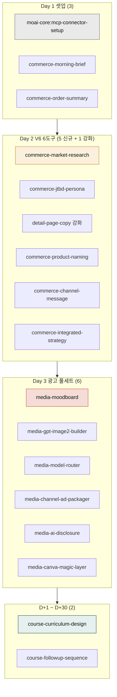

**릴리스 날짜**: 2026-05-12
**버전**: v2.3.0 (최신, MINOR)
**업데이트 명령**: `/plugin marketplace update cowork-plugins`



## Highlights

v2.3.0은 **"모두의 커머스 3일 마스터 캠프" 통합본**입니다. 월 매출 100만~10억 스마트스토어·자사몰 셀러가 외주 없이 3일 만에 신상품 1개의 상세페이지·광고·SNS·동영상을 직접 제작·운영하는 **21세션·18개 산출물 데이터 체인** 강의의 백엔드 도구로, **17 신규 + 6 강화 스킬**을 추가했습니다.

Day 1 셋업(MCP 4커넥터 인증·매장 데이터 1줄 통합) → Day 2 V6 6도구(V6 7교시 구조 1:1 매핑) → Day 3 신규 AI 모델(GPT Image 2·Kling 3·Veo 3·Seedance 라우터) → D+1~D+30 후기 자산화까지 PDF 기획서의 모든 산출물이 자연어 한 줄 입력으로 자동 호출됩니다.

또한 **Track C 페어 정리**로 15개 페어의 description에 `[책임 경계]`를 명시하고, `social-media`를 `sns-content`로 통합(글로벌 4채널 모드 추가), `campaign-planner`의 상세페이지·이미지 책임을 분리했습니다.

마켓플레이스 108 → **124 스킬** (+16 신규, `social-media` stub은 카운트 유지). 동기화 지점 130 → **146개** (marketplace 1 + plugin.json 21 + SKILL.md 124). **Breaking change 없음** — 기존 워크플로우 그대로 동작합니다.

## What's New (추가)

### Day 1 셋업 (3 신규)

#### moai-core:mcp-connector-setup
- **한 줄 기능 요약**: Drive·Notion·Higgsfield·OpenAI **4커넥터** 인증·환경변수·트러블슈팅 통합 가이드
- **합격 기준**: 4커넥터 모두 인증 성공 + 1회 호출 성공 (PDF §4.4 ③)
- **트러블슈팅 커버리지**: Windows MAX_PATH, 한글 파일명 30자, `computer://` 링크, API 키 만료·rate limit, Higgsfield Secret Key 발급
- 시연 매핑: Day 1 S4 (14:00–14:50)
- **링크**: [SKILL.md](https://github.com/modu-ai/cowork-plugins/blob/v2.3.0/moai-core/skills/mcp-connector-setup/SKILL.md) · [SPEC-CAMP-SETUP-005](https://github.com/modu-ai/cowork-plugins/blob/v2.3.0/.moai/specs/SPEC-CAMP-SETUP-005/spec.md)

#### moai-commerce:commerce-morning-brief
- **한 줄 기능 요약**: MCP `dashboard_morning_brief` → 어제 주문·신규 문의·트렌드·ROAS **4영역 1줄 통합**
- 페어 분리: `moai-business:daily-briefing`(외부 뉴스·웹) vs 본 스킬(MCP 매장 데이터)
- **링크**: [SKILL.md](https://github.com/modu-ai/cowork-plugins/blob/v2.3.0/moai-commerce/skills/commerce-morning-brief/SKILL.md)

#### moai-commerce:commerce-order-summary
- **한 줄 기능 요약**: MCP `order_summary_today` → 스마트스토어 + 카페24 + 아임웹 **채널 통합 신규 주문 1줄**
- **링크**: [SKILL.md](https://github.com/modu-ai/cowork-plugins/blob/v2.3.0/moai-commerce/skills/commerce-order-summary/SKILL.md)

### Day 2 V6 6도구 (5 신규 + 1 강화)

V6(정해준 강사) 7교시 구조 1:1 매핑 wrapper. PDF §5.3 V6 ↔ MCP 매핑.

| 스킬 | V6 매핑 | MCP 호출 | 산출물 |
|------|---------|----------|--------|
| `commerce-market-research` | ① 시장조사 | `trend_search`·`trend_shopping_categories`·`trend_shopping_keywords`·`keyword_for_product_idea` | 거시·경쟁·검색 3축 시장 리포트 1장 |
| `commerce-jtbd-persona` | ② 고객분석 | `review_list_naver`·`review_list_cafe24`·`qna_list_cafe24` | `--mode jtbd`: JTBD 9개 / `--mode persona`: 페르소나 3명 8필드 (리뷰 10건 미만 시 fallback) |
| `detail-page-copy` **강화** | ③ 상세페이지 | — | 기본 13섹션 + `--mode diagnose`: 7단계 진단 / `--mode copy`: 페르소나 2세트 (비율 25/50/25 강제) |
| `commerce-product-naming` | ④ 상품명 | `keyword_search_volume`·`keyword_related`·`keyword_bulk_research` | 상품명 3안(검색·CTR·브랜드) + 스마트스토어/쿠팡/네이버쇼핑 25자·금지어 검증 |
| `commerce-channel-message` | ⑤ 채널별 메시지 | `keyword_seasonal_calendar`·`ad_keyword_performance` | NCM(Need→Channel→Moment→Message→CTA) 검색·광고·CRM × 5종 = 15종 |
| `commerce-integrated-strategy` | ⑥ 통합 전략 | `dashboard_morning_brief`·`sales_compare_channels`·`ad_roas_summary` | 매출 향상 전략 1장 + 실행 우선순위 Top 3 |

**SPEC**: [SPEC-COMMERCE-V6-003](https://github.com/modu-ai/cowork-plugins/blob/v2.3.0/.moai/specs/SPEC-COMMERCE-V6-003/spec.md)

### Day 3 광고 풀세트 (6 신규)

PDF §6 + 부록 A·B·D 매핑. moai-media 플러그인 7 → 13 스킬.

| 스킬 | V6 매핑 | 백엔드 | 산출물 |
|------|---------|--------|--------|
| `media-moodboard` | ⑫ Day3 S1 | 분석·검색 | 색 팔레트 3종 + 톤 키워드 5개 + 레퍼런스 이미지 5장 + 작업 카드 |
| `media-gpt-image2-builder` | ⑬ Day3 S2 | **GPT Image 2** | 한글 타이포 5장 세트 (Hero 1 + 인포 1 + 라이프 2 + CTA 1) — 8단계 자동 리라이팅 |
| `media-model-router` | ⑮⑯ Day3 S4 | Kling 3 / Veo 3 / Seedance | 카테고리 매트릭스 자동 라우팅 + 의심차단형 후크 + 메인 영상 5~10초 + 보조 영상 2컷 |
| `media-channel-ad-packager` | ⑰ Day3 S6 | 후처리 | 메타 1:1·9:16 / 네이버 GFA / 카카오모먼트 1:1·16:9 채널 규격 자동 변환 + .zip |
| `media-ai-disclosure` | Day3 S2~S7 | 후처리 자동 체인 | "AI 생성" 메타데이터·워터마크·캡션 **3계층 부착** — 광고심의·소비자보호법 대응 |
| `media-canva-magic-layer` | Day3 S7 보너스 | 가이드 | 합성 PNG → 카피만 분리 → 시즌 재사용 5단계 체크리스트 (GPT Image 2 재호출 ↓90%) |

**카테고리 매트릭스 자동 라우팅**: 의류=Kling 3 / 뷰티=Veo 3 / 건강식품=Kling 3 / 생활용품=Seedance. 4명×5조 시차 호출(5분 간격)로 Higgsfield 동시 호출 비용 폭증 방지.

**SPEC**: [SPEC-MEDIA-CAMP-004](https://github.com/modu-ai/cowork-plugins/blob/v2.3.0/.moai/specs/SPEC-MEDIA-CAMP-004/spec.md)

### moai-education 활성화 (2 신규)

| 스킬 | 용도 | 출력 |
|------|------|------|
| `course-curriculum-design` | 3일 21세션 시간표 + 강사·조교 동선표 + D-7 사전 준비물 + 리스크 Plan B 5건+ | `moai-office:docx-generator` 자동 체이닝 → Word(.docx) |
| `course-followup-sequence` | 강의 후 30일 후기 카피 5종(D+1·D+3·D+7·D+14·D+30) + 인센티브 + 자산화 시퀀스 + SUNO BGM·MCP Phase 1 직접 호출 가이드 | 후기 카피 5종 + 자산화 매뉴얼 |

**SPEC**: [SPEC-CAMP-FOLLOWUP-006](https://github.com/modu-ai/cowork-plugins/blob/v2.3.0/.moai/specs/SPEC-CAMP-FOLLOWUP-006/spec.md)

## Changed (변경)

### detail-page-copy 강화 (3 모드)

기존 13섹션 모드는 하위 호환으로 유지하면서 V6 신규 모드 2개를 추가했습니다:

| 모드 | 플래그 | 설명 |
|------|--------|------|
| 기본 (13섹션) | 없음 | 감정여정 13섹션 카피 전체 생성 (기존) |
| 진단 | `--mode diagnose` | 현재 상세페이지 7단계 진단 점수 (V6 신규) |
| 페르소나 카피 | `--mode copy` | ⑥⑦ 기반 카피 2세트 생성, 비율 25/50/25 강제 (V6 신규) |

### Track C 페어 정리 (SPEC-CATALOG-CLEANUP-007)

**통합 1건**: `moai-content:social-media` → `moai-marketing:sns-content`에 흡수
- 글로벌 4채널 모드 추가: **스레드·X·링크드인·유튜브 쇼츠**
- 한국 3채널 모드(인스타·네이버 블로그·카카오)는 유지
- `social-media`는 deprecate stub + 리디렉션 안내 (v2.5.0까지 호환)

**책임 분리 1건**: `moai-marketing:campaign-planner`
- "이커머스 상세페이지 제작·AI 이미지 생성" 책임 제거
- 상세페이지 카피 → `moai-commerce:detail-page-copy`
- 상세페이지 합성 이미지 → `moai-commerce:detail-page-image`
- AI 이미지·영상 → `moai-media:*`
- 본 스킬은 캠페인 단위 전술(1~3개월)에만 집중

**[책임 경계] 명확화 15건**: copywriting/commerce-copywriting (Pair 1), product-detail/detail-page-copy (Pair 2), personal-branding/brand-identity (Pair 5), target-script (Pair 6), performance-report/executive-summary (Pair 7), market-analyst/sbiz365-analyst (Pair 8), daily-briefing (Pair 9), landing-page (Pair 10) + sns-content·campaign-planner

### 버전 동기화 (146 지점)

- `.claude-plugin/marketplace.json`: `metadata.version` 2.2.0 → **2.3.0**
- 모든 plugin.json (21개): `version` → **2.3.0**
- 모든 SKILL.md frontmatter (124개): `version` → **2.3.0**
- 총 **146 지점** 동기화 완료

### Marketplace description 갱신
- moai-core, moai-marketing, moai-content, moai-education, moai-commerce, moai-media 6개 플러그인 description 갱신

## Removed

해당 없음. `social-media`는 v2.5.0까지 stub으로 호환 유지됩니다.

## Fixed

해당 없음 (별도 fixed 항목 없음 — 본 릴리스는 신규 기능 위주의 MINOR).

## 업그레이드 방법

```bash
# Cowork/Claude Code 사용자
/plugin marketplace update cowork-plugins
```

이후 플러그인 상세 페이지에 재진입하면 반영됩니다.

**API 키 재등록 필요 (Day 3 광고 풀세트 사용 시)**:
- `OPENAI_API_KEY` (GPT Image 2 호출) — [platform.openai.com](https://platform.openai.com/api-keys)
- `HIGGSFIELD_API_KEY` + `HIGGSFIELD_SECRET` (Kling 3·Veo 3·Seedance) — [higgsfield.ai](https://higgsfield.ai)

또는 `moai-core:mcp-connector-setup` 스킬을 호출해 통합 가이드를 받으세요.

**Breaking change 없음** — 기존 워크플로우 그대로 동작합니다.

## MCP 의존성 안내 (Day 2 V6 6도구 + Day 1 셋업)

V6 6도구와 Day 1 셋업 스킬은 **MoAI-Commerce MCP Phase 1**(34종 도구)을 호출합니다. v2.3.0 출시 시점에는 MCP 서버가 아직 미출시이므로 다음 중 하나로 대체합니다:

- **옵션 A**: 사전 녹화 영상 5분 (PDF §S4 운영 노트)
- **옵션 B**: 강사 본인 워크스페이스에서 라이브 호출

**v2.4.0 출시 예정**: `cowork-plugins/mcp-servers/moai-commerce/` monorepo에 Python(uvx) 기반 MCP 서버 구현. 광고 운영 4종(meta ads · tiktok ads · 네이버 광고 · 카카오 모먼트) + Phase 1 34종 + Higgsfield MCP 통합.

## 사용 예시 프롬프트

```text
# Day 1 셋업
> "MCP 커넥터 4개 연결 방법 알려줘 — Drive·Notion·Higgsfield·OpenAI"
> "아침 매장 브리핑 해줘"

# Day 2 V6 6도구
> "내 카테고리 시장조사 해줘"
> "리뷰 분석해서 페르소나 3명 만들어줘"
> "현재 상세페이지 진단해줘"
> "키워드 넣어서 상품명 3안 만들어줘 — 무선이어폰, ANC, 30시간"
> "검색·광고·CRM 채널별로 메시지 15종 뽑아줘"
> "오늘 배운 것 종합 전략 1장으로 정리해줘"

# Day 3 광고 풀세트
> "무드보드 만들어줘 — 비건 스킨케어, 따뜻한 톤"
> "광고 이미지 5장 만들어줘 — 무선이어폰, 직장인 타겟"
> "광고 영상 만들어줘 — 의류 카테고리, 의심차단형 후크"
> "채널별 광고 소재 만들어줘 — 메타+네이버+카카오"

# D+1 ~ D+30 후기 자산화
> "캠프 종료 후 30일 후기 시퀀스 카피 만들어줘"

# 운영 매뉴얼
> "3일 21세션 운영 매뉴얼 만들어줘 — 강사·조교 동선 + D-7 사전 준비물 + Plan B"
```

## 비교표

### Track C 페어 정리 — 언제 어떤 걸 쓰나

| 작업 | 사용할 스킬 |
|------|-------------|
| 일반 광고·마케팅 카피 | `moai-content:copywriting` |
| 이커머스 광고·톡톡·푸시 카피 | `moai-commerce:commerce-copywriting` |
| 상세페이지 13섹션 카피 | `moai-commerce:detail-page-copy` (강화) |
| 상세페이지 합성 이미지 | `moai-commerce:detail-page-image` |
| 한글 타이포 광고 이미지 5장 | `moai-media:media-gpt-image2-builder` 🆕 |
| 광고 영상 (카테고리 자동 라우팅) | `moai-media:media-model-router` 🆕 |
| 한국 3채널 + 글로벌 4채널 SNS | `moai-marketing:sns-content` (확장) |
| 캠페인 단위 전술 (1~3개월) | `moai-marketing:campaign-planner` (책임 분리) |
| 사업·OKR·BMC 단위 전략 (1~5년) | `moai-business:strategy-planner` |

## 관련 문서 & 출처

### SPEC 산출물 (총 84 EARS REQ)
- [SPEC-COURSE-CAMP-001](https://github.com/modu-ai/cowork-plugins/blob/v2.3.0/.moai/specs/SPEC-COURSE-CAMP-001/spec.md) — 강의 전체 요구사항·18 산출물·합격기준·운영 매뉴얼
- [SPEC-COMMERCE-MCP-002](https://github.com/modu-ai/cowork-plugins/blob/v2.3.0/.moai/specs/SPEC-COMMERCE-MCP-002/spec.md) — Track A MoAI-Commerce MCP 서버 (v2.4.0 예정)
- [SPEC-COMMERCE-V6-003](https://github.com/modu-ai/cowork-plugins/blob/v2.3.0/.moai/specs/SPEC-COMMERCE-V6-003/spec.md) — Wave 1 commerce 6
- [SPEC-MEDIA-CAMP-004](https://github.com/modu-ai/cowork-plugins/blob/v2.3.0/.moai/specs/SPEC-MEDIA-CAMP-004/spec.md) — Wave 2 media 6
- [SPEC-CAMP-SETUP-005](https://github.com/modu-ai/cowork-plugins/blob/v2.3.0/.moai/specs/SPEC-CAMP-SETUP-005/spec.md) — Wave 3 core 3
- [SPEC-CAMP-FOLLOWUP-006](https://github.com/modu-ai/cowork-plugins/blob/v2.3.0/.moai/specs/SPEC-CAMP-FOLLOWUP-006/spec.md) — Wave 4 education 2
- [SPEC-CATALOG-CLEANUP-007](https://github.com/modu-ai/cowork-plugins/blob/v2.3.0/.moai/specs/SPEC-CATALOG-CLEANUP-007/spec.md) — Track C 페어 정리

### 영향받은 플러그인 페이지
- [moai-commerce 플러그인 페이지](/plugins/moai-commerce/) — V6 6도구 추가
- [moai-media 플러그인 페이지](/plugins/moai-media/) — Day 3 광고 풀세트 추가
- [moai-core 플러그인 페이지](/plugins/moai-core/) — mcp-connector-setup 추가
- [moai-education 플러그인 페이지](/plugins/moai-education/) — 3일 캠프 운영 매뉴얼 + 30일 후기 자산화 시퀀스 추가

### CHANGELOG
- [CHANGELOG.md (v2.3.0 섹션)](https://github.com/modu-ai/cowork-plugins/blob/main/CHANGELOG.md)

### 외부 출처
- 모두의 커머스 3일 마스터 캠프 PDF 기획서 (강사: 정해준)
- [GPT Image 2 (OpenAI Platform)](https://platform.openai.com/docs/guides/images)
- [Kling AI](https://klingai.com/) · [Veo 3 (Google DeepMind)](https://deepmind.google/technologies/veo/) · [Seedance (ByteDance)](https://www.volcengine.com/)
- [Higgsfield AI](https://higgsfield.ai/)

## 후속 작업 (v2.4.0 예정)

**Track A MoAI-Commerce MCP 서버 구현** (`cowork-plugins/mcp-servers/moai-commerce/` monorepo):
- 광고 운영 4종: meta ads · tiktok ads · 네이버 광고 · 카카오 모먼트
- Phase 1 34종 도구
- Higgsfield (Kling 3·Veo 3·Seedance 2.0) 통합
- Python (uvx) 기반

본 v2.3.0 출시까지는 사전 녹화 영상 5분 또는 강사 본인 워크스페이스 라이브 호출로 대체합니다 (PDF §S4 운영 노트).
