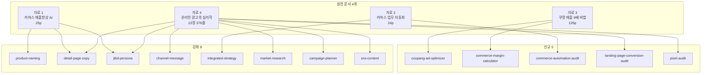

**릴리스 날짜**: 2026-05-12
**버전**: v2.4.0 (최신, MINOR)
**업데이트 명령**: `/plugin marketplace update cowork-plugins`



## Highlights

v2.4.0은 **"캠프 후속 인사이트 통합본"** 입니다. v2.3.0 출시 직후 GOOS행님이 분석에 넘겨준 정해준 강사 본인 노하우 3개 문서 + 광고 심리학 완전판(총 200+ 페이지)을 분석해 **13건(신규 5 + 강화 8)**으로 통합했습니다.

특히 `coupang-ad-optimizer`는 정해준 강사가 본인 매장에서 **월매출 7천 → 6개월 만에 3.6억, 광고비 매출 30% → 11.2%** 까지 끌어낸 6개월 노하우를 wrapper 스킬화 한 것으로, 캠프 D-14 운영 직전에 강의 전 단계에서 즉시 활용 가능합니다.

마켓플레이스 124 → **129 스킬**. 동기화 지점 146 → **151**개. Breaking change 없음 — 기존 워크플로우 그대로 동작.

## What's New (신규 5)

### moai-commerce 신규 3

#### coupang-ad-optimizer
- **한 줄**: 쿠팡 광고 풀세트 최적화 (3 캠페인 유형 자동 분류 + 검색/비검색 분리 + 엔드 ROAS + 자동규칙 3종)
- **원전**: 정해준 강사 "쿠팡 매출 9배 올려준 광고관리 비법" 전자책 126p
- **핵심**: 검색영역 vs 비검색영역 CPM 167배 차이 분리 분석, 캠페인 = 정리함 원칙(상품 1개당 캠페인 1개), 목표 ROAS = 입찰가 조절 역할, 오디언스 플러스 OFF·할인쿠폰 ON·키워드 제외 500개
- **링크**: [SKILL.md](https://github.com/modu-ai/cowork-plugins/blob/v2.4.0/moai-commerce/skills/coupang-ad-optimizer/SKILL.md)

#### commerce-margin-calculator
- **한 줄**: 상품별 마진·엔드 ROAS(본전 ROAS)·손익분기 광고비 자동 계산
- **원전**: 정해준 강사 시크릿팡(secretpang.kr) 마진계산기 로직 + 자료 3 §4 엔드 ROAS 공식
- **핵심**: 채널별 수수료 자동 반영(스마트스토어 5.94% / 쿠팡 10~12% / 카페24 2~3% / 아임웹 0~2.5%), 부가세·결제 수수료·쿠폰 자동, AI 챗봇 자연어 입력
- **링크**: [SKILL.md](https://github.com/modu-ai/cowork-plugins/blob/v2.4.0/moai-commerce/skills/commerce-margin-calculator/SKILL.md)

#### commerce-automation-audit
- **한 줄**: 셀러 운영 자체 진단 + 자동화 우선순위 점수 산정 + 3 Phase 로드맵
- **원전**: 정해준 강사 "커머스 업무 자동화 기획" 24p 풀세트
- **핵심**: 6대 영역(A 상품운영 / B 가격&프로모션 / C 주문&정산 / D 재고&물류 / E 마케팅&고객 / F 데이터&경영) + 자동화 3분류 + 우선순위 공식((빈도×시간×오류비용)÷복잡도) + 3 Phase(Quick Wins/Core/AI Enhancement) + 5 KPI + HITL Golden Rule(80% 자동화 + 10배 검수)
- **링크**: [SKILL.md](https://github.com/modu-ai/cowork-plugins/blob/v2.4.0/moai-commerce/skills/commerce-automation-audit/SKILL.md)

### moai-marketing 신규 2

#### landing-page-conversion-audit
- **한 줄**: 랜딩페이지 6섹션 구조 진단 + CTR/CVR 분기별 개선 처방
- **원전**: 자료 4 "온라인 광고의 심리학" §9 랜딩페이지
- **핵심**: 진단 분기(CTR↓→광고 / CVR↓→랜딩 / 장바구니↓→결제) + 빠른 처방 3종(불안해소 문구 +10~20% / 메시지 일치 / 간편결제)
- **링크**: [SKILL.md](https://github.com/modu-ai/cowork-plugins/blob/v2.4.0/moai-marketing/skills/landing-page-conversion-audit/SKILL.md)

#### pixel-audit
- **한 줄**: 메타·구글 픽셀 설치 검증 + 1st Party 데이터 활용 진단 + Lookalike 씨앗 품질 평가
- **원전**: 자료 4 §5 1st Party 데이터와 커스텀 오디언스
- **핵심**: 픽셀 실수 3종 점검(구매자 미제외/이벤트 파라미터 미설정/CAPI 미설치), VIP 구매자(상위 20%) Lookalike 권장, iOS 14.5+ CAPI 필수
- **링크**: [SKILL.md](https://github.com/modu-ai/cowork-plugins/blob/v2.4.0/moai-marketing/skills/pixel-audit/SKILL.md)

## Changed (강화 8)

| 스킬 | 강화 항목 |
|------|----------|
| `commerce-product-naming` | 공식 4요소 `[브랜드]+[카테고리]+[키워드]+[차별점]` + 매핑 3안 카테고리(검색/CTR/브랜드) + 금지 키워드 9종 + 주의사항 4종 + 적용 예시 2종 |
| `detail-page-copy` | 7단계 + 25/50/25 비율 가이드 보강 + 좋은/피해야 할 예시 + PAS 카피 공식 매핑(7단계 ↔ Problem-Agitate-Solution) + 혜택 언어 3단계 변환법(기능→변화→감정) |
| `commerce-jtbd-persona` | JTBD 3분류 카테고리별 예시(다이어트 가루 9개) + 심리적 필요 4종 촉발 패턴(보상심리·불안해소·지루함·사회적자극) + 타겟 온도 4단계 메타데이터 |
| `commerce-channel-message` | 6 심리 방아쇠(신뢰·손실회피·사회증거·인지쉬움·정체성·앵커링) + 채널별 심리 상태 매트릭스(메타·구글·네이버·카카오·쿠팡) + 인지 편향 8종 |
| `commerce-integrated-strategy` | 자동화 4단계 프로세스 + 3 Phase 로드맵 + HITL Golden Rule |
| `commerce-market-research` | 포지셔닝 5축(품질/가성비/전문성/편의성/가치관) + 새 카테고리 창출 vs 기존 카테고리 경쟁 분석 + 6대 영역 진단 통합 |
| `campaign-planner` | 광고 심리학 완전판 통합 — 성과 공식 + 3 동기 + 6 방아쇠 + 8 편향 + PAS + 후크 6종 + 영상 30초 구조 + 타겟 온도 × 동기 매트릭스 + 1st Party + LTV/CAC + 단계별 예산 배분 |
| `sns-content` | 채널별 심리 상태 매트릭스 + 메타 학습 기간 48~72시간 가이드 + iOS 14+ CAPI·GA4 교차 검증 |

## Fixed

해당 없음.

## Removed

해당 없음.

## 업그레이드 방법

```bash
# Cowork/Claude Code 사용자
/plugin marketplace update cowork-plugins
```

플러그인 상세 페이지 재진입 시 반영.

**Breaking change 없음** — 기존 워크플로우 그대로 동작합니다.

**API 키 재등록 필요 없음** — v2.4.0 신규 5 스킬은 기존 데이터·계정·플랫폼만으로 동작 (마케팅 API 키는 사용자 측에서 광고 플랫폼 별도 등록).

## 사용 예시 프롬프트

```text
# 쿠팡 광고 운영
> "쿠팡 광고 분석해줘"
> "엔드 ROAS 계산해줘 — 19,800원 무선이어폰 원가 6,000원 쿠팡"
> "쿠팡 골든타임 자동규칙 적용"

# 마진·자동화
> "이 가격 팔아도 본전인가? 12,900원 비건 스킨케어 카페24"
> "내 매장 자동화 우선순위 진단해줘 — 월주문 3,500건"

# 랜딩·픽셀
> "랜딩페이지 진단 — CTR 1.2% CVR 0.5%"
> "메타 픽셀·CAPI 설치 점검 + Lookalike 씨앗 진단"
```

## 비교표 — v2.3.0 vs v2.4.0

| 항목 | v2.3.0 | v2.4.0 |
|------|--------|--------|
| 마켓플레이스 스킬 | 124 | **129 (+5)** |
| moai-commerce | 19 | **22 (+3)** |
| moai-marketing | 8 | **10 (+2)** |
| 동기화 지점 | 146 | **151** |
| 쿠팡 광고 운영 | — | ✅ coupang-ad-optimizer |
| 마진·엔드 ROAS 자동 | — | ✅ commerce-margin-calculator |
| 자동화 진단·로드맵 | — | ✅ commerce-automation-audit |
| 랜딩 진단 | — | ✅ landing-page-conversion-audit |
| 픽셀·Lookalike | — | ✅ pixel-audit |
| 광고 심리학 적용 | 부분 | ✅ 완전판 (campaign-planner) |

## 관련 문서 & 출처

### 인사이트 원전
- 정해준 강사 "쿠팡 매출 9배 올려준 광고관리 비법" 전자책 (126p, 본인 6개월 노하우)
- 정해준 강사 "커머스 업무 자동화 기획" (24p, 6대 영역 + 자동화 프레임워크)
- 정해준 강사 "커머스 매출향상을 위한 AI 활용 전략" (26p, JTBD + 페르소나 + 상세페이지 + 상품명)
- "온라인 광고의 심리학" (DOCX, 13장 376줄 완본, 성과 공식 + 심리 방아쇠 + 인지 편향)
- 시크릿팡 마진계산기 (https://secretpang.kr/?ref=pdf) — 마진 공식 호환

### 영향받은 플러그인 페이지
- [moai-commerce 플러그인 페이지](/plugins/moai-commerce/) — 19 → 22 스킬
- [moai-marketing 플러그인 페이지](/plugins/moai-marketing/) — 8 → 10 스킬

### CHANGELOG
- [CHANGELOG.md (v2.4.0 섹션)](https://github.com/modu-ai/cowork-plugins/blob/main/CHANGELOG.md)

## 후속 작업 (v2.5.0 예정)

**Track A MoAI-Commerce MCP 서버 구현** (v2.4.0이 캠프 후속 인사이트 통합으로 사용되어 v2.5.0으로 이동):
- 광고 운영 4종: meta ads · tiktok ads · 네이버 광고 · 카카오 모먼트
- Phase 1 34종 도구
- Higgsfield (Kling 3·Veo 3·Seedance 2.0) 통합
- Python (uvx) 기반
- `cowork-plugins/mcp-servers/moai-commerce/` monorepo
