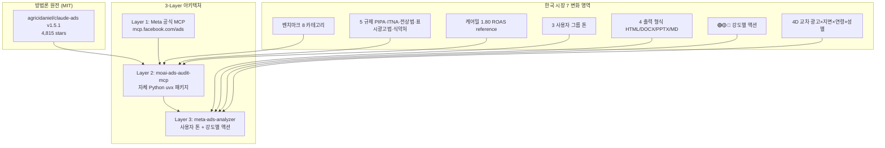

**릴리스 날짜**: 2026-05-13
**버전**: v2.5.0 (최신, MINOR)
**업데이트 명령**: `/plugin marketplace update cowork-plugins`

## Highlights

v2.5.0은 **"메타 광고 audit 3-Layer 인프라"** 출시입니다. v2.4.0 캠프 후속 인사이트 통합 직후 GOOS행님이 분석에 넘겨준 메타 광고 분석 스킬 작업명세서(v1.1, 12 섹션 + 11 부록) + 케어밀 3개월 광고 보고서 + 광고 심리학 §11 데이터 분석 장 + 쿠팡 매출 9배 비법 + 외부 자료 [agricidaniel/claude-ads](https://github.com/AgriciDaniel/claude-ads) v1.5.1 (MIT, 4,815 stars)을 통합 분석해 **신규 1 스킬 + 신규 1 MCP 서버**로 통합했습니다.

**Layer 3** `meta-ads-analyzer`는 메타 광고관리자에서 추출한 `.xlsx` 보고서 1~6개를 받아 9 분석 모듈(퍼널·KPI·차원·매트릭스·누수·라이프사이클·학습·예산·시뮬레이션) + 4D 교차 분석(광고×지면×연령×성별) + 3 사용자 그룹 톤(인하우스/대행사/소규모, 명시 입력) + 4 출력 형식(HTML/DOCX/PPTX/MD, cowork 공용 디자인 토큰 적용) + 🟢🟡🔴 강도별 액션 옵션을 제시합니다. claude-ads의 50-check 매트릭스를 한국 시장에 맞춰 매핑하고, 메타 광고관리자 UI 조작 가이드는 배제(REQ-META-ADS-018)해 단정적 명령이 아닌 의사결정 옵션을 제공합니다.

**Layer 2** `moai-ads-audit-mcp`는 audit 비즈니스 로직 전담 자체 MCP 서버(Python uvx 패키지, MIT, v0.1.0)입니다. cowork-plugins monorepo의 첫 MCP 서버 패키지로, `mcp-servers/moai-ads-audit/` 아래에 구현되어 있습니다. claude-ads의 가중치 스코어링 공식·Severity multiplier·카테고리 가중치·A-F 등급·Quick Wins 로직을 한국 시장에 맞춰 적용하며, 한국 벤치마크 8 카테고리 + 5 규제 컴플라이언스(PIPA·정보통신망법·전자상거래법·표시광고법·식약처 광고심의)를 추가로 제공합니다.

마켓플레이스 129 → **130 스킬**. 동기화 지점 151 → **152**개. Breaking change 없음 — 기존 워크플로우 그대로 동작합니다.

## What's New

### moai-marketing 신규 1 스킬

**`meta-ads-analyzer`** — 메타 광고관리자 `.xlsx` 보고서 분석기

- **SKILL.md GitHub URL**: [moai-marketing/skills/meta-ads-analyzer/SKILL.md](https://github.com/modu-ai/cowork-plugins/blob/main/moai-marketing/skills/meta-ads-analyzer/SKILL.md)
- **문서 페이지**: [/plugins/moai-marketing/](/plugins/moai-marketing/)
- **공식 외부 참고**: [agricidaniel/claude-ads v1.5.1 (MIT)](https://github.com/AgriciDaniel/claude-ads)

핵심 기능:

- 입력: `.xlsx` 보고서 1~6개 업로드 (메타 광고관리자에서 추출)
- 사용자 그룹: 인하우스 / 대행사 / 소규모 3 그룹 중 명시 선택 (자동 추정 없음)
- 9 분석 모듈: 퍼널 분해 / KPI 분해 / 차원별 분해(플랫폼·지면·소재·연령·성별) / 범용 매트릭스 / 누수·파레토 / 소재 라이프사이클 / 학습 단계 진입 / 예산 적정성 / 시나리오 시뮬레이션
- 4D 교차 분석: 광고 × 지면 × 연령 × 성별
- 5 자동 모드 판단: 단일 캠페인 / 통합 분석 / 분리 보고서 통합 / 다중 월 비교 / 다중 캠페인 일괄
- 7-Level 출력 계층 (한 줄 요약 → 영역별 진단 → 강도별 액션 옵션 → 시뮬레이션)
- 4 출력 형식: HTML(React+Recharts 단일 파일, cowork 공용 디자인 토큰 `--ivory`/`--paper`/`--slate`/`--clay`/`--clay-d`/`--oat`/`--olive` 적용) / DOCX(8 섹션) / PPTX(10~15 슬라이드) / MD(체크박스 + 우선순위)
- 강도별 액션 옵션: 🟢 보수안 / 🟡 중도안 / 🔴 적극안 + 양면 해석 + 의사결정 가이드
- 면책 문구 자동 첨부 (메타 광고관리자 실제 적용은 사용자 본인 책임)
- `ai-slop-reviewer` 자동 체이닝 (DOCX/PPTX/MD 텍스트 산출물)

산출물: SKILL.md + references/{A,B,C,D,E,F,G,H,I,J,K}.md 11개 부록 = **12파일, 1,829줄**.

사용 예시:


> 메타 광고 보고서 분석해줘. 케어밀 3개월 .xlsx 파일 첨부.



> ROAS 낮은 이유 분석 + 지면별 분해 + 연령·성별 교차 분석 부탁드립니다.


### `mcp-servers/moai-ads-audit/` 신규 자체 MCP 서버

cowork-plugins monorepo 첫 MCP 서버 패키지. Python uvx, MIT 라이선스, v0.1.0.

- **GitHub URL**: [mcp-servers/moai-ads-audit/](https://github.com/modu-ai/cowork-plugins/tree/main/mcp-servers/moai-ads-audit)
- **방법론 원전**: [agricidaniel/claude-ads v1.5.1 (MIT)](https://github.com/AgriciDaniel/claude-ads) — NOTICE.md attribution 보존

핵심 사양:

- 가중치 스코어링 공식: `S_total = Σ(C_pass × W_sev × W_cat) / Σ(C_total × W_sev × W_cat) × 100`
- Severity multiplier: Critical 5.0× · High 3.0× · Medium 1.5× · Low 0.5×
- 카테고리 가중치: Pixel/CAPI 30% · Creative 30% · Account 20% · Audience 20%
- 상태 매핑: PASS=1.0 · WARNING=0.5 · FAIL=0.0 · N/A excluded
- A-F 등급: A ≥90 / B 75-89 / C 60-74 / D 40-59 / F <40
- 43 unique check matrix: Pixel/CAPI 10 (M01-M10) + Creative 12 (M25-M32 + M-CR1~4) + Account 10 (M11-M18 + M-ST1-2) + Audience 7 (M19-M24 + M-TH1) + Andromeda 4 (M-AN1·M-AT1·M-IA1·M-TH1 cross)
- 한국 벤치마크 8 카테고리: 식품/음료(CPC ₩500-1,500 · ROAS 1.5-2.5, 케어밀 1.80 reference) / 패션/뷰티 / 건강기능식품 / IT/디지털 / 가정용품 / 교육 / B2B / 기타
- 5 규제 검사: PIPA (개인정보) / 정보통신망법 / 전자상거래법 / 표시광고법 / 식약처 광고 심의 (식품·건강기능식품 자동 활성)
- 우선 구현 도구 3종: `audit_meta_account` (4 카테고리 합산 진입점) · `audit_pixel_capi` (M01-M10 검사) · `calculate_health_score` (가중치 공식 + A-F 등급)
- **테스트**: 50/50 pytest pass (scoring + xlsx parser)
- 잔여 7 도구는 v2.5.x 후속 (`audit_creative_diversity` · `audit_account_structure` · `audit_audience_targeting` · `audit_andromeda_emq` · `generate_quick_wins` · `apply_korean_benchmarks` · `apply_korean_compliance`)

산출물: pyproject.toml + manifest.json + README + CONNECTORS + Python 모듈 12파일 + 테스트 2종 = **23파일, 3,813줄**.

### MCP 등록 인프라

- `moai-marketing/.mcp.json` 신규 — 2 MCP 서버 등록 (`meta-ads` hosted + `moai-ads-audit` local stdio)
- `moai-marketing/CONNECTORS.md` 신규 — `META_ACCESS_TOKEN` 발급 절차 + Layer 1 fallback 옵션 4종(Meta 공식 · Adspirer · byadsco · pipeboard) + 10 도구 명세

## Changed

- 마켓플레이스 스킬 카운트: 129 → **130** (+1 신규, mcp-server 1종 신규)
- 동기화 지점: 151 → **152** (marketplace 1 + plugin.json 21 + SKILL.md 130)
- `moai-marketing` plugin.json `description` v2.5.0 신규 항목 추가
- `marketplace.json` `plugins[]` 배열의 `moai-marketing` description 갱신
- 루트 README 배지(Version 2.5.0 · Skills 130) + v2.5.0 하이라이트 섹션
- `moai-marketing/README.md` 스킬 테이블 11행 + MCP 서버 섹션 신규

## Fixed

해당 없음.

## Removed

해당 없음. Breaking change 없음 — 기존 워크플로우 그대로 동작.

## 업그레이드 방법

1. **마켓플레이스 캐시 갱신**:


> /plugin marketplace update cowork-plugins


2. **`moai-marketing` 플러그인 상세 재진입** — 새 스킬 `meta-ads-analyzer`와 MCP 서버 2종이 자동 감지됩니다.
3. **Meta 공식 MCP 활성화 (선택)** — Layer 1 데이터 fetch를 위해 `META_ACCESS_TOKEN` 환경변수 등록. 발급 절차는 `moai-marketing/CONNECTORS.md` §Meta Ads 참조. 비활성 환경에서는 `.xlsx` 업로드 fallback이 자동 동작합니다.
4. **`moai-ads-audit-mcp` 패키지 자동 설치** — `uvx`가 첫 호출 시 자동 처리 (`mcp-servers/moai-ads-audit/` 경로 참조).

기존 워크플로우(v2.4.0까지의 13건 통합본 + 캠프 캠페인 후속)는 그대로 동작합니다.

## 관련 문서 & 출처

- **CHANGELOG**: [전체 변경 사항](https://github.com/modu-ai/cowork-plugins/blob/main/CHANGELOG.md#250---2026-05-13)
- **moai-marketing 플러그인 페이지**: [/plugins/moai-marketing/](/plugins/moai-marketing/)
- **방법론 원전**: [agricidaniel/claude-ads](https://github.com/AgriciDaniel/claude-ads) v1.5.1 (MIT, 4,815 stars) — 50-check audit matrix · 가중치 스코어링 공식 · Quick Wins 로직
- **NOTICE attribution**: [.claude/rules/moai/NOTICE.md §agricidaniel/claude-ads (MIT)](https://github.com/modu-ai/cowork-plugins/blob/main/.claude/rules/moai/NOTICE.md)
- **MCP 등록 가이드**: [moai-marketing/CONNECTORS.md](https://github.com/modu-ai/cowork-plugins/blob/main/moai-marketing/CONNECTORS.md)
- **Meta 공식 MCP**: [Meta for Developers](https://developers.facebook.com/) (2026-04-29 출시)
- **Layer 1 fallback 옵션**: Adspirer / byadsco/meta-ads-mcp / pipeboard (CONNECTORS.md §Fallback 참조)

## 후속 (v2.5.x 또는 v2.6.0 예정)

- `moai-ads-audit-mcp` 잔여 7 도구 구현 (creative_diversity · account_structure · audience_targeting · andromeda_emq · quick_wins · korean_benchmarks · korean_compliance)
- 한국 벤치마크 8 카테고리 수치 정식 검증 출처 확정 (현재 v0.1.0 placeholder, SPEC §7 OQ4)
- claude-ads 50 vs 43 check 차이 7 항목 추가 검토 (SPEC §7 OQ3)
- 표본 부족 셀 마스킹 기준 N값 통일 (SPEC §7.2 미결정)
- v2 단계: TikTok·Naver·Kakao audit 확장
- v3 단계: SaaS UI·다국어·상시 대시보드
