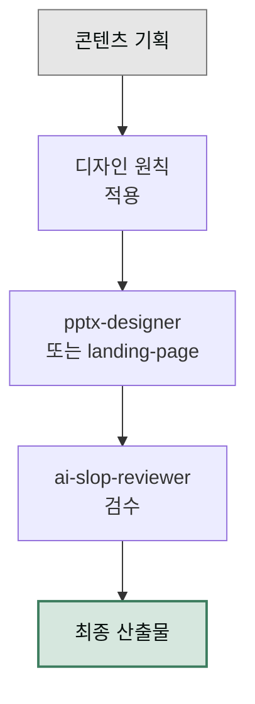

모두의 코워크의 디자인 계열 스킬을 사용할 때 참고할 수 있는 원칙 모음입니다.

```mermaid
flowchart TD
   A["콘텐츠 기획"] --> B["디자인 원칙<br/>적용"]
   B --> C["pptx-designer<br/>또는 landing-page"]
   C --> D["ai-slop-reviewer<br/>검수"]
   D --> E["최종 산출물"]

   style A fill:#e6e6e6,stroke:#757575,color:#09110f
   style E fill:#d6e7de,stroke:#3d7d5f,stroke-width:2px,color:#09110f
```

## 가이드

- [프레젠테이션 디자인 원칙](./presentation/) — `moai-officer:doc-pptx`로 만든 슬라이드를 더 좋게 만드는 룰
