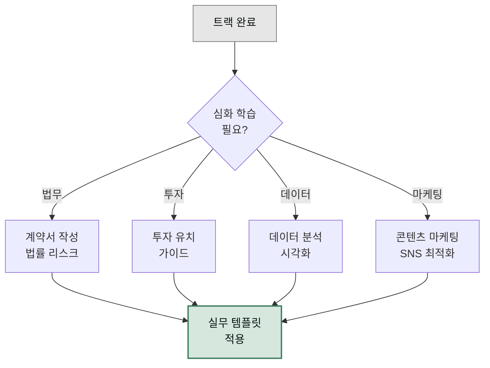

각 [트랙](../tracks/)이 끝날 때 권장하는 심화 가이드입니다. 한 가지 도메인을 더 깊이 파고들고 싶을 때 여기서 시작하세요.

## 가이드 목록

- [계약서 작성 가이드](./contract-drafting/) — NDA·SLA·공급계약 작성, `moai-lawyer:legal-contract-review` + `legal-nda-triage`
- [법률 리스크 관리](./legal-risk/) — 법적 리스크 평가·IP 포트폴리오, `moai-lawyer:legal-legal-risk`
- [투자 유치 가이드](./funding/) — IR 덱·재무 모델·정부지원사업, `moai-accountant:finance-investor-relations` + `business-kr-gov-grant`
- [데이터 분석 가이드](./data-analysis/) — EDA·프로파일링·이상값, `moai-analyst:office-data-explorer`
- [시각화 최적화 원칙](./data-visualization/) — 차트 선택·대시보드, `moai-analyst:office-data-visualizer`
- [콘텐츠 마케팅 전략](./content-marketing/) — 블로그·캠페인 기획, `moai-marketer:content-blog` + `moai-marketer:marketing-campaign-planner`
- [SNS 최적화 가이드](./social-media/) — 인스타·LinkedIn·X 채널 전략, `moai-marketer:content-sns-content` + `moai-marketer:content-editorial-calendar`
