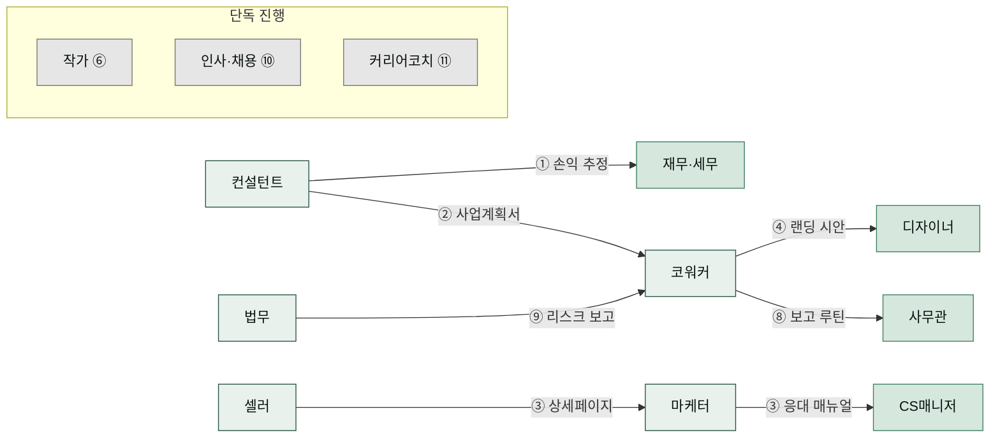

# 코워크 프로젝트

> 스킬 하나를 소개하는 레시피가 아니라, **여러 AI 코워커를 이어 붙여 실제 문제 하나를 끝까지 해결하는 여정**을 담은 프로젝트 모음입니다.

## 레시피와 프로젝트, 무엇이 다른가요

쿡북의 다른 레시피들은 대체로 "이 스킬을 이렇게 쓰면 이런 산출물이 나온다"는 기능 단위 설명입니다. 요리책으로 치면 "달걀 삶는 법", "육수 내는 법" 같은 기본기 페이지입니다. 그런데 실제 업무는 기본기 하나로 끝나지 않습니다. 창업 타당성을 검증하려면 상권 분석도 해야 하고, 그 숫자를 손익 추정으로 이어야 하고, 마지막엔 가족을 설득할 한 장짜리 보고서도 필요합니다. 코워커 한 명이 아니라 **팀이 릴레이로 움직여야 하는 일**입니다.

코워크 프로젝트는 그래서 사람(페르소나)의 문제 상황에서 출발합니다. "수제 캔들을 파는 지은 님이 신제품을 내야 하는데 혼자서는 벅차다" 같은 이야기로 시작해, 어느 AI 코워커(플러그인)의 어느 스킬을 어떤 순서로 투입하는지, 중간 산출물이 다음 코워커에게 어떻게 넘어가는지, 마지막에 손에 무엇이 남는지를 따라갑니다. 기능 목록이 아니라 **문제 해결 여정**을 읽는다고 생각하시면 됩니다.

모든 프로젝트는 같은 6단 구성을 따릅니다 — ① 문제 상황 ② 투입 코워커와 스킬 ③ 진행 단계 ④ 결과물 ⑤ 생산성 포인트 ⑥ 응용. 한 편을 읽고 나면 나머지 열한 편도 같은 자리에서 같은 정보를 찾을 수 있습니다.

## 12개 프로젝트 한눈에 보기

아래 그림은 여러 코워커가 릴레이로 이어지는 프로젝트의 흐름을 그린 것입니다. 한 코워커가 만든 중간 산출물을 다음 코워커가 받아 마무리하는 구조를 한눈에 보여줍니다. 화살표 위 숫자는 해당 프로젝트 번호입니다.

릴레이에 등장한 코워커 가운데 마케터·사무관·CS매니저는 단독 프로젝트(⑤·⑦·⑫)도 맡습니다. 각 코워커가 정확히 어느 프로젝트에 참여하는지는 아래 표에서 확인하세요.

| # | 프로젝트 | 카테고리 | 투입 코워커 | 결과물 |
|---|---------|---------|----------|--------|
| ① | [상권분석으로 창업 타당성 검증하기](./startup-feasibility/) | 창업·운영 | 컨설턴트 → 재무·세무 | 상권분석 보고서 + 손익 추정 + 의사결정 1페이지 |
| ② | [정부 지원사업 신청서 완성하기](./gov-grant-application/) | 창업·운영 | 컨설턴트 → 코워커 | 공고 맞춤 사업계획서 + 신청 서류 세트 |
| ③ | [스마트스토어 신제품 런칭하기](./smartstore-launch/) | 창업·운영 | 셀러 → 마케터 → CS매니저 | 상세페이지 + 홍보 콘텐츠 + 응대 매뉴얼 |
| ④ | [브랜드에서 랜딩 페이지까지](./brand-to-landing/) | 마케팅·콘텐츠 | 코워커 → 디자이너 | 브랜드 가이드 + 디자인 시스템 + 랜딩 시안 |
| ⑤ | [한 달치 SNS 콘텐츠 캘린더 만들기](./sns-content-month/) | 마케팅·콘텐츠 | 마케터 | 월간 캘린더 + 게시물 원고 + 카드뉴스 이미지 |
| ⑥ | [웹소설 기획부터 표지까지](./webnovel-project/) | 마케팅·콘텐츠 | 작가 | 시놉시스 + 연재 원고 + 표지 시안 |
| ⑦ | [공공데이터로 시장 보고서 만들기](./public-data-report/) | 사무·문서 | 사무관 | 데이터 분석 + 차트 + HWPX 보고서 |
| ⑧ | [주간보고 자동화 루틴 만들기](./weekly-report-routine/) | 사무·문서 | 코워커 → 사무관 | 주간보고 초안 루틴 + XLSX 집계 + DOCX 보고서 |
| ⑨ | [계약서 검토와 리스크 보고](./contract-risk-report/) | 사무·문서 | 법무 → 코워커 | 조항별 검토표 + 리스크 등급 + 경영진 요약 |
| ⑩ | [채용 공고부터 오퍼레터까지](./hiring-pipeline/) | 사람·커리어 | 인사·채용 | 공고문 + 스크리닝 결과표 + 오퍼레터 |
| ⑪ | [이직 준비 4주 플랜 실행하기](./career-transition-4weeks/) | 사람·커리어 | 커리어코치 | 4주 로드맵 + 이력서 + 면접 답변 노트 |
| ⑫ | [VOC 분석으로 FAQ 지식베이스 구축하기](./voc-to-faq/) | 사람·커리어 | CS매니저 | VOC 분류 리포트 + FAQ 문서 + 응대 템플릿 |

## 읽기 전에 알아두면 좋은 것

여기서 **코워커**이란 마켓플레이스에 등록된 전문가 플러그인을 부르는 말입니다. 컨설턴트(`moai-consultant`), 셀러(`moai-seller`), 사무관(`moai-officer`)처럼 각자 전문 분야의 스킬 묶음이 있습니다. **스킬**은 그 코워커가 수행하는 개별 업무 절차이고, 여러분은 스킬 이름을 외울 필요 없이 자연어로 "~해줘"라고 요청하면 매칭되는 스킬이 자동으로 호출됩니다. 각 프로젝트 본문에서 스킬 이름을 함께 적어두는 이유는, 원하는 스킬이 잡히지 않을 때 이름을 직접 불러 정확히 지목할 수 있게 하기 위해서입니다.

- 코워커별 스킬 전체 목록은 [AI 코워커 소개](../../moai-agents/)에서 확인할 수 있습니다.
- 스킬을 잇는 기본 원리가 궁금하다면 [스킬 체이닝 가이드](/cookbook/skill-chaining/)를 먼저 읽어보세요.
