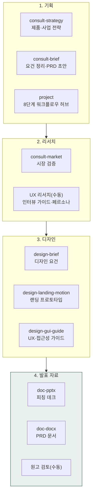

> **대상**: 제품 매니저(PM), UX 디자이너, 개발 매니저, 스타트업 창업자
> **전제**: moai-pm · moai-consultant · moai-designer · moai-officer 플러그인 활성화
> **소요**: 시나리오당 약 5-20분

## 무엇을 할 수 있나

## 한 줄 요청 예시 4종

| # | 한 줄 요청 | 자동 체인 |
|---|---|---|
| 1 | "결제 모듈 PRD 초안 + 인터뷰 가이드 만들어줘" | consult-strategy → consult-brief → UX 리서치(수동) → doc-docx |
| 2 | "분기 로드맵 짜줘. 향후 12개월" | project → doc-docx (마일스톤 표) |
| 3 | "SaaS 랜딩 프로토타입 만들어줘" | design-landing-motion → 원고 검토(수동) → korean-humanize → 최종 검수 |
| 4 | "투자자용 피칭 데크 12장 만들어줘" | consult-strategy → doc-pptx → 원고 검토(수동) |

---

## 시나리오 ① 신규 기능 PRD + 사용자 인터뷰 가이드 (약 12분)

### 사용자 입력


결제 모듈 PRD 초안 + 사용자 인터뷰 가이드 만들어줘


### 시스템 인터뷰 (AskUserQuestion)

1. **제품 단계**: 0-1 (MVP) / 1-10 (PMF 직전) / 10+ (확장)
2. **사용자 페르소나**: 페르소나 정의 / 자동 추출 / 없음
3. **우선순위 기준**: 매출·리텐션·LTV·신규 획득
4. **성공 KPI**: 전환율·재구매율·NPS·MAU

### 자동 체인

`consult-strategy`(제품 전략 정의) → `consult-brief`(PRD: 문제·해결·요구사항·인수기준) → UX 리서치(수동: 5-7개 핵심 질문 + STAR 후속 질문) → `doc-docx` → 원고 검토(수동)

### 산출물

- `90_Output/product/payment-prd.docx` — 8섹션 PRD (요구사항·인수기준·OKR 매핑)
- `90_Output/product/user-interview-script.docx` — 5-7개 핵심 질문 + 후속 프로브
- 우선순위 매트릭스 (MoSCoW + RICE 점수)

---

## 시나리오 ② 분기 로드맵 자동 작성 (약 8분)

### 사용자 입력


향후 4분기 제품 로드맵 짜줘


### 시스템 인터뷰

1. **기간**: 다음 1분기 / 4분기 / 12개월
2. **자원**: 개발자 수·디자이너·PM
3. **우선순위 기준**: 사용자 가치 / 매출 / 기술 부채
4. **출력 형식**: XLSX 간트 / DOCX 서술 / PPT 발표용

### 자동 체인

`project`(8단계 허브: MoSCoW 우선순위·마일스톤·의존성 매핑) → `doc-docx`(로드맵 문서) 또는 `doc-pptx`(발표용) → 원고 검토(수동)

### 산출물

- 분기별 마일스톤 표 + 의존성 매트릭스
- 자원 배분 시뮬레이션 (인력·시간·예산)
- 리스크 관리 5건 + 완화 계획

---

## 시나리오 ③ SaaS 랜딩 프로토타입 (약 8분)

### 사용자 입력


AI 영어 회화 SaaS 랜딩 프로토타입 만들어줘


### 시스템 인터뷰 (소크라테스식 테마)

1. **베이스 팔레트**: Neutral / Zinc / Stone / Slate
2. **컬러 모드**: Light / Dark / System
3. **모서리**: Sharp - Pill
4. **효과**: Fade-up · Scroll Reveal · Parallax · Chart

### 자동 체인

`design-landing-motion` (Next.js 15 + shadcn/ui + Tailwind v4 + OKLCH 토큰) → 원고 검토(수동) → `korean-humanize`

### 산출물

- `90_Output/landing/index.tsx` — Next.js App Router 컴포넌트
- 히어로·CTA·FAQ·소셜프루프 6섹션
- Framer Motion 애니메이션

> **상세**: [콘텐츠 트랙 — 시나리오 ③](../track-content/#시나리오--랜딩-페이지--shadcnui-약-8분)

---

## 시나리오 ④ 투자자용 피칭 데크 (약 10분)

### 사용자 입력


시리즈A 피칭 데크 12장 만들어줘


### 시스템 인터뷰

1. **단계**: 프리시드·시드·시리즈A·시리즈B
2. **목표 금액**: 5억 / 30억 / 100억+
3. **하이라이트 우선**: 팀·시장·기술·트랙션
4. **참고 자료**: 회사 소개·재무·트랙션 폴더 경로

### 자동 체인

`consult-strategy`(엘리베이터 피치) → `consult-brief`(12장 표준 목차) → `doc-pptx`(시각화) → 원고 검토(수동)

### 산출물

- 12장 피칭 데크 (Problem · Solution · Market · Product · Traction · Business Model · Competition · Team · Roadmap · Financials · Ask · Appendix)
- 발표 메모 스크립트 (장당 30-60초 발화 가이드)
- Q&A 예상 질문 10개 + 모범 답안

---

## AskUserQuestion 표준 슬롯 (제품 트랙 공통)

| 슬롯 | 예시 값 |
|---|---|
| 제품 단계 | 0-1 (MVP) · 1-10 (PMF) · 10+ (확장) |
| 페르소나 | 자동 추출 · 정의 입력 · 없음 |
| 우선순위 기준 | 사용자 가치·매출·LTV·기술 부채 |
| KPI | 전환율·재구매·NPS·MAU·ARR |
| 출력 형식 | DOCX·PPTX·XLSX(간트)·MD |
| 자원 | 개발자·디자이너·PM 인원 |

---

## 자주 묻는 질문

### Q. 사용자 정의 product-assistant 플러그인을 직접 만들어야 하나요?

**아니오.** 기본 `moai-consultant`(consult-strategy·consult-brief·consult-market) + `moai-pm`(project) + `moai-designer`(design-landing-motion·design-brief·design-gui-guide) + `moai-officer`(doc-docx·doc-pptx)만으로 모든 시나리오 처리 가능. 더 깊은 자동화가 필요하면 `/harness:builder`로 커스텀 스킬을 만들 수 있습니다.

### Q. UX 와이어프레임·디자인 평가도 자동으로 되나요?

`design-landing-motion`(moai-designer)으로 코드 기반 프로토타입을 즉시 생성할 수 있습니다. `design-gui-guide`(moai-designer)로 휴리스틱·접근성(WCAG)·사용자 플로우 평가 가이드를 받을 수 있습니다. 페르소나·사용자 흐름 설계와 Figma·Sketch 연동은 수동 영역입니다.

### Q. PRD 표준 양식은?

`consult-brief`(moai-consultant)가 EARS 형식 + 8섹션 표준 PRD(제품·시장·페르소나·요구사항·인수기준·KPI·로드맵·리스크) 초안을 만들고, `doc-docx`(moai-officer)로 문서화합니다. 회사 표준 양식 .docx를 첨부하면 자동 매핑됩니다.

### Q. 투자자 피칭 데크는 어떤 양식?

기본값: Sequoia 12장 표준. AskUserQuestion에서 Y Combinator·a16z·자체 양식 선택 가능.

---

## 다음 단계

- [**표준 패턴**](../) — 4가지 표준 패턴
- **[문서 트랙](../track-documents/)** — 사업계획서·IR
- **[콘텐츠 트랙](../track-content/)** — 랜딩 페이지 심화
- **[운영 트랙](../track-operations/)** — RFP·제안서

---

### Sources

- [moai-pm 디렉터리](https://github.com/modu-ai/moai-cowork/tree/main/plugins/moai-pm)
- [moai-consultant 디렉터리](https://github.com/modu-ai/moai-cowork/tree/main/plugins/moai-consultant)
- [moai-designer 디렉터리](https://github.com/modu-ai/moai-cowork/tree/main/plugins/moai-designer)
- [moai-officer 디렉터리](https://github.com/modu-ai/moai-cowork/tree/main/plugins/moai-officer)
- [Nielsen Norman Group UX 리서치](https://www.nngroup.com/)
- [Marty Cagan Inspired Product Management](https://www.svpg.com/)
