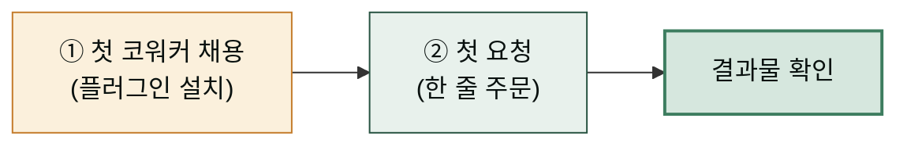

데스크톱 앱 설치가 끝났다면 이제 실제로 일을 시켜볼 차례입니다. 이 문서에서 할 일은 두 가지입니다. ① 내 일에 맞는 코워커(플러그인)을 한 명 채용하고 → ② 첫 요청을 던져 결과물을 받아봅니다. 마켓플레이스 등록과 코워커 설치 절차는 [플러그인 설치와 관리](/plugins/install/)에 단계별로 정리해 두었으니, 여기서는 **어떤 코워커를 첫 번째로 채용할지**와 **첫 요청을 어떻게 쓸지**에 집중합니다.

"코워커를 채용한다"는 표현이 낯설다면 [도구와 기능 개념 기초](../concepts/)의 플러그인 항목을 먼저 읽고 오시면 좋습니다. 요약하면 — 플러그인은 업무 매뉴얼(스킬)과 일하는 담당자(에이전트)를 한 상자에 담은 "코워커 패키지"이고, 마켓플레이스는 그 코워커들을 소개해 주는 곳입니다. 모두의 코워크 마켓플레이스에는 문서 담당부터 쇼핑몰 운영 담당까지 분야별 전문 코워커가 준비되어 있습니다.

## 준비: 마켓플레이스 등록과 첫 코워커 설치

마켓플레이스를 한 번 등록하고(`modu-ai/moai-cowork`) 코워커를 설치하는 절차 — Claude Cowork·ChatGPT Work 양쪽의 UI 경로와 CLI 명령, 설치 확인, 업데이트·제거까지 — 는 [플러그인 설치와 관리](/plugins/install/)에 정리해 두었습니다. 처음이라면 아래에서 코워커 한 명을 골라 그 페이지의 절차대로 채용해 주세요.


어떤 코워커부터 채용할지 고민이라면 만능 사무코워커 **moai-coworker**를 먼저 추천합니다. 익숙해진 뒤 분야별 코워커를 추가하면 됩니다. 여러 코워커를 팀으로 묶어 큰 일을 진행할 때는 팀장 역할의 **moai-pm**(`/project` 한 명령으로 프로젝트를 초기화하고 스킬 체인을 조립)을 채용하세요.


## 어떤 코워커를 첫 번째로 채용할까

코워커를 전부 채용할 필요는 없습니다. 처음에는 **지금 가장 급한 일 하나에 맞는 코워커 한 명**만 데려오는 것이 좋습니다. 코워커가 많아질수록 Claude가 참고할 매뉴얼도 많아져서 필요 없는 코워커는 자리만 차지하기 때문입니다. 아래 표에서 내 일과 가장 가까운 줄을 찾아보세요.

| 하고 싶은 일 | 채용할 코워커 | 대표 업무 |
|---|---|---|
| 보고서·기획서·회의록 등 사무 문서 전반 | **moai-coworker** (만능 사무코워커) | 문서 작성, PPT·엑셀, 요약·정리 |
| 블로그·보도자료·뉴스레터 등 글쓰기 | **moai-writer** (작가) | 원고 작성, 윤문, 어투 교정 |
| SNS·광고·캠페인 마케팅 | **moai-marketer** (마케터) | 카피, 콘텐츠 기획, 광고 운영 |
| 스마트스토어·카페24·아임웹 쇼핑몰 운영 | **moai-seller** (셀러) | 상품 등록, 주문·리뷰 관리, 매출 분석 |
| 카드뉴스·슬라이드·화면 시안 등 디자인 | **moai-designer** (디자이너) | 시각 자료 제작, 디자인 시스템 |
| 계약서 검토·법령 확인 | **moai-lawyer** (법무 담당) | 계약서 분석, 판례·법령 검색 |

전체 코워커 목록은 [플러그인 패밀리 개요](/plugins/)에서, 각 코워커가 데리고 있는 세부 에이전트 구성은 [AI 코워커 소개](/moai-agents/)에서 확인하세요.

## 첫 요청 예시 3가지

채용이 끝났으니 일을 시켜봅니다. 요청은 평소 동료에게 부탁하듯 자연스러운 문장이면 충분합니다. 아래 세 가지는 첫 요청으로 좋은 예시입니다 — 그대로 복사해 붙여넣고, 따옴표 안의 상황만 내 것으로 바꿔보세요.

**예시 1 — 사무 문서 (moai-coworker 채용 시)**


다음 주 월요일 팀 회의에서 쓸 '상반기 업무 정리' 보고서 초안을 만들어줘.
우리 팀은 온라인 쇼핑몰 고객센터 5명이고, 상반기 주요 성과는
응답 시간 단축이랑 리뷰 평점 상승이야. A4 2장 분량으로.


**예시 2 — 글쓰기 (moai-writer 채용 시)**


우리 카페 인스타그램에 올릴 신메뉴 소개 글을 3가지 버전으로 써줘.
신메뉴는 '흑임자 크림 라떼', 타깃은 20-30대 직장인,
어투는 친근하고 과장 없이.


**예시 3 — 쇼핑몰 운영 (moai-seller 채용 시)**


스마트스토어에 올릴 '프리미엄 곱창김' 상품 상세페이지 문구를 만들어줘.
특징은 두 번 구운 바삭함, 국내산 김, 선물 포장 가능.
구매를 망설이는 사람이 자주 묻는 질문 3개와 답변도 함께.


요청을 보내면 Claude가 채용된 코워커의 매뉴얼(스킬)을 참고해 결과물을 만들어 냅니다. 결과가 마음에 들지 않으면 새로 시작할 필요 없이 같은 대화에서 "더 짧게", "어투를 격식 있게" 처럼 이어서 고치면 됩니다.

**잘 안 될 때**
- 결과가 너무 일반적이면: 상황·대상·분량을 한 문장씩 더 붙여보세요. 요청이 구체적일수록 결과도 구체적입니다.
- 코워커 매뉴얼이 적용되지 않은 느낌이면: 플러그인이 활성 상태인지 [설치 확인](/plugins/install/) 절차로 점검하고, 새 대화에서 다시 요청해 보세요.

## 다음 단계

첫 결과물을 받아보셨다면 이제 기본기를 다질 차례입니다.

- [빠른 시작](../quick-start/) — 전체 동선과 대표 스킬 체인을 한눈에 보기
- [플러그인 설치와 관리](/plugins/install/) — 설치·업데이트·제거와 MCP 자격증명 준비

### Sources
- 마켓플레이스 저장소: [https://github.com/modu-ai/moai-cowork](https://github.com/modu-ai/moai-cowork)
