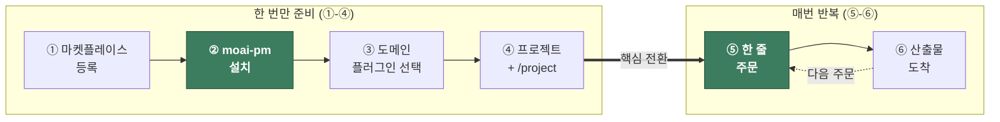
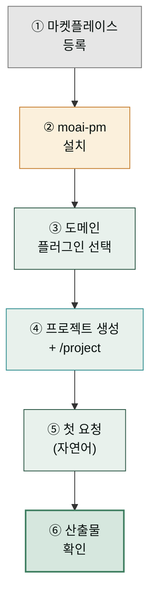
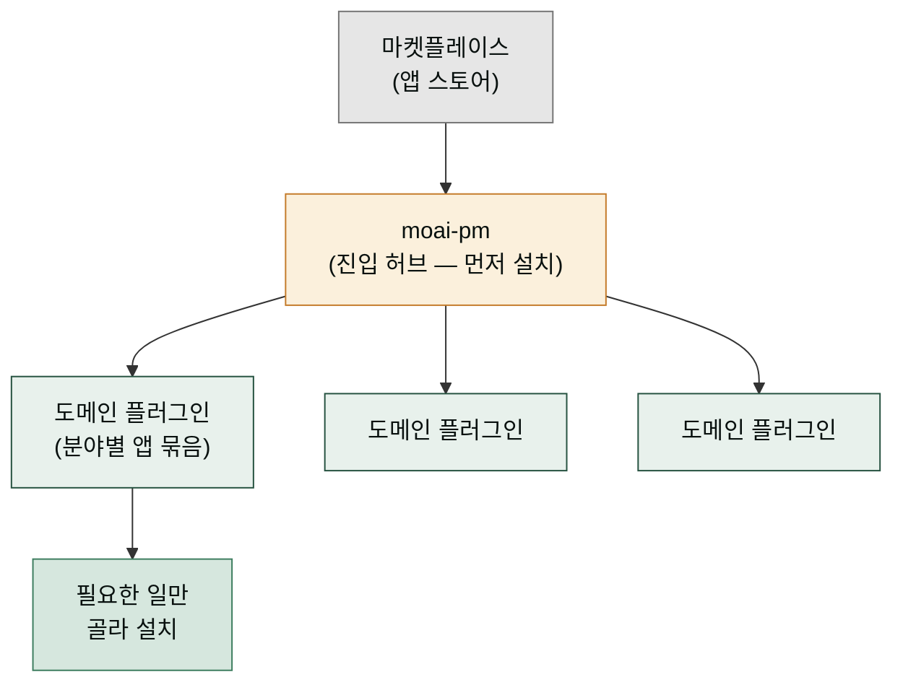
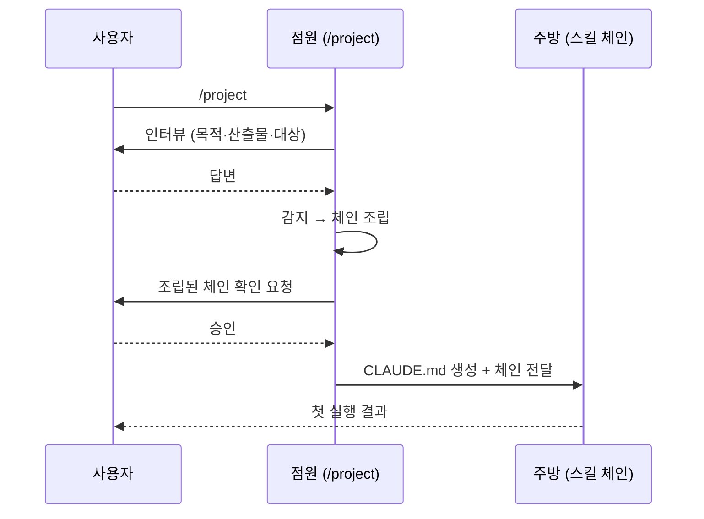
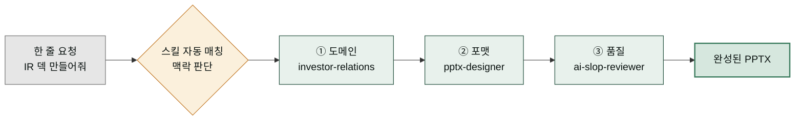

`modu-ai/moai-cowork` 마켓플레이스를 Claude Cowork에 등록하고 첫 스킬 체인을 실행하기까지의 전체 흐름을 정리한 페이지입니다. 처음부터 끝까지 약 **10분** 소요됩니다.

## 사전 체크

- [Cowork 설치](../install/) 완료
- 작업할 **로컬 폴더** 하나 준비 (Windows에서는 짧은 경로를 권장합니다)

## 6단계가 한 줄로 이어지는 이유

이 페이지는 여섯 단계를 순서대로 안내하지만 처음 보는 입장에서는 "왜 하필 이 순서인가"가 궁금할 수 있습니다. 음식 배달 앱에 빗대어 보면 한눈에 들어옵니다. **앱 스토어에서 배달 앱을 설치**하고(① 마켓플레이스 등록, ② 플러그인 설치), **집 주소와 결제수단을 한 번 등록**해 두면(④ 프로젝트 + `/project`), 이후에는 **"오늘 저녁 한국식으로" 한 줄만 주문**하면(⑤ 자연어 요청) **주방에서 요리 순서대로 만들어 도착**합니다(⑥ 산출물). 즉 여섯 단계는 흩어진 작업이 아니라 "주문 한 번 → 완성품 도착"의 한 줄 파이프라인입니다.

처음 한 번만 준비(①②③④)해 두면, 그 뒤로는 ⑤ 한 줄 입력과 ⑥ 결과 확인만 반복하면 됩니다. 준비 단계가 앞에 있는 이유는 시스템이 "어떤 일을, 어떤 순서로, 어떤 품질 기준으로 만들지"를 알아야 주문 한 줄만으로 알아서 조립할 수 있기 때문입니다. 아래 흐름도는 사용자가 설치에서 첫 산출물까지 거치는 여정을 한 줄로 보여줍니다.

## 전체 흐름

## 마켓플레이스, 플러그인, PM — 세 단어 정리

아래 1-3단계로 넘어가기 전에 처음 만나는 용어 네 개를 스마트폰에 빗대어 잡아둡니다. **마켓플레이스**는 앱 스토어(플레이스토어·앱스토어)처럼 "설치할 수 있는 앱 목록이 모여 있는 곳"입니다. **플러그인**은 그 스토어에서 하나하나 다운로드하는 앱 한 개입니다 — 사진 편집 앱, 배달 앱처럼 각자 쓰임이 정해져 있습니다. 여기서 **moai-pm**은 이사 업체 팀장 같은 역할입니다. 짐을 직접 나르기 전에 "어느 방 짐부터, 어떤 순서로"를 잡아 주듯, `/project` 한 명령으로 이 프로젝트에 어떤 직원을 배치하고 어떤 순서로 일할지를 `CLAUDE.md`에 정리해 줍니다. 그래서 `moai-pm`을 먼저 설치합니다.

**도메인 플러그인**은 일을 분야별로 묶어 둔 앱 묶음입니다(비즈니스 묶음, 콘텐츠 묶음, 법무 묶음 등). 사진 편집을 안 한다면 그 앱은 내려받지 않아도 되듯, 개 플러그인 중 지금 진행할 작업에 맞는 것만 골라 설치하면 됩니다. 토큰이란 컴퓨터가 한 번에 읽는 텍스트 분량의 단위인데, 설치를 최소한으로 유지하면 대화창이 한 번에 읽어야 할 분량도 줄어들어 반응이 가벼워집니다.

1. **마켓플레이스 등록**

   Cowork **좌측 사이드바 → 사용자 지정(Customize) → 개인 플러그인 → 플러그인 추가 → 마켓플레이스 추가**에서 다음 URL을 입력합니다.

   
> modu-ai/moai-cowork
   

   동기화가 끝나면 개 플러그인 목록이 표시됩니다.

2. **`moai-pm` 설치**

   
   **먼저 `moai-pm`을 설치**하세요. `/project` 한 명령으로 프로젝트를 초기화하고 나머지 직원을 배치해 주는 진입 허브입니다. 텍스트 산출물 검수에 쓰이는 `ai-slop-reviewer`는 `moai-coworker`에 있으니 함께 설치해 두면 편합니다.
   

   `moai-pm` 옆의 **+** 버튼을 클릭하면 설치가 완료됩니다.

3. **도메인 플러그인 선택**

   이번에 진행할 작업에 맞춰 플러그인을 추가합니다. 예시는 다음과 같습니다.

   - 사업계획서 → `moai-consultant`, `moai-officer`
   - 블로그 발행 → `moai-marketer`, `moai-media`
   - 계약서 검토 → `moai-lawyer`, `moai-officer`
   - 이미지 생성 → `moai-media` (+ `GEMINI_API_KEY` 필요)

   개 모두를 한 번에 설치할 필요는 없습니다.

## `/project`가 하는 일 — 점원이 주문을 받아 주방까지 전달

프로젝트를 만들고 `/project`를 실행하는 단계는 식당에 들어가서 **점원이 인터뷰를 시작하는 순간**에 해당합니다. 손님이 자리에 앉으면 점원이 "몇 명이세요, 매운 거 괜찮으세요, 예산이 어떻게 되세요"라고 차례로 묻습니다. 점원은 그 답을 모아 알아서 앞채 → 메인 → 디저트 순서(체인)를 정하고 주방에 넘깁니다. 손님이 직접 요리 순서를 정하지 않아도 됩니다. `/project`가 바로 이 점원 역할을 합니다.

구체적으로는 7단계 흐름(질문 → 감지 → 체인 조립 → 확인 → 생성 → API키 → 첫 실행)을 거칩니다. 먼저 프로젝트의 목적과 산출물을 **인터뷰**(질문)로 듣고, 그 답에서 **무슨 일인지를 감지**한 뒤, 알맞은 스킬들을 순서대로 이어 **체인**으로 조립합니다. 사용자가 **확인**하면 프로젝트 루트에 `CLAUDE.md`(이 프로젝트에서 일할 때 지켜야 할 규칙 모음)를 **생성**하고, 외부 서비스가 필요하면 **API 키** 등록을 안내한 뒤 **첫 실행**까지 이어갑니다. 이 일곱 단계가 끝나면 "어떤 일을, 어떤 순서로, 어떤 품질 기준으로"가 한 번에 정리됩니다.

4. **프로젝트 생성 및 `/project`**

   Cowork에서 좌측 사이드바 **프로젝트** 섹션의 **+ 새 프로젝트**를 눌러 프로젝트를 만들고, 프로젝트 설정 화면에서 **작업 폴더 연결** 항목에 앞서 준비한 로컬 폴더를 지정합니다.

   

   1. **새 프로젝트 시작하기** — 새 프로젝트를 생성합니다
   2. **프로젝트 가져오기** — 기존 프로젝트를 Cowork로 가져옵니다
   3. **기존 프로젝트 사용** — 이미 생성된 프로젝트를 선택합니다

   

   4. **프로젝트 이름** — 프로젝트 이름을 입력합니다
   5. **설명** — 프로젝트에 대한 설명을 입력합니다 (선택)
   6. **파일 추가** — 프로젝트에 참고 파일을 추가합니다
   7. **저장 위치** — 프로젝트가 저장될 경로를 확인합니다

   프로젝트·폴더 개념이 낯설다면 [프로젝트와 메모리](../../cowork/projects-memory/) 페이지를 먼저 참고하세요. 이후 대화창에 다음을 입력합니다.

   
> /project
   

   

   1. **명령어 입력** — 채팅창에 `/project`를 입력합니다
   2. **프로젝트 유형** — 프로젝트 유형 드롭다운에서 적합한 항목을 선택합니다
   3. **모델 버전** — 사용할 AI 모델 버전을 확인합니다
   4. **제목 편집** — 프로젝트 제목을 수정할 수 있습니다
   5. **태스크 추가** — 프로젝트에 수행할 태스크를 추가합니다
   6. **스크립트 추가** — 실행할 스크립트를 추가합니다
   7. **연결된 스크립트** — 현재 연결된 스크립트 목록을 확인합니다
   8. **메모리 영역** — 프로젝트 메모리 컨텍스트를 확인합니다

   

   1. **실행 전 확인** — 인터뷰 시작 전 확인 드롭다운을 엽니다
   2. **자동 확인** — "못지 않고 확인"으로 자동 승인할 수 있습니다

   

   1. **프로젝트 설명** — 프로젝트에 대한 간단한 설명을 입력합니다
   2. **상세 정보** — 프로젝트의 세부 정보를 제공합니다
   3. **카테고리 선택** — 비즈니스 카테고리를 선택합니다 (예: 아동용품)
   4. **브랜드 선택** — 브랜드 정보를 선택합니다 (예: 기타)
   5. **이미지 형식** — 산출물 이미지 형식을 지정합니다
   6. **설명 방식** — 콘텐츠 설명 방식을 선택합니다
   7. **메뉴 항목** — 프로젝트에 포함할 메뉴 항목을 설정합니다
   8. **추가 옵션** — 필요에 따라 추가 옵션을 구성합니다
   9. **채널 설정** — 채널별 설정을 확인합니다
   10. **유효성 검사** — 입력값에 대한 유효성 검사가 자동 수행됩니다
   11. **카테고리 세부 선택** — 세부 카테고리를 지정합니다
   12. **브랜드 상세** — 브랜드 관련 상세 정보를 입력합니다
   13. **형식 지정** — 산출물 형식을 세부 지정합니다
   14. **완료 확인** — 모든 인터뷰 항목 입력 후 완료를 확인합니다

   `moai-pm:project-manager` 스킬이 실행되어 **7단계 흐름**(Interview → Detect → Chain → Confirm → Generate → APIKey → First Run)을 진행합니다. 자세한 내용은 [PM 직원 페이지](../../moai-agents/pm/)에서 확인할 수 있습니다. 약 3-5분 안에 프로젝트용 `CLAUDE.md`가 루트에 생성됩니다.

## 한 줄을 쓰면 체인이 저절로 조립되는 원리

`/project`가 끝나면 이후에는 자연어 한 줄만 던지면 됩니다. "IR 덱 만들어줘"라고 쓰면 마치 "오늘 비즈니스 점심으로" 한마디만 했는데 점원이 알아서 적합한 세트메뉴를 조립해 오는 것과 같습니다. 사용자는 어떤 스킬을, 어떤 순서로 부를지 직접 정하지 않아도 됩니다.

이게 작동하는 까닭은 각 스킬이 "어떤 요청일 때 나를 부르라"는 설명을 스스로 달고 있어서, Claude가 한 줄 요청의 맥락을 읽어 "이 일은 도메인 → 포맷 → 품질 순서로 흘러가겠구나"를 판단하기 때문입니다. 도메인 스킬(예: `finance-investor-relations`)이 내용을 만들면, 포맷 스킬(예: `doc-pptx`)이 PPTX로 옮기고, 품질 스킬(`ai-slop-reviewer`)이 마지막에 AI 특유 어투를 솎아냅니다. 이 세 단계가 한 줄에서 자동으로 연쇄 실행되므로, 사용자는 "무엇을 만들까"에만 집중하면 됩니다.

5. **첫 요청**

   이제 자연어로 요청하면 적합한 스킬이 자동으로 호출됩니다. **본 문서의 모든 사용자 입력은 `> ` prefix와 함께 표기**합니다(실제 입력 시 `>` 제외 — [표기 규약](../../cowork/skills/#스킬-호출-방식)).

   
> "우리 SaaS의 Series A용 IR 덱 초안 만들어줘. 타깃 고객은 한국 중소제조업체야."
   

   체인 예시: `investor-relations → pptx-designer → ai-slop-reviewer`

6. **산출물 확인**

   PPTX 파일이 작업 폴더에 저장되고, 대화창에 **진단 → 수정 → 주요 변경사항** 3블록의 AI 슬롭 검수 리포트가 함께 표시됩니다.

## API 키·커넥터 등록 (선택)

일부 플러그인은 외부 서비스 키가 필요합니다.

| 플러그인 | 필요한 키·커넥터 |
|---|---|
| `moai-media` | `GEMINI_API_KEY`, `HIGGSFIELD_API_KEY`, `HIGGSFIELD_SECRET`, `ELEVENLABS_API_KEY` |
| `moai-consultant` (DART 공시 연동) | DART MCP |
| `moai-analyst` | 공공데이터포털·KOSIS API 키 |
| `moai-marketer:content-blog` (WordPress 자동 업로드) | WordPress MCP |

키는 프로젝트 루트의 `.moai/credentials.env`에 저장됩니다. 절대 외부 저장소에 커밋하지 마세요.

## 잘 안 될 때

- **스킬이 자동으로 호출되지 않을 때**: 해당 직무의 플러그인이 설치돼 있는지, `/project`가 실행됐는지 확인합니다.
- **Word·PPT 파일이 깨질 때**: `moai-officer`가 설치돼 있는지, Python 의존성(`python-docx`, `python-hwpx` 등)이 갖춰졌는지 확인합니다.
- **AI 슬롭 검수가 실행되지 않을 때**: 요청에 "빠르게"라는 표현이 포함되면 검수가 스킵될 수 있습니다. "검수까지 돌려줘"라고 명시하세요.

## 스킬 카탈로그는 어디서 보나

플러그인 개에 스킬 종이 담겨 있습니다. 스킬 목록은 페이지마다 손으로 적어두지 않고 **마켓플레이스 정본에서 자동 생성**합니다. 그래야 플러그인이 바뀌어도 문서가 어긋나지 않습니다.

- 직원별 전체 스킬 표 → [AI 직원 17명](../../moai-agents/) 각 페이지
- 설치·운용 방법 → [플러그인 가이드](../../plugins/)
- 스킬을 어떻게 이어 쓰는지 → [쿡북 — 스킬 체인 설계](../../cookbook/skill-chaining/)

스킬 이름을 외울 필요는 없습니다. "사업계획서 써줘"처럼 하려는 일을 그대로 말하면 알맞은 스킬이 자동으로 매칭됩니다.

## 다음 단계

- [PM 상세](../../moai-agents/pm/)
- [코워커 상세](../../moai-agents/coworker/)
- [Cowork 플러그인 사용](../../cowork/plugins/) — Cowork 환경 통합 가이드

### Sources

- [modu-ai/moai-cowork README](https://github.com/modu-ai/moai-cowork)
- [Use plugins in Claude Cowork](https://support.claude.com/en/articles/13837440)
