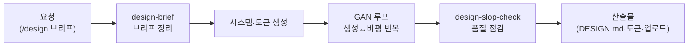

"디자인 감각이 없어서요"라는 말 뒤에는 대개 감각의 문제가 아니라 체계의 부재가 있습니다. 색은 어떤 기준으로 고르고, 버튼 모서리는 왜 그 값이어야 하는지 — 좋은 디자인은 규칙의 집합이고, 그 규칙을 문서로 만든 것이 디자인 시스템입니다. 디자이너 직원은 이 규칙을 세우고 지키게 하는 직원입니다. 인테리어로 치면 벽지 한 장을 골라 주는 사람이 아니라, 집 전체의 컬러·자재·조명 기준표를 만들어 어떤 방을 꾸며도 톤이 맞게 해 주는 설계사입니다.

스킬 14종의 중심에는 두 축이 있습니다. 하나는 **Claude Design 연동**(cd-\*) — 브리프 작성부터 프롬프트 빌드, 결과물 업로드, 슬롭 체크(AI 특유의 어색한 디자인 패턴 점검)까지 Claude의 디자인 도구와 오가는 파이프라인입니다. 다른 하나는 **토큰 파이프라인** — 디자인 토큰(색·글꼴·간격 같은 디자인 값을 변수로 정리한 것)을 DTCG 표준↔CSS↔shadcn 3계층으로 변환해, 디자인 결정이 코드까지 일관되게 흐르게 합니다. 여기에 GAN 품질 루프(생성과 비평을 반복해 완성도를 끌어올리는 반복 개선 방식)가 얹힙니다. 세운 규칙 위에서 실제 이미지를 뽑는 축도 붙었습니다 — Higgsfield 커넥터를 통해 히어로·OG·목업·마스코트 비주얼을 만들되, 만들기 전에 프로젝트의 토큰을 읽어 팔레트와 형태 언어를 제약으로 걸어 둡니다. 여기서 한 걸음 더 나가 **움직이는 랜딩까지** 만듭니다. 스크롤 스크럽·시차 레이어·WebGL 왜곡·파티클·키네틱 타이포 같은 효과를 카탈로그에서 하나만 골라 완성하고, 초기 렌더와 저감모션·모바일 열화를 기계적으로 점검합니다.

`/design`으로 브리프부터 시작하고 `/upload`로 Claude Design 업로드까지 이어지는 명령형 진입점을 제공합니다.

## 스킬 카탈로그

cd-\*(Claude Design 연동)와 design-\*/moai-\*(시스템·토큰·워크플로우) 계열의 전체 목록입니다.



## 에이전트

디자이너는 별도의 worker/auditor 에이전트 대신 **GAN 품질 루프 스킬**(design-iteration-loop)이 검수 역할을 겸합니다. 생성한 시안을 비평자 관점으로 다시 뜯어보고 고치는 반복이 스킬 파이프라인 안에 내장되어 있는 구조입니다.



## 대표 시나리오 5선

**1. 브랜드 디자인 시스템 만들기.** "우리 브랜드 컬러랑 폰트 기준 잡아줘"라고 하면 `design-brand-system`과 `design-system-prep`이 브랜드 시스템 문서(DESIGN.md)를 만들어, 이후 어떤 산출물이든 같은 톤을 유지하게 합니다.

**2. 디자인 토큰을 코드로.** "이 디자인 토큰을 우리 웹사이트 CSS로 변환해줘"라고 요청하면 `design-tokens-transformer`가 DTCG 표준 토큰을 CSS 변수와 shadcn 테마로 변환합니다. 디자이너와 개발자 사이의 수작업 전달이 사라집니다.

**3. Claude Design 왕복 작업.** `/design`으로 브리프를 정리해 Claude Design에서 시안을 만들고, 결과를 `design-handoff-reader`로 읽어 와 `design-slop-check`로 어색한 부분을 점검한 뒤 `/upload`로 다시 올리는 왕복 루프를 돕습니다.

**4. 브랜드에 맞는 이미지 뽑기.** "랜딩 히어로 이미지 만들어줘"라고 하면 `design-brand-visual`이 먼저 프로젝트의 디자인 토큰과 브랜드 규칙을 읽습니다. 그 값을 프롬프트 제약으로 바꾼 뒤 생성을 미디어 크리에이터에게 넘기고, 돌아온 이미지가 팔레트와 형태 언어를 벗어나지 않았는지 다시 확인합니다. 근거가 될 토큰이 없으면 색을 지어내지 않고 "근거 없음"이라고 적습니다.

**5. 움직이는 랜딩 만들기.** "스크롤하면 영상이 재생되는 랜딩 만들어줘"처럼 요청하면 `design-landing-motion`이 먼저 이 사이트가 말하려는 한 가지(컨셉 스파인)를 정하고, 12종 효과 카탈로그에서 **딱 하나**를 골라 끝까지 완성합니다. 화면에 들어갈 이미지는 브랜드 팔레트에 잠근 채 생성하고, 마지막에 초기 렌더·저감모션·모바일 열화·대비를 기계적으로 점검합니다. React면 R3F와 GSAP로, 정적 사이트면 바닐라 three.js로 갈라집니다. 배포와 호스팅은 다루지 않습니다.

**6. 브랜드에 맞는 로고 뽑기.** "로고 만들어줘"라고 하면 `design-logo`가 먼저 프로젝트의 브랜드 컨텍스트(토큰·보이스)를 읽고 로고 타입을 정합니다. 로고는 히어로와 달리 작아도 보이고 컬러·흑백·단색으로 변형되어야 하므로 벡터/심볼로 다룹니다 — recraft 모델로 디자이너 용어 기반 프롬프트를 조립해 생성을 미디어 크리에이터에게 넘기고, 스케일러빌리티와 단색 실루엣 내성을 점검합니다.



**잘 안 될 때** — 시안 톤이 계속 흔들리면 브리프를 건너뛰고 바로 생성부터 시작했을 가능성이 큽니다. `design-brief`로 타깃·톤·금지 요소를 먼저 못 박은 뒤 생성 단계로 넘어가세요.

## MCP 연동

- **higgsfield** — 브랜드 비주얼과 랜딩 에셋 킷 생성. `design-brand-visual`·`design-logo`·`design-landing-motion`이 사용하며, 실제 생성 실행과 모델 선택, 크레딧 사전 고지는 미디어 크리에이터의 Higgsfield 계약에 위임합니다. Higgsfield OAuth 인증이 필요합니다 ([설정 가이드](/plugins/higgsfield-setup/)).
