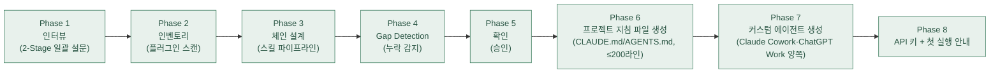

새 프로젝트를 시작할 때 가장 어려운 것은 일 자체가 아니라 "무엇부터 세팅해야 하지?"라는 질문입니다. PM은 바로 그 질문을 대신 받아 주는 직원입니다. 이사 갈 때 짐을 직접 나르기 전에 이사 업체 팀장이 먼저 와서 "어느 방 짐부터, 어떤 순서로"를 잡아 주는 것처럼, PM은 프로젝트 폴더에 어떤 직원(플러그인)의 지침을 깔고 어떤 워크플로우를 쓸지 먼저 정리해 줍니다.

PM이 담당하는 것은 개발을 제외한 모든 협업 프로젝트입니다. 전 직원 지침 설정과 커스텀 에이전트(`.claude/agents/*.md`는 Claude Cowork용, `.codex/agents/*.toml`은 ChatGPT Work용), 그리고 프로젝트 지침 파일(`CLAUDE.md`는 Claude Cowork용, `AGENTS.md`는 ChatGPT Work용) 워크플로우까지 생성하고 스스로 개선해 나갑니다. 비개발자도 자연어 한마디로 프로젝트를 시작할 수 있게 하는 것이 존재 이유입니다. 소프트웨어 개발 환경 셋업은 이 마켓플레이스의 범위 밖입니다.

의 AI 직원 플러그인 패밀리가 있습니다.

## 양쪽 런타임 지원

PM은 Claude Cowork와 ChatGPT Work 양쪽 런타임에서 동작합니다. 생성된 산출물이 두 환경에서 모두 작동하도록 설계되어 있습니다.

| 산출물 | Claude Cowork용 경로 | ChatGPT Work용 경로 |
|--------|---------------|---------------|
| 프로젝트 지침 | `./CLAUDE.md` | `./AGENTS.md` (동일 내용) |
| 커스텀 에이전트 | `./.claude/agents/*.md` (markdown+YAML frontmatter) | `./.codex/agents/*.toml` (TOML) |

`CLAUDE.md`와 `AGENTS.md`는 같은 내용을 두 파일로 저장하며, Claude Cowork는 `CLAUDE.md`를, ChatGPT Work는 `AGENTS.md`를 자동 로드합니다. 에이전트도 마찬가지로 양쪽에 각각 생성됩니다.

## 8-Phase 워크플로우

```
Phase 1 인터뷰 → Phase 2 인벤토리 → Phase 3 체인 설계 → Phase 4 Gap Detection
  → Phase 5 확인 → Phase 6 CLAUDE.md 생성 → Phase 7 커스텀 에이전트 생성 → Phase 8 API 키 + 첫 실행 안내
```



### Phase 1 인터뷰

사용자의 **이 프로젝트 맥락**만 수집합니다. 이름·회사·역할 같은 글로벌 프로필 정보는 묻지 않습니다. 인터뷰는 2-Stage 구조로 고정되며, 질문은 한 라운드에 최대 4개를 묶어 한 번의 `AskUserQuestion`으로 낸다(과거의 1-1/1-2/1-3 3연발 순차 호출은 폐기).

| 단계 | 목적 | 호출 |
|---|---|---|
| **S1 일괄 진단** | 프로젝트 설계에 필요한 맥락을 한 번에 확보 | `AskUserQuestion` 1회 (최대 4질문 × 각 4옵션) |
| **S2 보강** | S1의 공백·모호성만 메움 | 조건부 추가 호출 (부족분을 다시 한 번에 배치) |

질문 풀: 업무 유형·주요 산출물·대상 독자·톤 제약·산출물 포맷·작업 주기·기존 자료·반드시 피해야 할 것·판단 배경(소크라테스 축). 이미 확립된 축(진입 발화·기존 `CLAUDE.md`·`.moai/context.md`)은 질문에서 제외합니다.

### Phase 2 인벤토리

에이전트/스킬 체인을 설계하기 전에 `~/.claude/plugins/`와 `~/.codex/plugins/` + `.codex/agents/`를 모두 스캔해 **실제 설치된 AI 직원 플러그인**을 확인합니다. 플러그인 수·스킬 수는 하드코딩하지 않습니다 — `.claude-plugin/marketplace.json`이 로스터의 유일한 정본입니다.

```bash
# 소스 A: 디렉터리 스캔 — Claude Cowork(~/.claude/plugins/) + ChatGPT Work(~/.codex/plugins/cache/) 양쪽
for dir in ~/.claude/plugins/moai-* ~/.codex/plugins/cache/*/moai-*; do
  [ -d "$dir" ] && { [ -f "$dir/.claude-plugin/plugin.json" ] || [ -f "$dir/.codex-plugin/plugin.json" ]; } && basename "$dir"
done
# ChatGPT Work 커스텀 에이전트(.codex/agents/*.toml)도 인벤토리에 포함
for f in ./.codex/agents/*.toml ~/.codex/agents/*.toml; do [ -f "$f" ] && basename "$f" .toml; done 2>/dev/null

# 소스 B: 현재 세션 system reminder의 "user-invocable skills" 목록 파싱
```

두 소스를 교차 검증해 `plugins_installed` + `skills_available` 인벤토리를 구성합니다(신뢰도 HIGH/MEDIUM).

### Phase 3 체인 설계

인터뷰 답변(무엇을·어떻게) + 인벤토리(무엇이 설치됐는가) + 재진입 시 기존 `.moai/context.md` 누적 맥락, 3종 입력을 종합해 산출물별 스킬 체인을 설계합니다.

**체인 구성 규칙**: `[기획/분석] → [생성] → [포맷 변환/미디어] → ai-slop-reviewer`. 한국어 최종 텍스트 산출물은 `korean-humanize` 2차 패스를 추가합니다. 비텍스트(차트·숫자·미디어) 산출물은 ai-slop 단계를 생략합니다.

**반복될 작업 유형별 에이전트 1개**를 생성합니다(과잉 생성 금지 — 근거 없는 에이전트는 만들지 않습니다). 본문은 7-step 루프 + 프로젝트 맥락(톤·산출물 규격·금지 사항)을 내장합니다.

### Phase 4 Gap Detection

체인 스킬이 인벤토리에 없으면 누락으로 간주합니다. `AskUserQuestion` 4옵션(설치 안내+재개 권장 / 제외하고 진행 / 대체 스킬 / 중단)을 제시하고, 재개는 `/project resume`로 받습니다.

### Phase 5 확인

설계된 체인을 `AskUserQuestion`으로 승인받습니다(승인/수정/취소).

### Phase 6 CLAUDE.md 생성

`references/templates/CLAUDE.md.tmpl` 치환, **≤200라인**, **8개 HARD 블록 고정** — 동일 내용을 `CLAUDE.md`(Claude Cowork용)와 `AGENTS.md`(ChatGPT Work용) 두 파일로 저장합니다. 소스 템플릿의 8개 `## N. … (HARD)` 블록을 전부 보존합니다(라인 예산 초과 시 축소 대상은 스킬 체인 나열뿐이며 HARD 블록은 절대 축소·删除하지 않습니다).

### Phase 7 커스텀 에이전트 생성

반복 작업 유형별 **Claude Cowork용 `.claude/agents/*.md`**(markdown+YAML frontmatter)와 **ChatGPT Work용 `.codex/agents/*.toml`**(TOML: `name`·`description`·`developer_instructions`, `model`·`sandbox_mode` 선택) 양쪽**으로 생성합니다. 둘 다 7-step 루프 + 프로젝트 맥락을 동일 내장합니다.

### Phase 8 API 키 + 첫 실행 안내

체인이 요구하는 키만 선택적 등록 안내를 하고, 상위 체인 3개 예시를 제시합니다. 전체 목록은 `/project catalog`로 참조합니다.

## 재귀적 자가 개선

`/project` 셋업이 끝난 프로젝트는 **사용하면서 스스로 개선**됩니다. 단일 단순화 모델만 사용합니다 — 강제 점수화·반성 에세이·별도 지표 파일을 요구하는 무거운 다단계 모델은 채택하지 않습니다.

**4가지 개선 트리거** (하나라도 감지되면 발동):

1. **`repeated correction`** — 같은 행동에 대한 사용자 수정 요청이 2회 이상 반복
2. **`chain failure`** — 스킬 체인이 반복적으로 같은 단계에서 실패·우회
3. 명시적 요청 `/project evolve` (단일 슬래시 — 레거시 수동 발동 커맨드)
4. **`inventory drift`** — 설치 플러그인 인벤토리가 `.moai/config.json` 스냅샷과 어긋남

**신호 영속화 (HARD)**: 사용자 수정 요청·체인 실패를 감지한 **즉시** `.moai/evolution/signals.md`에 1줄을 기록합니다(`날짜 | 트리거 토큰 | 대상 | 요지`). 트리거 1·2의 "반복" 판정은 대화 기억이 아니라 **이 파일을 세어서** 합니다 — 세션이 바뀌어도 1회차 신호가 유실되지 않습니다.

**개선 사이클**: 신호 감지 → 진단(무엇이 어긋났는가) → 최소 diff 작성(전면 재작성 금지) → 사용자에게 변경 요지 1-3줄 보고(파괴적 변경만 사전 확인) → `CLAUDE.md` 말미 `<!-- evolution-log -->` 주석에 1줄 기록(트리거 토큰 + 수정 대상 포함). diff 적용 전 수정 지점의 **원문 조각을 `.moai/evolution/` 진단 기록에 함께 남겨** 되돌리기가 가능해야 합니다.

**개선 검증 + 롤백 (HARD)**: 개선은 적용으로 끝나지 않습니다 — 적용 이후 **같은 트리거 토큰 + 같은 대상**의 신호가 다시 발동하면 그 개선은 **실패한 개선**로 판정합니다. 실패한 개선은 `.moai/evolution/`에 남긴 원문 조각으로 해당 diff를 되돌리고, 같은 지점을 자동으로 재수정하는 대신 사용자에게 상황을 1-3줄로 보고해 방향을 확인받습니다(동일 지점 자동 재수정 반복 금지).

**가드레일 (HARD)**: 자가 개선은 **`CLAUDE.md`와 `.claude/agents/` 파일만** 수정합니다(`.moai/evolution/`의 신호·진단·이관 기록 파일은 예외). 스킬 본문·플러그인 파일은 건드리지 않습니다. 개선 1회당 수정 파일은 **최대 3개**까지입니다(evolution 기록 파일은 카운트 제외).

## 플러그인 업데이트 동기화 (`--update`)

`/project --update`는 **외부에서 플러그인이 업데이트된 직후** 프로젝트를 최신 인벤토리에 동기화하는 수동 스위치입니다. §재귀적 자가 개선의 `inventory drift` 트리거를 "감지 대기"가 아니라 **즉시·전수조사로 강제 실행**하는 모드입니다. 자가 개선 가드레일(수정 대상·3파일 상한·파괴적 변경 사전 확인)을 그대로 계승합니다.

**`evolve` vs `--update` (발동 조건으로 구분)**:

| 모드 | 발동 | 입력 |
|---|---|---|
| `/project evolve` | 사용 중 신호(`repeated correction`·`chain failure`)가 `.moai/evolution/signals.md`에 **누적**되어 발동 | 대화 맥락 + 누적 신호 |
| `/project --update` | **사용자가 플러그인 업데이트 직후 수동 호출** — drift를 기다리지 않음 | 설치된 전체 플러그인 전수조사 + 누적 신호 |

**`--update` 실행 절차 (5단계)**:

1. **전수조사(Full Census)** — `~/.claude/plugins/moai-*`와 `~/.codex/plugins/` 양쪽을 전체 스캔해 각 플러그인의 `plugin.json`(ChatGPT Work는 `.codex-plugin/plugin.json`) + `skills/` + MCP 정의를 조사. 기존 `.moai/config.json` 스냅샷과 비교해 **새 스킬·새 MCP·변경된 스킬**의 diff를 도출합니다.
2. **세션 신호 분석** — `.moai/evolution/signals.md`(누적 교정·체인 실패 신호) + `.moai/context.md`(프로젝트 맥락)를 읽어, 업데이트된 스킬이 기존 신호를 해소할 수 있는지 교차 확인합니다.
3. **CLAUDE.md·에이전트 동기화** — diff에 맞춰 `CLAUDE.md`/`AGENTS.md` §워크플로우 표와 `.claude/agents/*.md`·`.codex/agents/*.toml`의 스킬 체인을 최소 diff로 갱신. 200라인 예산·8개 HARD 블록 보존 정책은 그대로 따릅니다.
4. **스냅샷 갱신** — `.moai/config.json`의 `plugins_installed` + `skills_available` 스냅샷을 새 인벤토리로 갱신(`inventory drift`를 0으로 리셋). `<!-- evolution-log -->`에 1줄 기록(트리거 토큰 `inventory drift` + 동기화 요지).
5. **검증 + 롤백** — 동일한 `inventory drift` 신호가 다시 발동하면 실패한 동기화로 판정해 `.moai/evolution/` 원문 조각으로 롤백합니다.

## 커맨드

| 커맨드 | 동작 |
|--------|------|
| `/project <지시>` | 진입 — 인터뷰 후 에이전트/체인 설계 + 생성. **PRIMARY 기본 동작.** |
| `/project resume` | 설치 완료 후 재개 |
| `/project evolve` | 재귀적 자가 개선 수동 발동(레거시 단일-슬래시 폼) |
| `/project --update` | 플러그인 업데이트 후 전수조사→CLAUDE.md·에이전트 재동기화 |
| `/project catalog` | 17-plugin 패밀리 · 스킬 카탈로그 |
| `/project status` | 현재 설정 상태 |
| `/project apikey` | API 키 관리 |
| `/project doctor` | 환경 진단 |

## 스킬 카탈로그

PM의 스킬 목록은 아래와 같습니다. 스킬 이름을 몰라도 됩니다 — "프로젝트 시작하고 싶어"라고 말하면 자동으로 매칭됩니다.



## 에이전트

PM은 라우팅 허브이므로 별도의 실행 직원(worker)·검수 직원(auditor) 에이전트를 두지 않습니다. 실제 작업은 배치된 각 직원 플러그인의 에이전트가 수행합니다. 다른 직원 페이지에서 worker/auditor 구조를 확인해 보세요.



## 대표 시나리오 3선

**1. 비개발자의 첫 프로젝트.** 온라인 강의를 준비하는 강사가 "강의 준비 프로젝트 시작하고 싶어"라고 말합니다. PM이 폴더에 튜터·마케터 지침과 워크플로우를 깔아 주고, 이후에는 "커리큘럼 짜줘" 같은 요청이 바로 튜터에게 연결됩니다.

**2. 여러 직원을 함께 쓰는 세팅.** 쇼핑몰 운영자가 "셀러랑 CS랑 마케터 같이 쓸 거야"라고 요청하면, PM이 세 직원의 역할 분담이 담긴 CLAUDE.md를 생성해 요청이 서로 엉키지 않게 정리합니다. 의 AI 직원 플러그인이 있습니다.

**3. 쓰면서 다듬기.** 프로젝트를 한동안 쓰다 보면 실제 작업 방식이 처음 세팅과 달라집니다. `/project evolve`라고 말하면 PM이 그동안의 사용 신호를 살펴 워크플로우와 커스텀 에이전트를 다시 손봐 줍니다. 플러그인이 업데이트되면 `/project --update`로 전체 인벤토리를 다시 조사해 CLAUDE.md와 에이전트를 최신 상태로 동기화합니다.

## 설치 확인

설치가 잘 됐는지 확인하려면 Claude Cowork에서 `/project`를 입력했을 때 명령이 인식되는지 보면 됩니다.

**잘 안 될 때** — `/project`가 인식되지 않으면 마켓플레이스 등록과 플러그인 설치가 끝났는지 먼저 확인하세요. 설치 절차는 [플러그인 가이드](/plugins/)에 있습니다. 등록 방법은 양쪽 앱에서 다릅니다:
- **Claude Cowork**: Cowork 탭 → 사용자 지정(Customize) → 개인 플러그인(Plugins) → "+" → URL: `modu-ai/moai-cowork`
- **ChatGPT Work**: `codex plugin marketplace add modu-ai/moai-cowork` CLI 명령

## Sources

- 공식 문서: [ChatGPT Work 하위 에이전트](https://learn.chatgpt.com/docs/agent-configuration/subagents), [agents.md](https://agents.md)
