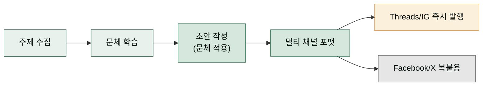

1인 브랜드·콘텐츠 크리에이터가 Threads·Instagram 을 운영할 때 가장 큰 병목은 **"규칙적인 게시"** 와 **"쓰는 손글씨(문체)의 일관성"** 입니다. 스레드 포스터 직원은 이 둘을 돕습니다. 주제를 받아 저장된 문체를 적용해 초안을 작성하고, 사용자에게 보여드린 뒤 승인하면 **즉시** Graph API 로 발행합니다. 큐·예약·승인 상태머신은 없습니다 — 세션 안에서 한 흐름으로 작성 → 확인 → 발행합니다.

스킬은 5종입니다. 초안 작성(문체 자동 적용)·문체 학습·멀티 채널 포맷(Threads/Facebook/X)·Instagram 포스트 발행·Instagram 댓글 관리를 다룹니다. MCP 서버로 Threads·Instagram Graph API 에 직접 연결되며, 월정액 없이 무료로 사용합니다.

왜 "직접 발행" 모델인가. 예약·정기 발행(예: 매주 수요일 12시 자동 게시)은 Claude Cowork 이 담당합니다. 본 플러그인은 세션 안에서 즉시 발행하는 데만 집중합니다 — 초안을 보여드리고 승인하면 그 자리에서 게시됩니다.

## 스킬 카탈로그

전체 목록입니다.



## MCP 도구

MCP 서버가 노출하는 도구들입니다. 큐·예약 도구는 없습니다 — 전부 직접 발행·조회·포맷 도구입니다.

| 도구 | 설명 |
|------|------|
| `threads_publish_text` | 텍스트 스레드 발행 (500 UTF-8 바이트 제한) |
| `threads_publish_image` | 이미지(JPEG/PNG, ≤8MB) 발행 |
| `threads_publish_video` | 비디오(MOV/MP4, ≤1GB, ≤5분) 발행 |
| `threads_get_profile` | 프로필 조회 — health check / who-am-I |
| `threads_refresh_token` | 장기 액세스 토큰(60일) 수동 갱신 |
| `instagram_publish_image` | Instagram 이미지 발행 (JPEG-only) |
| `instagram_publish_video` | Instagram 비디오 발행 (컨테이너 폴링 후 발행) |
| `instagram_publish_reel` | Instagram 릴 발행 (`share_to_feed` 옵션) |
| `instagram_get_profile` | Instagram 프로필 조회 |
| `instagram_refresh_token` | Instagram 장기 Page 토큰 갱신 |
| `instagram_comments_list` | Instagram 미디어 댓글 목록 |
| `instagram_comments_reply` | Instagram 댓글에 답글 작성 |
| `instagram_comments_hide` | Instagram 댓글 숨김 |
| `instagram_insights` | Instagram 인사이트 조회 (계정/미디어 수준) |
| `threads_style_save` | 문체 프로필 저장 |
| `threads_style_load` | 문체 프로필 불러오기 |
| `threads_format_multi_channel` | 하나의 텍스트를 Threads/Facebook/X 용으로 포맷 |

## 대표 시나리오 3선

**1. 문체 학습 → 주제 초안 → 즉시 발행.** "내 문체 학습시켜줘"라고 과거 포스팅 3-10개를 붙여넣으면 `threads-style-learn`가 문체 프로필을 저장합니다. 그 뒤 "최신 AI 뉴스로 Threads 포스트 작성해줘"라고 하면 `threads-post-draft`가 저장된 문체를 자동으로 적용해 초안을 만들어 보여드립니다. 승인하면 `threads_publish_text`로 그 자리에서 즉시 발행됩니다.

**2. 멀티 채널 배포.** 블로그 글을 쓰고 나서 "이거 Threads랑 Facebook, X용으로 포맷해줘"라고 하면 `threads-multichannel`이 세 채널용 텍스트를 한 번에 만들어줍니다. Threads용은 승인 시 즉시 발행하고, Facebook/X용은 복붙용으로 제공합니다.

**3. Instagram 릴 + 댓글 모더레이션.** "이 영상 인스타 릴로 올려줘"라고 하면 `instagram-post`가 캡션을 작성해 보여드리고, 승인하면 `instagram_publish_reel`로 즉시 발행합니다. 발행 후 "최근 릴 댓글 확인해줘"라고 하면 `instagram-comments`가 댓글을 조회하고 답글·숨김 처리를 합니다.

**잘 안 될 때** — Threads 인증이 실패하면 `THREADS_ACCESS_TOKEN`과 `THREADS_USER_ID` 환경변수를 확인하세요. Instagram 인증이 실패하면 `IG_ACCESS_TOKEN`과 `IG_USER_ID`를 확인하세요. 토큰 발급 절차는 `mcp-servers/threads-poster/CONNECTORS.md`를 참조하세요. Facebook 개인 계정/그룹은 API 발행이 정책상 불가하므로 복붙만 지원합니다.

## Instagram 지원

Instagram Graph API를 통한 직접 발행도 지원합니다. Threads와 동일한 "직접 발행" 모델을 따릅니다 — 세션 안에서 초안을 보여드리고 승인하면 즉시 발행합니다.

### 발행 모델

1. **초안 작성** — `instagram-post` 스킬이 캡션과 미디어 URL을 작성해 사용자에게 보여드립니다.
2. **승인 게이트** — 사용자가 초안을 승인합니다 (승인 없이는 발행하지 않습니다).
3. **즉시 발행** — `instagram_publish_image/video/reel` 도구로 Graph API 에 바로 게시합니다.

**백그라운드 스케줄러 없음.** 예약·정기 발행은 Claude Cowork 이 담당합니다. 본 플러그인은 즉시 발행만 합니다.

### 지원 콘텐츠

| 콘텐츠 | MCP 도구 | 제한 |
|--------|----------|------|
| **이미지** | `instagram_publish_image` | JPEG만 (PNG 제한), 8MB 이하 |
| **비디오** | `instagram_publish_video` | MOV/MP4, 1GB 이하, 5분 이하 |
| **릴스** | `instagram_publish_reel` | 비디오 URL만, `share_to_feed` 옵션 |
| **댓글 관리** | `instagram_comments_list`, `instagram_comments_reply`, `instagram_comments_hide` | — |
| **인사이트** | `instagram_insights` | 계정/미디어별 노출/참여 지표 |

### Instagram 특이사항

**2단계 발행 프로세스** — 이미지/비디오는 Graph API의 2단계 발행(Container → Media Publish)를 따릅니다. `instagram_publish_image`/`instagram_publish_reel`이 먼저 컨테이너를 생성하고, `instagram_publish_video`가 폴링으로 상태를 확인한 뒤 완료되면 `Media Publishing API`로 최종 발행합니다. 완료까지 최대 5분이 소요될 수 있습니다(EXPIRED 예외 처리됨).

**Professional 계정 필요** — Instagram Graph API 발행은 Professional(Business 또는 Creator) 계정만 지원합니다. 개인 계정은 API 정책상 지원되지 않습니다. 설정 시 `IG_ACCESS_TOKEN`과 `IG_USER_ID` 환경변수가 필요합니다.

**Facebook Login for Business** — Instagram 토큰 발급은 Facebook Login for Business 흐름을 통해 이루어집니다. Meta App의 Instagram Product를 설정하고, 시스템 사용자(System User) 토큰을 발급받아 `IG_ACCESS_TOKEN`으로 등록합니다. 상세 절차는 `CONNECTORS.md`의 Instagram 섹션을 참조하세요.

### 셋업

환경변수:

export THREADS_ACCESS_TOKEN="<Threads 장기 액세스 토큰(60일)>"
export THREADS_USER_ID="<Threads 사용자 ID>"
export IG_ACCESS_TOKEN="<Instagram 장기 액세스 토큰(무기한)>"
export IG_USER_ID="<Instagram Business 계정 ID>"


`IG_USER_ID`는 Instagram Graph API `get_profile` 응답의 `id` 필드 또는 Facebook Login 콜백에서 제공되는 사용자 ID입니다. Professional 계정 요건은 `CONNECTORS.md`를 참조하세요.

## 책임 경계

| 채널 | 직접 발행? | 설명 |
|------|-----------|------|
| **Threads** | 예 | MCP 도구로 즉시 직접 발행 |
| **Instagram** | 예 | MCP 도구로 즉시 직접 발행 (Professional 계정만) |
| **Facebook** | **아니오** (복붙) | 개인 계정/그룹은 API 발행 불가 — 복붙용 텍스트만 제공. 페이지는 추후 추가 가능 |
| **X** | **아니오** (복붙) | 무료 280자 제한 → `1/`·`2/` 번호 트윗 체인으로 자동 분할. Premium 25,000자는 단일 문자열. 둘 다 복붙용 |

예약·정기 발행은 본 플러그인 범위 밖입니다 — Claude Cowork 이 담당합니다.

## 설치·셋업

이 플러그인을 사용하려면 Meta App 등록과 토큰 발급이 필요합니다. 자세한 절차는 `mcp-servers/threads-poster/CONNECTORS.md`를 참조하세요.

환경변수:

export THREADS_ACCESS_TOKEN="<장기 액세스 토큰(60일)>"
export THREADS_USER_ID="<Threads 사용자 ID>"

