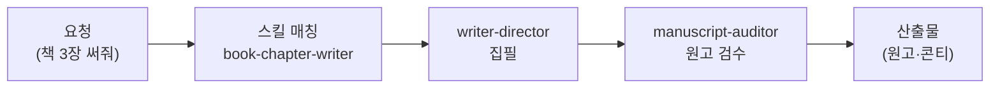

책 한 권, 웹툰 한 편이 세상에 나오기까지는 글쓰기 말고도 수많은 공정이 있습니다. 컨셉 기획, 목차 설계, 출판사 제안서, 회차 구성, 콘티, 표지 시안, 그리고 끝없는 퇴고. 작가 코워커는 이 전 공정을 함께 뛰는 창작 파트너입니다. 요리로 치면 레시피 개발부터 플레이팅까지 옆에서 거드는 수셰프에 가깝습니다 — 맛의 최종 결정은 언제나 셰프(작가 본인)의 몫이지만 준비와 정리는 훨씬 빨라집니다.

스킬은 출판 계열(book-\*) 8종 — 컨셉 기획, 타깃 독자 분석, 목차 설계, 챕터 집필, 출판 제안서, 출판사 매칭, 저자 약력, 퇴고 코칭 — 에 한국어 인문화 윤문(AI가 쓴 티를 지우고 사람 글처럼 다듬는 후처리)과 맞춤법 점검이 더해져 **총 10종**입니다. 웹툰·웹소설·시나리오·콘티·IP 피치 같은 스토리 창작은 [스토리 크리에이터](../story/) 코워커가 따로 담당합니다.

특히 이 코워커에는 검수 전담 에이전트가 따로 있어서, 원고를 "쓰는 눈"과 "읽는 눈"이 분리되어 있다는 점이 특징입니다.

## 스킬 카탈로그

출판(book-\*) 8종 + 윤문·맞춤법 2종, 총 10종으로 구성됩니다.



## 에이전트

작가 코워커는 실행 코워커와 검수 코워커를 분리해 둡니다. **writer-director**가 기획·집필을 수행하고, **manuscript-auditor**는 읽기 전용(readonly) 권한으로 원고·출판 제안서를 회의적인 시선으로 검사합니다. 쓴 사람이 스스로 채점하지 않게 만드는 구조라, 설정 붕괴나 개연성 구멍을 잡는 데 유리합니다.



## 대표 시나리오 3선

**1. 출판 기획부터 제안서까지.** "30대 직장인 대상 재테크 에세이를 쓰고 싶어"라고 하면 `book-concept-planner` → `book-target-reader` → `book-outline-designer` → `book-proposal-writer` 흐름으로 컨셉·독자 정의·목차·출판사 제안서가 순서대로 나옵니다.

**2. 원고 집필과 퇴고.** 목차가 잡히면 "3장 초고 써줘"로 `book-chapter-writer`가 꼭지 단위 초고를 쓰고, `book-revision-coach`가 구조·문체·근거를 짚어 고쳐쓸 지점을 알려 줍니다. 저자 약력이 필요하면 `book-author-bio`가 짧은·중간·긴 3종을 한 번에 만들어 줍니다.

**3. AI 티 지우기 퇴고.** 초고를 붙여 넣고 "사람이 쓴 것처럼 다듬어줘"라고 하면 `korean-humanize`이 의미와 사실은 보존한 채 기계적인 문장 패턴만 걷어냅니다. 다듬은 글은 그대로 오는 게 아니라 원문과 나란히 놓고 뜻이 바뀌지 않았는지 확인하는 **최종 검수**를 한 번 거칩니다 — 윤문이 과해서 원문에 없던 단정이 생기거나 지워지지 말아야 할 문장이 지워진 경우는 여기서 걸러져 다시 고쳐집니다.

**잘 안 될 때** — 긴 원고를 한 번에 요청하면 중간에 흐름이 끊길 수 있습니다. 챕터·회차 단위로 나눠 요청하고, 앞 회차 요약을 함께 붙여 주면 일관성이 크게 좋아집니다.
