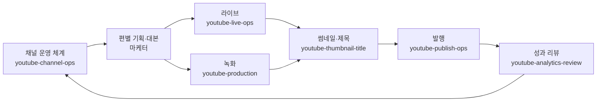

유튜브 채널이 멈추는 이유는 대개 아이디어가 떨어져서가 아닙니다. 한 편을 올리기까지 붙어 있는 일 — 촬영 세팅 점검, 편집 지시, 썸네일 고민, 설명란과 챕터, 댓글 응대 — 이 쌓여서 감당이 안 되기 때문입니다. 유튜버 코워커는 이 살림을 맡는 역할입니다. 채널의 PD 겸 매니저라고 생각하시면 됩니다.

특히 **라이브 방송**을 정면으로 다룹니다. 라이브는 되돌릴 수 없어서 사전 점검이 전부인데, 정작 그 점검표를 매번 만들어 쓰는 사람은 드뭅니다. 방송 전 송출·소리·화면·개인정보 노출까지 순서대로 확인하고, 방송 중에는 한 화면짜리 큐시트로 진행을 잡고, 끝나면 다시보기를 검색되는 자산으로 정리합니다.

## 이 코워커가 하지 않는 일

경계가 분명합니다. 같은 일을 하는 스킬을 새로 만들지 않는 것이 이 패밀리의 원칙입니다.

| 필요한 일 | 담당 |
|---|---|
| 영상 한 편의 기획서·대본 | [마케터](../marketer/) |
| 처음부터 쓰는 숏폼 대본 | [마케터](../marketer/) |
| 썸네일 이미지·B롤·내레이션 생성 | [미디어 크리에이터](../media/) |
| 채널 브랜드 색·서체 규칙 | [디자이너](../designer/) |
| 저작권 분쟁·법적 대응 | [법무 담당](../lawyer/) |

## 스킬 카탈로그



## 대표 시나리오

**1. 오늘 밤 라이브 준비.** "저녁에 생방송 하는데 준비해줘"라고 하면 `youtube-live-ops`가 송출·소리·화면·방송정보·대비책 다섯 갈래 점검표를 먼저 냅니다. 하나라도 미확인이면 시작하지 말라고 말립니다. 그다음 한 화면에 들어가는 큐시트를 만듭니다.

**2. 편집자에게 넘길 문서.** "이 영상 편집 지시서 써줘"라고 하면 `youtube-production`이 시각별로 컷·자막·B롤·효과음 지시를 적습니다. "적당히", "느낌 있게" 같은 말은 쓰지 않습니다 — 편집자가 되묻게 되니까요.

**3. 제목과 썸네일이 따로 노는 문제.** `youtube-thumbnail-title`은 둘을 한 묶음으로 설계합니다. 썸네일에 쓴 문구를 제목에 반복하지 않게 하고, 축소했을 때 읽히는지까지 확인합니다.

**4. 조회수가 안 나올 때.** `youtube-analytics-review`는 먼저 어디서 새는지 특정합니다. 노출이 없는 것과, 노출은 됐는데 클릭이 없는 것과, 클릭 후 금방 나간 것은 처방이 전혀 다릅니다. 그리고 다음 영상에 적용할 액션을 **하나만** 냅니다. 한 번에 여러 개를 바꾸면 무엇이 효과였는지 알 수 없기 때문입니다.

**5. 라이브 다시보기에서 쇼츠 뽑기.** `youtube-shorts-repurpose`가 앞뒤 설명 없이 이해되는 구간을 찾아, 세로 화면으로 어떻게 자를지와 자막 원고까지 만듭니다. 가장 싼 콘텐츠는 이미 만든 것입니다.

## 유튜브 연동

유튜브에는 Google이 관리하는 공식 MCP 서버가 없습니다. 그래서 YouTube Data API v3와 Live Streaming API, Analytics API를 감싼 **자체 MCP 서버를 함께 넣었습니다.** 방송 생성과 송출 상태 전환, 실시간 채팅 관리, 업로드와 메타데이터, 성과 조회, 댓글 처리를 대화 안에서 바로 할 수 있습니다.

연결 방법은 [MCP 연동 — 유튜브](../../plugins/mcp/youtube/)에서 순서대로 안내합니다.

**할당량 방어가 들어 있습니다.** 유튜브 API는 하루 10,000 units를 주는데, 검색은 1회에 100 units를 씁니다. 하루 100번이면 끝입니다. 그래서 같은 검색은 캐시에서 돌려주고, 내 영상 목록은 검색 대신 업로드 재생목록으로 받아 2 units만 씁니다. 응답마다 남은 양을 함께 알려 드립니다.


연결하지 않아도 스킬은 그대로 작동합니다. 점검표·큐시트·편집 지시서·설명란 원고·답글 초안까지 전부 만들어 드리고, 실제 버튼을 누르는 단계는 유튜브 스튜디오에서 하실 수 있도록 순서를 안내합니다. **하지 않은 일을 했다고 보고하지 않습니다.**


## 어디서 쓸 수 있나

macOS와 Windows, Claude Cowork(데스크톱)와 ChatGPT Work 어디서든 똑같이 동작합니다.
