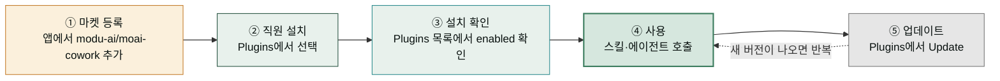

플러그인은 Claude에게 새로운 직무 능력을 붙여 주는 확장 꾸러미입니다. 스마트폰에 앱을 설치하면 없던 기능이 생기듯, **Claude Cowork와 ChatGPT Work 두 데스크톱 앱**에 플러그인을 설치하면 마케팅 캠페인 기획, 쇼핑몰 주문 관리, 계약서 검토 같은 전문 업무를 바로 시킬 수 있게 됩니다. 그리고 이런 플러그인을 받아오는 곳이 **마켓플레이스**입니다 — 앱스토어가 앱을 모아 두는 곳이라면, 마켓플레이스는 플러그인을 모아 두는 곳이라고 생각하면 정확합니다. 같은 플러그인이 Claude Cowork와 ChatGPT Work 양쪽에서 작동합니다.

`모두의 코워크`가 운영하는 마켓플레이스(`modu-ai/moai-cowork`)에는 **명의 AI 직원**이 올라와 있습니다. 실무 범용 코워커부터 작가·스토리 크리에이터, 마케터·미디어 크리에이터, 셀러, 사무관·데이터 애널리스트, 법무·재무세무·인사채용 담당, CS 매니저, 컨설턴트, 커리어 코치, 튜터, 디자이너, 개발 방법론(moai), 그리고 프로젝트 허브(PM)까지 — 각 플러그인이 한 명의 전문 직원처럼 자기 분야의 스킬과 에이전트, 필요하면 외부 서비스 연동(MCP)까지 갖추고 있습니다. 전부 설치할 필요는 없습니다. 회사에서 필요한 직무만 채용하듯, 필요한 직원만 골라 설치하면 됩니다.

이 섹션은 그 직원들을 "**어떻게 설치하고 부리나**"를 다루는 운용 매뉴얼입니다. 각 직원이 "**무엇을 하나**" — 어떤 스킬을 갖고 있고 어떤 일을 맡기면 좋은지 — 는 [에이전트 팀 소개](/moai-agents/) 섹션이 직원별 페이지로 안내합니다. 두 섹션을 오가며 읽으면 "누구를 뽑을지"와 "어떻게 부릴지"가 모두 잡힙니다.

## 플러그인 생애주기 한눈에 보기

플러그인 운용은 다섯 단계의 순환입니다. 마켓플레이스를 한 번 등록해 두면, 이후에는 설치 → 확인 → 사용 → 업데이트를 반복하게 됩니다.

## 이 섹션의 구성

| 순서 | 페이지 | 다루는 질문 |
|------|--------|------------|
| 1 | [설치와 관리](install/) | 마켓플레이스 등록부터 설치·확인·업데이트·제거까지, 터미널에서 무엇을 치는가? |
| 2 | [전문가 에이전트 이해](agents/) | 일하는 직원(worker)과 검수하는 직원(auditor)은 왜 나뉘어 있고, 어떻게 직접 호출하는가? |
| 3 | [팀 구성 패턴](teams/) | 직원 하나로 시작해서 여러 직원을 조합하는 실전 시나리오는 어떻게 짜는가? |

> 미디어 크리에이터·스토리 크리에이터·디자이너의 생성형 스킬(이미지·영상·3D·오디오·설명영상)을 쓸 분은 [Higgsfield MCP 설정](higgsfield-setup/)에서 OAuth 인증(1회)을 먼저 확인하세요.

## 플러그인 패밀리 개요

마켓플레이스 `moai-cowork`(v1.1.0)에 등록된 개 플러그인입니다. 이름이 곧 직무입니다.

| 플러그인 | 직무 | 한 줄 소개 |
|----------|------|-----------|
| `moai-coworker` |  코워커 | 브랜드·제안서·보고·협상 등 비즈니스 범용 실무 + 라이프스타일 |
| `moai-writer` |  작가 | 출판 기획·집필·제안서, 한국어 인문화 윤문·맞춤법 검수 |
| `moai-story` |  스토리 크리에이터 | 웹툰·웹소설·시나리오·콘티·캐릭터 시트 (Higgsfield 연동) |
| `moai-marketer` |  마케터 | 캠페인 기획·퍼포먼스 분석·콘텐츠·광고 (Meta Ads·ElevenLabs) |
| `moai-media` |  미디어 크리에이터 | 이미지·영상·오디오 생성 (Higgsfield·ElevenLabs·GPT-image·Gemini·Midjourney) |
| `moai-seller` |  셀러 | 스마트스토어·아임웹·카페24 운영(MCP)·상세페이지·CRM |
| `moai-officer` |  사무관 | HWPX·DOCX·XLSX·PPTX·PDF 한국형 오피스 문서·HTML 리포트 |
| `moai-analyst` |  데이터 애널리스트 | 공공데이터·KOSIS·DART 조회, 데이터 시각화 (MCP 연동) |
| `moai-lawyer` |  법무 담당 | 계약 검토·컴플라이언스·법령/판례 리서치 (국가법령정보 연동) |
| `moai-accountant` |  재무·세무 담당 | 재무제표 분석·결산·세금 절약·가계 예산 |
| `moai-recruiter` |  인사·채용 담당 | 채용 공고·이력서 스크리닝·오퍼레터·성과평가 (고용주 편) |
| `moai-cs` |  CS매니저 | 티켓 분류·응답 초안·VOC 분석·지식베이스 |
| `moai-consultant` |  컨설턴트 | 사업계획서·시장 분석·정부 지원사업 매칭·상권분석 |
| `moai-career` |  커리어코치 | 이력서·포트폴리오 첨삭, 면접 준비, 이직 전략 (구직자 편) |
| `moai-tutor` |  튜터 | 커리큘럼 설계·평가 문항·논문 검색/작성 |
| `moai-designer` |  디자이너 | Claude Design 연동, 토큰 파이프라인, 브랜드 시스템 |
| `moai-pm` |  PM | `/project` 명령으로 프로젝트 단위 셋업·직원 배치 |
| `moai-threads-poster` |  SNS 크리에이터 | Threads 자율 발행·문체 학습·멀티 채널 포맷·분할 등록 |

각 직원의 스킬 목록과 활용 예시는 [에이전트 팀 소개](/moai-agents/)의 직원별 페이지에서 확인하세요.

## 예전 페이지를 찾아오셨다면

이 섹션은 과거 "플러그인 카탈로그"(chat / cowork / design / code 4-카테고리 시절)를 대체합니다. `moai-cowork` 단일 통합 플러그인은 이전 버전에서 전문가 플러그인으로 분화됐고, 이후 스토리·미디어·데이터 애널리스트·SNS 크리에이터가 더해져 지금의 패밀리로 자리 잡았으며, 예전 하위 페이지 URL(`/plugins/cowork/` 등)은 모두 이 페이지로 리다이렉트됩니다. 옛 문서에서 보던 스킬들은 이름이 바뀌지 않은 채 담당 직원 플러그인으로 이사했다고 생각하면 됩니다.

## 다음 단계

- **처음이라면** → [설치와 관리](install/)에서 마켓플레이스 등록부터 따라 하세요.
- **설치는 끝났고 부리는 법이 궁금하다면** → [전문가 에이전트 이해](agents/)로 가세요.
- **여러 직원을 묶어 프로젝트를 돌리고 싶다면** → [팀 구성 패턴](teams/)을 읽으세요.
- **누구를 뽑을지 고민 중이라면** → [에이전트 팀 소개](/moai-agents/)에서 직원별 소개를 먼저 보세요.
- **만든 결과물을 팔아도 되는지 궁금하다면** → [라이선스와 산출물 권리](license/) — 됩니다, 제한 없습니다.

---

### Sources

- 마켓플레이스 진실 원본: [`/.claude-plugin/marketplace.json`](https://github.com/modu-ai/moai-cowork/blob/main/.claude-plugin/marketplace.json) (플러그인 패밀리 로스터 정본)
- Claude Code 플러그인 공식 문서: <https://code.claude.com/docs/en/plugins>
- OpenAI 플러그인 빌드 가이드: <https://developers.openai.com/plugins/build/plugins>
- OpenAI 플러그인 사용 가이드: <https://learn.chatgpt.com/docs/plugins?surface=app>
- OpenAI 서브에이전트 설정: <https://learn.chatgpt.com/docs/agent-configuration/subagents>
