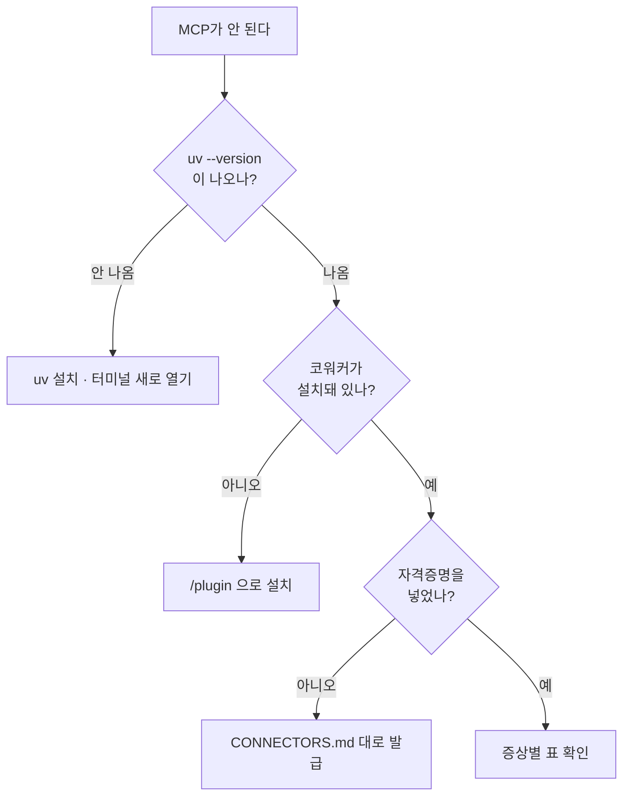

MCP가 안 될 때는 대개 네 가지 중 하나입니다. **위에서부터 차례로** 확인하세요.

## 먼저 이 순서로

## 증상별

### "설정이 필요합니다" 라고 나온다

오류가 아닙니다. **자격증명이 아직 없다는 안내**입니다. 답변에 어떤 값이 빠졌는지
함께 나오니, 그 값을 발급받아 넣으시면 됩니다.

이 상태에서도 코워커는 초안·점검표·원고를 만들어 드립니다.

### 도구가 아예 보이지 않는다

MCP 서버가 뜨지 못한 것입니다. 대개 uv 문제입니다.

1. 새 터미널에서 `uv --version` 확인
2. 안 나오면 [설치와 설정](../install/)의 1단계 다시
3. 나오는데도 안 되면 Claude Cowork(또는 ChatGPT Work)를 **완전히 종료 후 재시작**

### 인증에 실패했다고 한다

| 상황 | 해결 |
|---|---|
| 어제까지 잘 됐는데 갑자기 | 토큰이 취소되었거나 만료됐습니다. 재발급하세요 |
| 유튜브에서 일주일 만에 | Google Cloud 동의 화면이 '테스트' 상태입니다. '프로덕션'으로 전환하면 풀립니다 |
| 일부 기능만 실패 | 권한(scope)이 빠졌습니다. 유튜브는 `youtube.force-ssl` 이 댓글·채팅에 필요합니다 |
| 비밀번호를 바꿨다 | 토큰이 무효가 됩니다. 재발급하세요 |

### 한도에 걸렸다고 한다

잠시 후 다시 하면 됩니다. 답변에 **얼마나 기다려야 하는지** 함께 나옵니다.

유튜브에서 자주 걸린다면 검색을 많이 쓰고 있을 가능성이 큽니다. 검색은 1회에 100,
내 영상 목록 조회는 2입니다. "내 영상 목록 보여줘"로 대체할 수 있는 요청을 검색으로
하고 있지는 않은지 확인하세요. 자세한 내용은 [유튜브 연동](../youtube/)에 있습니다.

### 오늘 할당량을 다 썼다고 한다

유튜브 할당량은 **태평양 시간 자정**에 재설정됩니다. 한국 시간으로는 대략 오후 4~5시입니다
(서머타임에 따라 한 시간 차이).

계속 부족하다면 Google Cloud 콘솔에서 할당량 상향을 신청할 수 있습니다. 신청이 승인되면
설정의 `YOUTUBE_DAILY_QUOTA` 값을 새 한도로 바꿔 주세요.

### 느리거나 중간에 멈춘다

MCP 서버는 실패하면 **스스로 몇 번 다시 시도**합니다. 그래서 상대 서버가 불안정할 때
평소보다 오래 걸릴 수 있습니다. 몇 분 기다려도 끝나지 않으면 상대 서비스 자체의 장애일
가능성이 큽니다 — 해당 서비스의 상태 페이지를 확인해 보세요.

### 파일을 못 찾는다고 한다

업로드하려는 파일 경로를 확인하세요. **전체 경로**로 알려 주시는 게 확실합니다.

| 운영체제 | 예 |
|---|---|
| macOS | `/Users/이름/Movies/영상.mp4` |
| Windows | `C:\Users\이름\Videos\영상.mp4` |

## 그래도 안 되면

무엇을 시도했고 어떤 메시지가 나왔는지 함께
[이슈](https://github.com/modu-ai/moai-cowork/issues)로 남겨 주세요.


**자격증명 값 자체는 절대 붙여 넣지 마세요.** 오류 메시지에 값이 섞여 있다면 그 부분은
지우고 올려 주세요. 우리 MCP 서버는 오류 본문을 잘라서 담지만, 완벽하지는 않습니다.

