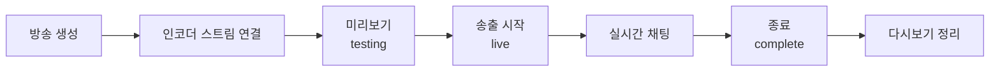

[유튜버 코워커](../../../moai-agents/youtuber/)에 유튜브 계정을 연결하면, 안내만 받는
것이 아니라 **실제로 방송을 켜고 영상을 올리고 성과를 읽어** 옵니다.

유튜브에는 Google이 관리하는 공식 MCP 서버가 없습니다. 그래서 직접 만들었습니다.

## 할 수 있는 일

| 묶음 | 내용 |
|---|---|
| 라이브 | 방송 생성 · 인코더 스트림 연결 · 미리보기/송출/종료 전환 · 실시간 채팅 읽기·보내기·삭제 |
| 발행 | 영상 업로드 · 제목/설명/태그 수정 · 썸네일 적용 · 재생목록 배치 · 자막 등록 · 공개 예약 |
| 분석 | 채널·영상 지표 · 유입 경로 구성 · 시청 유지 곡선 |
| 댓글 | 댓글 조회 · 답글 · 숨김 처리 |

## 연결하기

먼저 [MCP 설치와 설정](../install/)의 uv 설치를 마치셔야 합니다.

유튜브는 다른 서비스보다 준비가 조금 깁니다. API 키 하나로 되지 않고, **본인이 한 번
동의**를 해 줘야 하기 때문입니다. 업로드·라이브·성과 조회가 전부 "내 계정으로 행동한다"는
뜻이라 그렇습니다. 한 번만 하면 계속 쓸 수 있습니다.

순서는 이렇습니다.

1. Google Cloud에서 프로젝트 만들기
2. YouTube Data API v3 · YouTube Analytics API 켜기
3. 동의 화면에 필요한 권한 네 가지 등록
4. OAuth 클라이언트(데스크톱 앱) 만들기 — 여기서 **ID와 시크릿**을 받습니다
5. 브라우저에서 한 번 동의하고 **리프레시 토큰** 받기
6. 세 값을 설정에 넣기

각 단계의 화면과 붙여 넣을 명령은 플러그인의
[`CONNECTORS.md`](https://github.com/modu-ai/moai-cowork/blob/main/plugins/moai-youtuber/mcp-servers/moai-youtube/CONNECTORS.md)에
macOS·Windows 양쪽으로 정리해 두었습니다.


**두 곳에서 가장 많이 막힙니다.**

동의 주소에 `access_type=offline` 과 `prompt=consent` 가 있어야 리프레시 토큰이 나옵니다.
빠뜨리면 하루도 못 가는 토큰만 받습니다.

그리고 권한에 `youtube.force-ssl` 을 꼭 넣으세요. 이게 없으면 다른 건 되는데 **댓글과
실시간 채팅만** 권한 오류가 납니다.


## 할당량 — 이것만은 알고 쓰세요

유튜브 API는 하루에 쓸 수 있는 양이 정해져 있습니다. 기본은 **10,000 units**인데,
작업마다 값이 다릅니다.

| 작업 | 소모 | 하루에 몇 번 |
|---|---:|---|
| 검색 | 100 | **100번이면 끝** |
| 영상 업로드 | 100 | 100번 |
| 자막 등록 | 400 | 25번 |
| 제목 수정·재생목록 추가 등 | 50 | 200번 |
| 조회 대부분 | 1 | 사실상 무제한 |
| 성과 분석 | 0 | 무제한 (다른 할당량을 씀) |

**검색이 압도적으로 비쌉니다.** 조회 100번과 검색 1번이 같은 값입니다.

그래서 두 가지 방어를 넣어 두었습니다.

- **같은 검색은 다시 요금을 물리지 않습니다.** 캐시에서 돌려줍니다.
- **내 영상 목록은 검색을 쓰지 않습니다.** 업로드 재생목록을 통해 받아 2 units만 씁니다.
  검색으로 했다면 100 units였을 일입니다.

한도를 넘길 요청은 **보내기 전에 막습니다.** 실패한 호출도 할당량은 소모되기 때문입니다.

"오늘 얼마나 썼는지 알려줘"라고 물으면 잔량을 알려 드립니다. 다만 이 값은 **추정치**입니다 —
같은 계정을 다른 도구가 함께 쓰고 있으면 실제로는 더 적습니다. 정확한 값은
[Google Cloud 콘솔](https://console.cloud.google.com/)이 정본입니다.

## 라이브 방송 순서

라이브는 되돌릴 수 없습니다. 그래서 송출 전에 확인할 단계를 하나 두었습니다.

**미리보기를 건너뛰지 마세요.** 소리가 안 나가는 걸 확인할 마지막 기회입니다.

방송이 끝나면 다시보기의 제목과 설명을 정리하라고 알려 드립니다. 라이브 제목을 그대로
두면 검색에서 묻히기 때문입니다.

## 안전장치

**업로드는 기본이 비공개입니다.** 실수로 공개되는 것보다 낫기 때문입니다. 확인하신 뒤에
공개하거나 예약을 걸면 됩니다.

**제목만 바꿔도 설명이 날아가지 않습니다.** 유튜브 API는 부분 수정을 지원하지 않아서,
기존 값을 먼저 읽어 병합한 뒤 저장합니다.

**답글과 채팅 메시지는 여러분 이름으로 나갑니다.** 보내기 전에 문구를 확인받습니다.

**예약 시각은 시간대를 다시 확인합니다.** 가장 흔한 사고라서요.

## 연결하지 않아도 됩니다

설정이 부담스러우면 나중에 하셔도 됩니다. 연결 전에도 유튜버 코워커는 점검표·큐시트·
편집 지시서·설명란 원고·답글 초안을 그대로 만들어 드리고, 실제 버튼을 누르는 단계만
유튜브 스튜디오에서 하시면 됩니다.

**하지 않은 일을 했다고 말하지 않습니다.** 올리지 않았으면 올렸다고 하지 않습니다.

## 문제가 생기면

[문제 해결](../troubleshooting/)에 증상별로 정리해 두었습니다.
